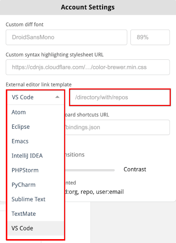

# Account Settings 
In the upper-right corner, click your username to view the account settings drop-down window.

Here, you can manage your global settings, and customize your Reviewable environment. See the explanations of each setting below.


<br>


## Custom diff font 

Specify the font for delineating all diffs. The font must be [monospace](https://medium.com/@vilcins/top-monospaced-fonts-for-coding-a7d941a143fe), exactly match the font name, and already exist on your machine. Specify the font size in a CSS format, such as 10pt, 1.2em, or 90%.

To use the GitHub style, for example, set the URL to: 

<strong>https://cdnjs.cloudflare.com/ajax/libs/highlight.js/8.2/styles/github.min.css</strong>

Ensure that the stylesheet is served as text/css. It may be necessary for you to use [https://gitcdn.xyz](https://gitcdn.xyz).

We also have a few extra styles used to highlight tabs, trailing whitespace, and lack of final newline that you can customize:

```
.tab, .no-newline, .trailing {
  color: #D95C5C;
}

.tab:before {
  content: "\00bb\00a0\00a0\00a0";
}

.no-newline:before {
  content: "\00a0\20e0\23ce";
}

```
By default, only deltas appear with highlights. If you'd also like diff lines with edits to appear with highlighting—in two-column mode—you can add the styles from this example, or simply set your account custom stylesheet URL to:

<strong>https://gitcdn.xyz/cdn/pkaminski/2922da3d58f76a8ed7bf/raw/highlight_lines_in_two_columns.css</strong>

If your favorite language is not one of the 120+ that have syntax highlighting, you can open an issue with [highlight.js](https://highlightjs.org/). Or, you can contribute a language-specific module to the project yourself.

## Custom syntax highlighting stylesheet URL 
Specify the location of the stylesheet that you want to apply to diffed code. Note that the URL that you enter here must serve a **text/css!** document type. Visit [www.rawgit.com](https://rawgit.com/) to access stylesheets that are kept in GitHub. We use [highlight.js](https://highlightjs.org/), so you might prefer to use one of those [predefined styles](https://highlightjs.org/static/demo/) that can be found in their [styles directory](https://github.com/isagalaev/highlight.js/tree/master/src/styles)—or create [your own styles](http://highlightjs.readthedocs.io/en/latest/css-classes-reference.html). 


## Custom line link template  

Here, enter the specific code line destination for the Line link that appears in the upper-right corner of discussions. Enter the syntax here to open the file in your favorite editor to the specific line that is under review. If nothing is specified here, the destination is Github. 

If your favorite editor supports a custom URL scheme for linking to files, then you can use this feature. Some of the sample templates assume that <strong><code>/directory/with/repos</code></strong> is the absolute path to the directory where your git repos live, and also assume that each repo directory is named the same as its repo. Look for your editor below to see the correct entry that you'll need to insert into the <strong>Custom line link template</strong> field.

### GitHub

This is the built-in default that opens GitHub on the exact version of the file you're reviewing—with the specific line highlighted.


    **<code>https://github.com/{{owner}}/{{repo}}/blob/{{viewSha}}/{{path}}#L{{viewLine}}</code></strong> 

### TextMate


    **<code>txmt://open?url=file:///directory/with/repos/{{repo}}/{{path}}&line={{line}}</code></strong>. \


### Sublime Text

Be sure to install an appropriate URL handler.


    **<code>subl://open?url=file:///directory/with/repos/{{repo}}/{{path}}&line={{line}}</code></strong> 


### Emacs

Be sure to install the [Emacs URL Handler](https://github.com/typester/emacs-handler) for OS X. If you know of solutions for Linux or Windows, please [let us know](mailto:support@reviewable.io)!


```
    emacs://open?url=file:///directory/with/repos/{{repo}}/{{path}}&line={{line}} 
```


### Atom

Be sure to install [Atom Handler](https://github.com/WizardOfOgz/atom-handler) on OS X.


```
    atm://open?url=file:///directory/with/repos/{{repo}}/{{path}}&line={{line}} 
```


### Eclipse

Be sure to install the [OpenInEclipse](https://gist.github.com/uncreative/1100212) script on OS X, or [follow these instructions](https://gist.github.com/jGleitz/cf9df461698f4e133cef) on Linux. If you know of solutions for Windows, please [let us know](mailto:support@reviewable.io)!


```
    openineclipse://open?url=file:///directory/with/repos/{{repo}}/{{path}}&line={{line}} 
```


IntelliJ IDEA, Android Studio, PyCharm, and PHPStorm:


```
    idea://open?file=/directory/with/repos/{{repo}}/{{path}}&line={{line}} 
```


Or, replace <code>idea</code>: with <code>pycharm:, phpstorm:</code> 

Check your docs for the scheme specific to your editor flavor. Should work on OS X, but we're not sure about other platforms.

Use the variable in your custom URL template:


*   <strong><code>{{owner}}</code></strong>: the repo owner (or organization) username.
*   <strong><code>{{repo}}</code></strong>: the repo name.
*   <strong><code>{{pr}}</code></strong>: the pull request number.
*   <strong><code>{{path}}</code></strong>: the full path to the file (does not start with /).
*   <strong><code>{{sha}}</code></strong>: the commit sha of the latest revision in this review.
*   <strong><code>{{line}}:</code></strong> the line number in the latest revision of the file that best represents the original context in which the comment was made.
*   <strong><code>{{viewLine}}</code></strong>: the line number in the revision in which the discussion currently appears. This is the number that appears in the top-right corner of the discussion.

Typically, you'll want to edit and load the latest version of the file into the editor, so you probably want to use <strong><code>{{line}}</code></strong> rather than <strong><code>{{viewLine}}</code></strong>. If you need any other variables for your template, please let us know.


## Customize key bindings

Get a copy of the [default bindings file](https://reviewable.io/bindings.json) and put it somewhere accessible on the web (such as a [gist](https://gist.github.com/)). Edit this file according to your preferences, remembering that all available commands are given in the file (though not all are bound by default). You can use any key combos supported by [Mousetrap](http://craig.is/killing/mice). If your favorite command isn't listed, please [open an issue](https://github.com/reviewable/reviewable/issues) so we can add it.

When you're done, point Reviewable to your custom bindings file through the corresponding field in your account settings drop-down—as shown in the figure below. If you're using a gist, make sure to get the "raw" URL, and consider removing the commit SHA from the path to always point to the latest version.



<br>
<br>

Your bindings will be loaded and applied right away, and the cheatsheet will update accordingly to reflect them. Be sure to check the console if they don't appear to work, since any errors will appear there. To load any updates to your file, either reload the page or make a no-op edit to the URL field.


## Animated transitions

Click the toggle to turn animated transitions on and off throughout the UI.


## Adjust the contrast 

Use the slider to adjust the UI contrast. Currently this only affects the red and green diff highlighting in reviews, but may be used for other UI elements in the future as well.

