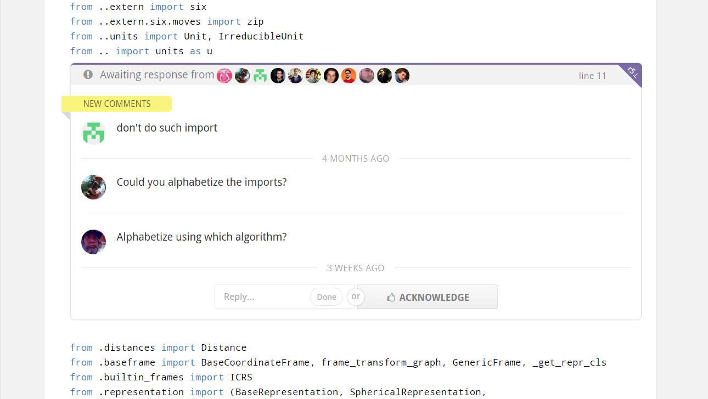
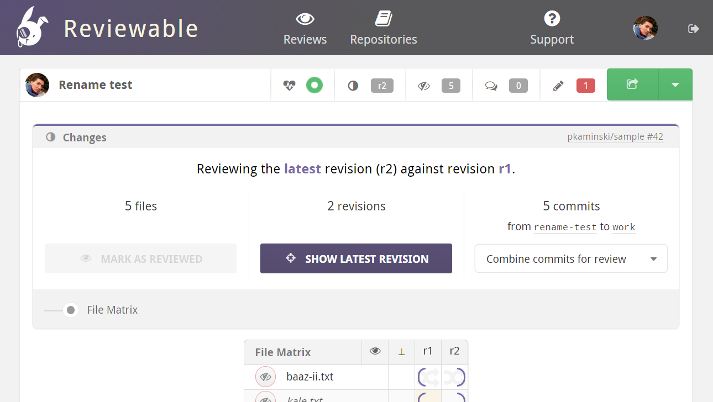

Reviewable is a light but powerful code review tool that helps you review code faster and more thoroughly.  (Yes, both at the same time!)  It integrates effortlessly with your GitHub pull requests in just two clicks.

### See only what changed since last time you looked

Iterating on a code review can be painful if you have to look at the entire diff from base each time.  Reviewable shows you **incremental diffs** between any pair of code revisions so you can focus on the new changes.  This works across multiple commits, **even if the pull request's branch was rebased**!  Plus, the diffs have cleaner deltas thanks to a custom algorithm, and are presented in a beautiful, syntax-highlighted, **responsive one- or two-column layout**.

### Stay on top of remaining issues

How can you make sure that a comment was addressed properly if it disappears when the underlying code changes?  Right&mdash;you can't.  So Reviewable makes sure that **comments stick around**, even across revisions, until everyone agrees that they've been resolved.  And you can draft your comments then **send them all together** in one coherent message so it's clear when the ball is in the other person's court.

### Keep track of your reviews and merge with confidence

Reviewable's **real-time dashboard** displays all the reviews you're involved with, including any related to the teams you're a member of&mdash;no need to mess around with queries.  It also keeps track of unresolved discussions and which revisions of which **files still need to be reviewed**.  A red counter indicates that it's your turn to move a review forward, and when all the counters are zero you can **merge the pull request** on the spot.

### Customize everything so it fits just right

As a developer, you want the tools you use every day to work just the way you like.  In Reviewable, you pick the review style: **commit-by-commit or all-at-once**.  You set the rules for when a review is done.  You can customize the **key bindings**, the code font, the syntax highlighting, and the maximum line length (to match your style guide).  You can even configure Reviewable to open your favorite editor on the right line with a single click!

### Set up in seconds and don't waste time on admin

Just sign in with your GitHub account and **toggle on the repos** where you'd like to use Reviewable.  You're done!  A **link to the code review** will automatically appear in every open pull request's description.  You don't need to set up serers, clone your repos, learn new commands, or maintain separate accounts for your team.  And since all your code and comments stay on GitHub, there's **no lock-in** and leaving is just as easy as getting started.
