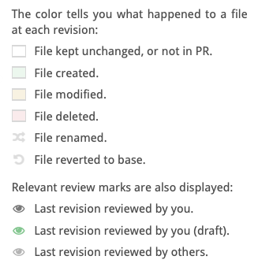

# File Matrix 
Click the toggle to display a history matrix for each file in the revision. Here, you can:

*   View a detail history for each file.
*   Set diff bounds for any files or all files.
*   Mark files as reviewed.
*   View the most recent reviewers of each file.
*   Click the file name to move directly to the diff for that file. Hold down the Cmd or Shift key to open the file diff in a new browser tab.

 
 

In the upper-right, you can see the delta numbers for all of the files in this diff:

*   Lines changed
*   Lines added
*   Links removed

## Mark an individual file as reviewed 

Instead of marking all files as reviewed, click the small button to the left of a file name (see the figure above) to indicate that you have reviewed that file. This marks a file as reviewed up to its current right diff bound. This doesn’t necessary mean that you are indicating that the file is ready for merging, but rather only that you reviewed it at the right bound revision of the current diff and added all of your review comments. In a future review round, you can easily diff each file against the last revision you marked as reviewed.

The button color reflects the current state:

 — The file has not yet been reviewed at or after the right diff-bound. Click the button to mark the file as reviewed.

 — Reviewed by you at the right diff-bound. Click to rescind your review marking.

 — The file has not yet been reviewed at or after the right diff-bound. However, marking is not advised because some unreviewed changes are not shown in the current diff—or you are the author of the PR.

 — Reviewed by you or someone else at or after the right diff-bound. It is redundant to mark the file as reviewed.

## Column headings

Each column in the matrix represents a single revision of each of the files in the review. Each revision consists of one or more commits. A revision is immutable, even if the branch is rebased. 

<table border ="1", bgcolor="ADE9FB">
<tbody>
<tr>
<td><strong>NOTE</strong>: You can also drag in the diff header to bulk-select the diff bounds. Doing so in the header will set the diff bounds for all files as close as possible to the new setting. Many reviewers choose to set diff bounds this way instead of file-by-file to see one coherent set of diffs at a time.</td>
</tr>
</tbody>
</table>
 

<strong>Revision status</strong>: Italicized revision names, such as r1, are provisional —which means that the author may make more changes. Revision names that have a strikethrough are  outdated and no longer part of the pull request.

<strong>Previous reviewers</strong>: Hover over the small review avatar icons to the right of the file name to see who were the last reviewers of that file. User details will appear when you hover over a specific icon. It may be that those people did not review the latest revision, and other people may have reviewed previous revisions.
 
There are also two virtual revisions:

 —  Click this button to automatically select the last revision that you reviewed for each file (defaulting to the base) for the left bound. For the right bound, it will choose the latest revision for that file. You can also drag from the eye symbol to set bounds between the last reviewed revision (as defined above) and any other revision to which you drag the marker. 

<table border ="1", bgcolor="ADE9FB">
<tbody>
<tr>
<td><strong>NOTE</strong>:In this scenario, the last reviewed revision may become either the left or right bound depending on the other bound you picked—and this may even vary with each file.</td>
</tr>
</tbody>
</table>
 

 —  This is the base version for a file in the target branch of the PR. This may depend on the right diff bound if the pull request has been rebased.

 

## Diff bounds

The brackets on each row are the left and right diff bounds for each file. To adjust the diff bounds for each file, simply drag or click either of the brackets.

 
 

There are other color schemes in effect in the file matrix which indicate how a file might have been modified—and also the latest revision review status.

 
 

