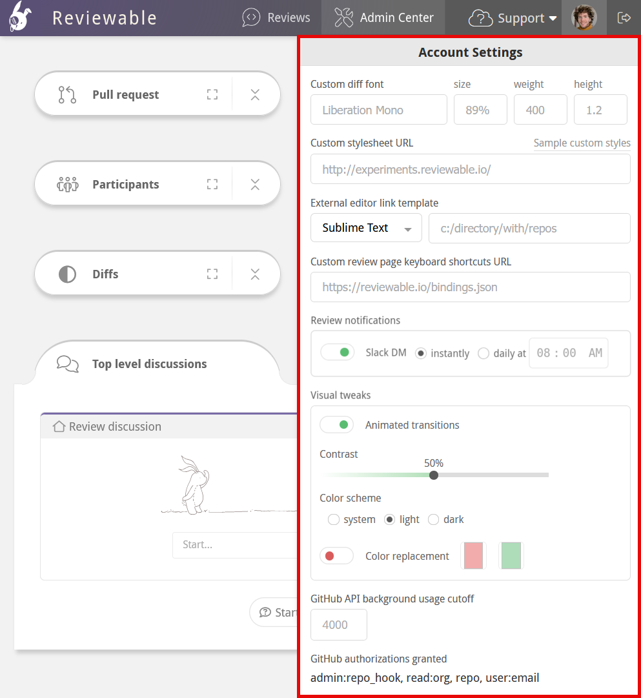
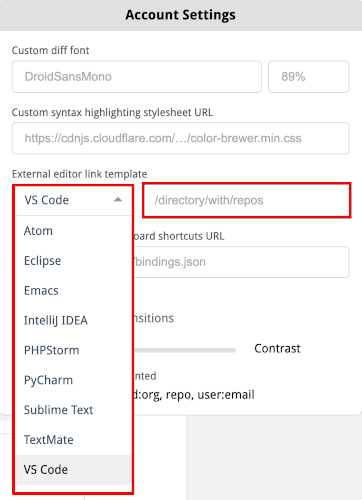
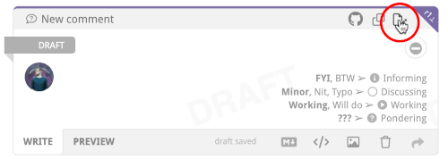

# Account Settings

When signed in, click your username in the upper-right corner to view the account settings dropdown.  Here, you can manage your global settings, and customize your Reviewable environment.



## Custom diff font

You can customize the font used in all the diffs. The font must be [monospace](https://medium.com/@vilcins/top-monospaced-fonts-for-coding-a7d941a143fe), exactly match the font name, and already exist on your machine. Specify the font size in a CSS format, such as 10pt, 1.2em, or 90%.  If the font can't be loaded Reviewable will fall back on its built-in one.

## Custom stylesheet

You can point to a custom stylesheet that you want to apply to all diffs.  Reviewable uses [highlight.js](https://highlightjs.org/), so you might prefer to use one of those [predefined styles](https://highlightjs.org/static/demo/) that can be found in their [styles directory](https://github.com/isagalaev/highlight.js/tree/master/src/styles). To use the GitHub style, for example, set the URL to `https://cdnjs.cloudflare.com/ajax/libs/highlight.js/8.2/styles/github.min.css`.  You can also create [your own styles](http://highlightjs.readthedocs.io/en/latest/css-classes-reference.html).

::: danger
Ensure that the stylesheet is served as text/css. It may be necessary for you to use [https://raw.githack.com](https://raw.githack.com) or another similar service.
:::

We also have a few extra styles used to highlight tabs, trailing whitespace, and lack of final newline that you can customize:

```css
.tab, .no-newline, .trailing {
  color: #D95C5C;
}

.tab:before {
  content: "\00bb\00a0\00a0\00a0";
}

.no-newline:before {
  content: "\00a0\20e0\23ce";
}
```

By default, only the actual deltas have red/green highlights in two-column mode. If you'd like the whole line to be highlighted as well (like on GitHub) you can add the styles from [this example](https://gist.github.com/pkaminski/2922da3d58f76a8ed7bf).

See more snippets at [visual tweaks](tips.md#visual-tweaks).

## External editor line link template

You can specify the file path to your git repos directory for the **external editor line link** that appears in the upper-right corner of discussions.



You can use this to open the file in your favorite editor on the specific line that is under review.



Your editor must support a custom URL scheme for linking to files to use this feature. Reviewable assumes that `/directory/with/repos` is the absolute path to the directory where your git repos live, and also that each repo directory is named the same as its repo.

There are a few caveats for specific editors:

* **Sublime Text:** You must install an appropriate URL handler.
* **Emacs:** You must install the [Emacs URL Handler](https://github.com/typester/emacs-handler) on OS X.
* **Atom:** You must install the [Atom Handler](https://github.com/WizardOfOgz/atom-handler) on OS X.
* **Eclipse:** You must install the [OpenInEclipse](https://gist.github.com/uncreative/1100212) script on OS X, or [follow the instructions for Linux](https://gist.github.com/jGleitz/cf9df461698f4e133cef). If you know of solutions for Windows, please [let us know](mailto:support@reviewable.io)!
* **IntelliJ IDEA, Android Studio, PyCharm, PHPStorm:** Should work on OS X, but not confirmed for other platforms.

### Custom line link template

You can also specify a custom line link template by choosing the `Custom` option in the dropdown. If you would like to base your custom template on one of the available editor templates, first select that template in the dropdown and then select `Custom`.

For example, if you initially select `VS Code` and then select `Custom`, the following template will populate the template field:

`vscode://file//directory/with/repos/{{repo}}/{{path}}:{{line}}`

If you have entered your `/directory/with/repos/` path, it will automatically carry over to your new custom template.

You can use these variables in your custom URL template:

* `{{owner}}`: the repo owner (or organization) username of the head (source) branch.
* `{{repo}}`: the repo name of the head (source) branch.
* `{{baseOwner}}`: the repo owner (or organization) username of the base (target) branch.
* `{{baseRepo}}`: the repo name of the base (target) branch.
* `{{pr}}`: the pull request number.
* `{{headBranch}}`: the name of the head (source) branch.
* `{{baseBranch}}`: the name of the base (target) branch.
* `{{path}}`: the full path to the file (does not start with /).
* `{{sha}}`: the commit sha of the latest revision in this review.
* `{{line}}:` the line number in the latest revision of the file that best represents the original context in which the comment was made.
* `{{viewLine}}`: the line number in the revision in which the discussion currently appears. This is the number that appears in the top-right corner of the discussion.  Not available for code blocks.

Typically, you'll want to edit and load the latest version of the file into the editor, so you probably want to use `{{line}}` rather than `{{viewLine}}`. If you need any other variables for your template, please let us know.

## Custom key bindings

You can customize the key bindings for common commands, and add new ones for commands that aren't bound by default.  First, get a copy of the [default bindings file](https://reviewable.io/bindings.json) and put it somewhere accessible on the web (such as a [gist](https://gist.github.com/)). Edit this file according to your preferences; all available commands are given in the file, though not all are bound by default. You can use any key combos supported by [Mousetrap](http://craig.is/killing/mice). If your favorite command isn't listed, please [open an issue](https://github.com/reviewable/reviewable/issues) so we can add it.

When you're done, point Reviewable to your custom bindings file by entering its URL in the field. If you're using a gist, make sure to get the “raw” URL, and consider removing the commit SHA from the path to always point to the latest version.

Your bindings will be loaded and applied right away, and the cheatsheet will update accordingly to reflect them. Be sure to check the browser's console if they don't appear to work, since any errors will appear there. To load any updates to your file, either reload the page or make a no-op edit to the URL field.

## Visual tweaks

Click the **Animated transitions** toggle to turn animated transitions on and off throughout the UI.

### Adjust contrast

Use the **Contrast** slider to adjust the UI contrast. Currently this only affects the red and green diff highlighting in reviews, but may be used for other UI elements in the future as well.

### Color scheme

You can switch between dark mode, light mode, or match your operating system's default display theme with the radio buttons within the **Color scheme** options. By default, Reviewable will match your operating system's light or dark mode setting. Changing the color scheme in any Reviewable tab will immediately update it in all other instances of Reviewable for your user across any tabs or windows.

### Accessibility

You can enable **color replacement** (colorblind) mode to replace all shades of red and green across the app, making it easier to distinguish between the two, which is especially important when looking at diffs. In single column layouts (unidiff), you will also notice that plus and minus icons are used to further differentiate between changes.

To use colorblind mode:

  - Turn on color replacement.
  - Click the left swatch to replace red, and the right swatch to replace green.
  - The default colors are optimized for users with deuteranopia. However, you can customize the colors to suit your needs.

To reset any custom colors back to the default red or green, click the "x" that appears after setting each custom color.

::: tip
When setting replacement colors, don't forget that you have the <a href="#adjust-contrast">contrast slider</a> at your disposal too. This primarily controls diff colors (and differentiation icons) and can help achieve a balanced UI when setting custom red/green replacements.
:::

## GitHub authorizations granted

This is a read-only list of all the GitHub OAuth scopes you've granted to Reviewable so far.  It can be useful to confirm the extent of permissions granted or when debugging GitHub API issues.
