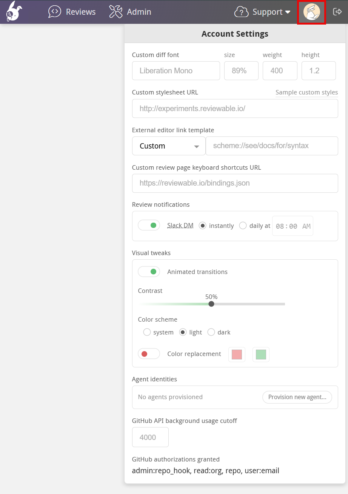
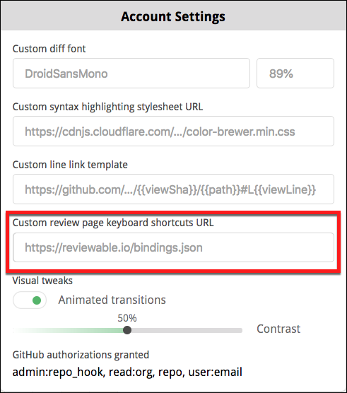
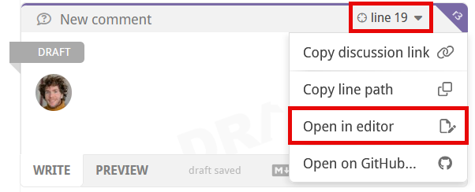

# Account Settings

When signed in, click your profile picture in the upper-right corner to view the account settings dropdown.  If you're already in a review, click the Reviewable icon in the upper-left corner first to reveal your profile picture.

Here, you can manage your global settings and customize your Reviewable environment.  This chapter explains each setting from top to bottom.

{width=580}

## Custom diff font

You can customize the font used in all the diffs. The font must be [monospace](https://medium.com/@vilcins/top-monospaced-fonts-for-coding-a7d941a143fe), match the exact font name, and already exist on your machine. Specify the font size in CSS format, such as 10pt, 1.2em, or 90%.  If the font can't be loaded, Reviewable will fall back on its built-in default.

## Custom stylesheet

You can point to a custom stylesheet that you want to apply to all diffs.  Reviewable uses [highlight.js](https://highlightjs.org/), so you might prefer to use one of those [predefined styles](https://highlightjs.org/demo) that can be found in their [styles directory](https://github.com/isagalaev/highlight.js/tree/master/src/styles).

For example, to use the GitHub style, set the URL to `https://cdnjs.cloudflare.com/ajax/libs/highlight.js/8.2/styles/github.min.css`.

You can also write your own custom styles by following the [highlight.js CSS class reference](http://highlightjs.readthedocs.io/en/latest/css-classes-reference.html).

::: danger
Make sure that your stylesheet is served as `text/css`. If your host doesn't set a Content-Type header automatically, you can use [https://raw.githack.com](https://raw.githack.com) or another similar service to set the MIME type for you.
:::

There are a few extra styles for highlighting tabs, trailing whitespace, and lack of a final newline that can be customized as well:

```css
.tab, .no-newline, .trailing {
  color: #D95C5C;
}

.tab:before {
  content: "\00bb\00a0\00a0\00a0";
}

.no-newline:before {
  content: "\00a0\20e0\23ce";
}
```

When viewing a diff in two-column mode, Reviewable only highlights the changed characters by default. If you prefer full-line red and green backgrounds similar to GitHub, you can add the styles from [this example](https://gist.github.com/pkaminski/2922da3d58f76a8ed7bf).

See more custom stylesheet snippets in the [Tips and Tricks](tips.md#visual-tweaks) section.

## External editor link template {#external-editor-line-link-template}

Reviewable lets you open files directly in your preferred external editor. Select your editor from the dropdown and provide the file path to your local git repos.

{width=410}

You can open a file by clicking its name in a [file diff panel header](files.md#file-header) and selecting **Open in editor**&nbsp;<i class="editor icon"/>.  To jump to a specific line, use the <i class="discussion scope icon"/>&nbsp;**line #** dropdown in the upper-right corner of any discussion.

{width=480}

::: tip
You can open files in your external editor from the file matrix by holding down `⌘` or `Ctrl` + `Alt` or `⇧` when clicking a file name. More on this [here](files.md#file-list).
:::

Your editor must support a custom URL scheme for linking to files to use this feature. Reviewable assumes that `/directory/with/repos` is the absolute path to the directory where your git repos live, and also that each repo directory is named the same as its repo.

There are a few caveats for specific editors:

* **Sublime Text:** You must install an appropriate URL handler.
* **Emacs:** You must install the [Emacs URL Handler](https://github.com/typester/emacs-handler) on OS X.
* **Atom:** You must install the [Atom Handler](https://github.com/WizardOfOgz/atom-handler) on OS X.
* **Eclipse:** You must install the [OpenInEclipse](https://gist.github.com/uncreative/1100212) script on OS X, or [follow the instructions for Linux](https://gist.github.com/jGleitz/cf9df461698f4e133cef). If you know of solutions for Windows, please [let us know](mailto:support@reviewable.io)!
* **IntelliJ IDEA, Android Studio, PyCharm, PHPStorm:** Should work on OS X, but not confirmed for other platforms.

### Custom editor link template {#custom-line-link-template}

You can specify a custom editor link template by choosing the `Custom` option in the editor dropdown. To base your custom template on one of the available editor templates, first select that template in the dropdown and then select `Custom`.  The file path to your local git repos will automatically be carried over when switching between editors.

For example, if you initially select `VS Code` and then select `Custom`, the following template will populate the template field:

`vscode://file//directory/with/repos/{{repo}}/{{path}}:{{line}}`

You can use these variables in your custom URL template:

* `{{owner}}` — the repo owner (or organization) username of the head (source) branch.
* `{{repo}}` — the repo name of the head (source) branch.
* `{{baseOwner}}` — the repo owner (or organization) username of the base (target) branch.
* `{{baseRepo}}` — the repo name of the base (target) branch.
* `{{pr}}` — the pull request number.
* `{{headBranch}}` — the name of the head (source) branch.
* `{{baseBranch}}` — the name of the base (target) branch.
* `{{path}}` — the full path to the file (does not start with /).
* `{{sha}}` — the commit sha of the latest revision in this review.
* `{{line}}` — the line number in the latest revision of the file that best represents the original context in which the comment was made.
* `{{viewLine}}` — the line number in the revision in which the discussion currently appears. This is the number that appears in the top-right corner of the discussion.  Not available for code blocks.

Typically, you'll want to open the latest version of a file into the editor.  In this case, use `{{line}}` rather than `{{viewLine}}`.  If you need any other variables for your template, please let us know.

## Custom key bindings

You can customize the key bindings for common commands, and add new ones for commands that aren't bound by default.  First, make a copy of the [default bindings file](https://reviewable.io/bindings.json) and put it somewhere accessible on the web (such as a [gist](https://gist.github.com/)). All available commands are listed in the file.  You can use any key combos supported by [Mousetrap](http://craig.is/killing/mice). If your favorite command isn't listed, please [open an issue](https://github.com/reviewable/reviewable/issues) so we can add it.

When you're done, point Reviewable to your custom bindings file by entering its URL in the **"Custom review page keyboard shortcuts URL"** field in the account settings dropdown. If you're using a gist, make sure to get the “raw” URL, and consider removing the commit SHA from the path to always point to the latest version.

Your bindings will be loaded and applied right away, and the keyboard shortcuts cheatsheet (type `?` in Reviewable) will automatically update to reflect them. Be sure to check the browser's console if they don't appear to work since any errors will appear there. To load any updates to your file, either reload the page or make a no-op edit to the URL field.

## Review notifications

Click the **Slack DM** toggle to turn review notifications via Slack on and off.  When turned on, you can choose between having notifications delivered **instantly** or **daily** (batched) at a given time.  Slack integration can be set up by organization owners in the [Admin Center](admincenter.md#slack-integration).

## Visual tweaks

Click the **Animated transitions** toggle to turn animated transitions on and off throughout the UI.

### Adjust contrast

Use the **Contrast** slider to adjust the UI contrast. Currently this only affects the red and green diff highlighting in reviews, but may be used for other UI elements in the future as well.

### Color scheme

You can switch between dark mode, light mode, or match your operating system's default display theme using the **Color scheme** radio buttons. By default, Reviewable will match your operating system's light or dark mode setting. Changing the color scheme in any Reviewable tab will immediately update it across all tabs and windows.

### Accessibility

You can enable **color replacement** (colorblind mode) to replace all shades of red and green across the app, making it easier to distinguish between the two in diffs. In single column diff layouts, plus and minus icons are also placed to the right side of the panel to further differentiate between changes.

To use colorblind mode:

  - Turn on color replacement.
  - Click the left swatch to replace red, and the right swatch to replace green.
  - The default colors are optimized for users with deuteranopia. However, you can customize the colors to suit your needs.

To reset any custom colors back to the default red or green, click the "x" that appears after setting each custom color.

::: tip
When setting replacement colors, don't forget that you have the <a href="#adjust-contrast">contrast slider</a> at your disposal too. This primarily controls diff colors (and differentiation icons) and can help achieve a balanced UI when setting color replacements.
:::

## Agent identities

Here you can manage subidentities of your own account to be used by agents or other automation inside Reviewable.  GitHub is not aware of these subidentities so all actions taken by agents there will be in your name and with your permissions.

### Creating and retiring an agent identity

Start by provisioning a new agent.  There are three kinds to choose from:
1. Author: the agent will have its own subidentity and — crucially — assume the role of an author on any pull requests you create.
2. Reviewer: the agent will have its own subidentity and assume the role of a reviewer on all pull requests.
3. Replicant: the agent will have no subidentity of its own and act entirely in your name, both in Reviewable and on GitHub.

Once you've created an agent you'll be shown its API bearer token.  This is the only time this token will be displayed so copy it and save it in an environment variable called `REVIEWABLE_API_TOKEN`.  Keep this token safe as it provides full access to Reviewable with no further authentication.  You can reissue the token at any time, which will immediately invalidate the old one.  You can also revoke the token, which will retire the agent, though you can reactivate them at any time.

::: tip
Agents are never completely deleted (only retired) to maintain data integrity for any reviews they might have participated in.
:::

### Customizing an agent identity

You can set an agent's tag, consisting of up to 4 uppercase letters and a background color.  This can help you tell multiple agents apart in the list and, for agents with their own subidentities, will be added to your avatar and username to distinguish the agent from you.  You can change the tag at any time and it will immediately take effect, including for all of an agent's past interactions — just like when you change your own avatar or username.

You can also constrain the agent to a subset of the organizations and repositories to which you have access.  Specify a comma-separated list of `OWNER/REPO` globs; if any one matches then access will be allowed.  For example, `work/*` grants access to all repos in the `work` organization, `*/special-*` grants access to repos that start with `special-` in any organization, and `*/*` grants access to all repos in all organizations (the default setting).

### Using an agent identity

To use an agent identity you'll first need to:
1. Install [Node.js](https://nodejs.org/) version 20 or higher.
2. Install Chrome or Chromium.  It's probably already available on your personal computer, but if you need to set it up in CI you can use the command `npx playwright install --with-deps chromium`.
3. Set the `REVIEWABLE_URL` environment variable to `https://reviewable.io` or the URL of your local instance of Reviewable (e.g., `https://internal.reviewable.cloud`).
4. Set the `REVIEWABLE_API_TOKEN` environment variable to your agent's secret token.

You're now ready to run the `reviewable` NPM package in one of two ways:
1. Download and execute it directly with `npx -y reviewable@latest`.  This has the advantage of automatically updating to the latest version (sooner or later) but carries some extra overhead each time you invoke it.
2. Install the package with `npm install --global reviewable@latest` then run it simply as `reviewable`.  This is a little more efficient but leaves it up to you to update the package every so often by running the same installation command again.

The `reviewable` command offers two ways for your agent to interact with Reviewable.  First, you can execute `reviewable mcp` to start up an MCP server; your agent should be able to take it from there.  Second, you can use it as a CLI tool; run `reviewable --help` to see a list of available commands, and consider adding our [skill stubs](https://github.com/Reviewable/Reviewable/tree/master/examples/skills) to your agent.  (Make sure to tweak the command they show for how you decided to run `reviewable` above.)

If you can't find a feature you need, first make sure you're running the latest version of the `reviewable` package (and the Reviewable instance, if you're on Reviewable Enterprise).  If it's still missing then please [get in touch](mailto:support@reviewable.io?subject=API%20feature%20request) and we'll see if we can get it added for you!

## GitHub API background usage cutoff
You can set an hourly GitHub API usage cutoff to limit Reviewable's background requests for your account on its server. This applies a maximum across all types of quota but is typically most relevant for core API quota. This does not affect interactive usage of Reviewable.

This setting can be helpful if you’re a member of an organization subscribed to GitHub Enterprise Cloud but also use personal access tokens or the gh command line tool. GHEC grants OAuth applications such as Reviewable a higher quota, but doesn’t extend this benefit to personal tokens, so it’s possible for Reviewable to unknowingly exhaust your quota. To prevent this, set the cutoff to a number below your personal token’s limit, e.g. 4000.

## GitHub authorizations granted

This is a read-only list of all the GitHub OAuth scopes you've granted to Reviewable so far.  It can be useful to confirm the extent of permissions granted or when debugging GitHub API issues.
