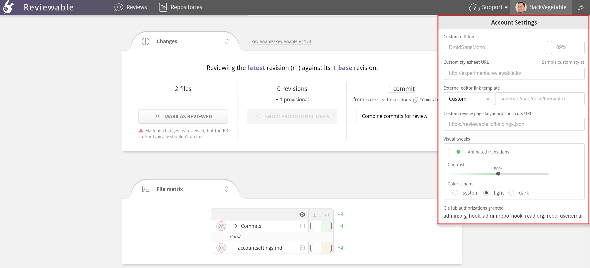

# Account Settings

When signed in, click your profile picture in the upper-right corner to view the account settings dropdown.  If you're already in a review, click the Reviewable icon in the upper-left corner first to reveal your profile picture.  

Here, you can manage your global settings and customize your Reviewable environment.  This chapter explains each setting from top to bottom. 

{width=590}

## Custom diff font

You can customize the font used in all the diffs. The font must be [monospace](https://medium.com/@vilcins/top-monospaced-fonts-for-coding-a7d941a143fe), match the exact font name, and already exist on your machine. Specify the font size in CSS format, such as 10pt, 1.2em, or 90%.  If the font can't be loaded, Reviewable will fall back on its built-in default.

## Custom stylesheet

You can point to a custom stylesheet that you want to apply to all diffs.  Reviewable uses [highlight.js](https://highlightjs.org/), so you might prefer to use one of those [predefined styles](https://highlightjs.org/demo) that can be found in their [styles directory](https://github.com/isagalaev/highlight.js/tree/master/src/styles). 

For example, to use the GitHub style, set the URL to `https://cdnjs.cloudflare.com/ajax/libs/highlight.js/8.2/styles/github.min.css`.  

You can also write your own custom styles by following the [highlight.js CSS class reference](http://highlightjs.readthedocs.io/en/latest/css-classes-reference.html).

::: danger
Make sure that your stylesheet is served as `text/css`. If your host doesn't set a Content-Type header automatically, you can use [https://raw.githack.com](https://raw.githack.com) or another similar service to set the MIME type for you.
:::

There are a few extra styles for highlighting tabs, trailing whitespace, and lack of a final newline that can be customized as well:

```css
.tab, .no-newline, .trailing {
  color: #D95C5C;
}

.tab:before {
  content: "\00bb\00a0\00a0\00a0";
}

.no-newline:before {
  content: "\00a0\20e0\23ce";
}
```

When viewing a diff in two-column mode, Reviewable only highlights the changed characters by default. If you prefer full-line red and green backgrounds similar to GitHub, you can add the styles from [this example](https://gist.github.com/pkaminski/2922da3d58f76a8ed7bf).

See more custom stylesheet snippets in the [Tips and Tricks](tips.md#visual-tweaks) section.

## External editor link template {#external-editor-line-link-template}

Reviewable lets you open files directly in your preferred external editor. Select your editor from the dropdown and provide the file path to your local git repos.

{width=410}

You can open a file by clicking its name in a [file diff panel header](files.md#file-header) and selecting **Open in editor**&nbsp;<i class="editor icon"/>.  To jump to a specific line, use the <i class="discussion scope icon"/>&nbsp;**line #** dropdown in the upper-right corner of any discussion.  

{width=480}

::: tip
You can open files in your external editor from the file matrix pane by holding down `⌘` or `Ctrl` + `Alt` or `⇧` when clicking a file name. More on this [here](files.md#file-list). 
:::

Your editor must support a custom URL scheme for linking to files to use this feature. Reviewable assumes that `/directory/with/repos` is the absolute path to the directory where your git repos live, and also that each repo directory is named the same as its repo.

There are a few caveats for specific editors:

* **Sublime Text:** You must install an appropriate URL handler.
* **Emacs:** You must install the [Emacs URL Handler](https://github.com/typester/emacs-handler) on OS X.
* **Atom:** You must install the [Atom Handler](https://github.com/WizardOfOgz/atom-handler) on OS X.
* **Eclipse:** You must install the [OpenInEclipse](https://gist.github.com/uncreative/1100212) script on OS X, or [follow the instructions for Linux](https://gist.github.com/jGleitz/cf9df461698f4e133cef). If you know of solutions for Windows, please [let us know](mailto:support@reviewable.io)!
* **IntelliJ IDEA, Android Studio, PyCharm, PHPStorm:** Should work on OS X, but not confirmed for other platforms.

### Custom editor link template {#custom-line-link-template}

You can specify a custom editor link template by choosing the `Custom` option in the editor dropdown. To base your custom template on one of the available editor templates, first select that template in the dropdown and then select `Custom`.  The file path to your local git repos will automatically be carried over when switching between editors.

For example, if you initially select `VS Code` and then select `Custom`, the following template will populate the template field:

`vscode://file//directory/with/repos/{{repo}}/{{path}}:{{line}}`

You can use these variables in your custom URL template:

* `{{owner}}` — the repo owner (or organization) username of the head (source) branch.
* `{{repo}}` — the repo name of the head (source) branch.
* `{{baseOwner}}` — the repo owner (or organization) username of the base (target) branch.
* `{{baseRepo}}` — the repo name of the base (target) branch.
* `{{pr}}` — the pull request number.
* `{{headBranch}}` — the name of the head (source) branch.
* `{{baseBranch}}` — the name of the base (target) branch.
* `{{path}}` — the full path to the file (does not start with /).
* `{{sha}}` — the commit sha of the latest revision in this review.
* `{{line}}` — the line number in the latest revision of the file that best represents the original context in which the comment was made.
* `{{viewLine}}` — the line number in the revision in which the discussion currently appears. This is the number that appears in the top-right corner of the discussion.  Not available for code blocks.

Typically, you'll want to open the latest version of a file into the editor.  In this case, use `{{line}}` rather than `{{viewLine}}`.  If you need any other variables for your template, please let us know.

## Custom key bindings

You can customize the key bindings for common commands, and add new ones for commands that aren't bound by default.  First, make a copy of the [default bindings file](https://reviewable.io/bindings.json) and put it somewhere accessible on the web (such as a [gist](https://gist.github.com/)). All available commands are listed in the file.  You can use any key combos supported by [Mousetrap](http://craig.is/killing/mice). If your favorite command isn't listed, please [open an issue](https://github.com/reviewable/reviewable/issues) so we can add it.

When you're done, point Reviewable to your custom bindings file by entering its URL in the **"Custom review page keyboard shortcuts URL"** field in the account settings dropdown. If you're using a gist, make sure to get the “raw” URL, and consider removing the commit SHA from the path to always point to the latest version.

Your bindings will be loaded and applied right away, and the keyboard shortcuts cheatsheet (type `?` in Reviewable) will automatically update to reflect them. Be sure to check the browser's console if they don't appear to work since any errors will appear there. To load any updates to your file, either reload the page or make a no-op edit to the URL field.

## Review notifications

Click the **Slack DM** toggle to turn review notifications via Slack on and off.  When turned on, you can choose between having notifications delivered **instantly** or **daily** (batched) at a given time.  Slack integration can be configured by organization owners in the [Admin Center](repositories.md#slack-integration). 

## Visual tweaks

Click the **Animated transitions** toggle to turn animated transitions on and off throughout the UI.

### Adjust contrast

Use the **Contrast** slider to adjust the UI contrast. Currently this only affects the red and green diff highlighting in reviews, but may be used for other UI elements in the future as well.

### Color scheme

You can switch between dark mode, light mode, or match your operating system's default display theme using the **Color scheme** radio buttons. By default, Reviewable will match your operating system's light or dark mode setting. Changing the color scheme in any Reviewable tab will immediately update it across all tabs and windows.

### Accessibility

You can enable **color replacement** (colorblind mode) to replace all shades of red and green across the app, making it easier to distinguish between the two in diffs. In single column diff layouts, plus and minus icons are also placed to the right side of the panel to further differentiate between changes. 

To use colorblind mode:

  - Turn on color replacement.
  - Click the left swatch to replace red, and the right swatch to replace green.
  - The default colors are optimized for users with deuteranopia. However, you can customize the colors to suit your needs.

To reset any custom colors back to the default red or green, click the "x" that appears after setting each custom color.

::: tip
When setting replacement colors, don't forget that you have the <a href="#adjust-contrast">contrast slider</a> at your disposal too. This primarily controls diff colors (and differentiation icons) and can help achieve a balanced UI when setting color replacements.
:::

## GitHub API background usage cutoff
You can set an hourly GitHub API usage cutoff to limit Reviewable's background requests for your account on its server. This applies a maximum across all types of quota but is typically most relevant for core API quota. This does not affect interactive usage of Reviewable. 

This setting can be helpful if you’re a member of an organization subscribed to GitHub Enterprise Cloud but also use personal access tokens or the gh command line tool. GHEC grants OAuth applications such as Reviewable a higher quota, but doesn’t extend this benefit to personal tokens, so it’s possible for Reviewable to unknowingly exhaust your quota. To prevent this, set the cutoff to a number below your personal token’s limit, e.g. 4000. 

## GitHub authorizations granted

This is a read-only list of all the GitHub OAuth scopes you've granted to Reviewable so far.  It can be useful to confirm the extent of permissions granted or when debugging GitHub API issues.
