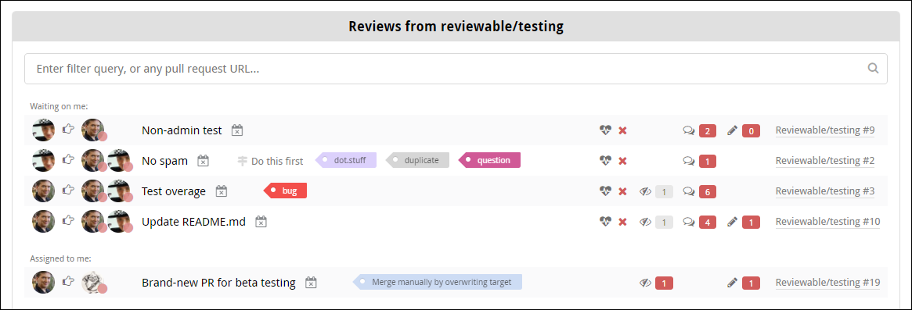
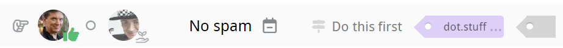
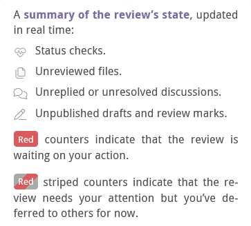
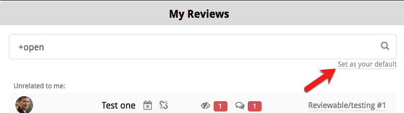
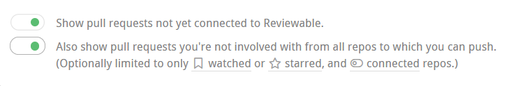

# Reviews dashboard

Click the **Reviews** button at the very top of the page to display the reviews list. If you're already in a review, click the Reviewable icon in the top left, then click **Reviews**. Here, you'll find all open pull requests in which you are a participant. These PRs have either been created by you, assigned to you, contain comments from you, or mention you (or a team you belong to).  Reviewable automatically updates this list at least once per minute (and data held in Reviewable is updated in real time), so there's no need to reload the page.

::: tip
If PRs appear to be missing from the list, try clicking the **Include stalled pull requests/reviews** link at the bottom of the panel. You may also want to click the green **Also show team reviews** or **Also show private reviews** buttons at the bottom if they're showing and you haven't yet granted those permissions. Finally, if PRs are still missing, check whether the relevant organizations have OAuth app access restrictions turned on.
:::

PRs are sorted into groups ordered from most to least relevant.  Within each group, PRs are sorted in chronological order — except for **Awaiting my action**, which shows PRs that are waiting on you first.  The logic that determines if a PR is waiting on you is described ([here](reviews.md#waiting-on)). The intention is that the PRs appear in the order you ought to deal with them. You cannot change the sort order, but you can filter the list instead (see below for details).

You can constrain the list to a specific organization by selecting it from the dropdown menu in the panel's header.  Your selection will be automatically saved for future visits.  You can also view all of the PRs in a specific repository by clicking one of the “N open reviews” links on the [Repository page](repositories.md), or by entering the full repository name and clicking on the "Go to dashboard for..." link under the query field.

::: tip
Loading the list of reviews for a single organization or repository will be much faster than doing so for all your repositories.
:::

You can further modify the view with the various toggles and filters on this page.  If a specific pull request isn't showing in the list, you can simply paste its URL into the filter field to access it directly.

The time since the list of PRs was last updated is displayed under the header.  The list refreshes automatically at regular intervals, but you can also force an immediate refresh by reloading the page.

::: tip
Up to three closed PRs from the previous three days may also be shown here. This makes it easier to follow up on recently completed reviews. Enter `+open` in the search bar to hide the closed PRs.  To show older closed PRs click **Show more concluded reviews** at the bottom of the panel, repeating as necessary.
:::

## Review state

Each review in the listing indicates the state of the review, in more-or-less real time.  People whose attention the review currently needs are show to the right of the <i class="waiting on icon"/>, while other participants follow the <i class="participating icon"/>.  Each avatar is decorated with the participant's current most important status, including PR authorship, GitHub approval (<i class="sanction approved icon"/>&nbsp;approved or <i class="sanction blocked icon"/>&nbsp;changes requested), discussion blocker, and LGTM. The rest of the line shows the pull request summary, current milestone, and labels (if any).

The <i class="unconnected icon"/> icon indicates that the repository for this PR is not connected to Reviewable and the review will update on demand only. In such cases, the counters may be out of date. An administrator can connect the repository from the [Repository page](repositories.md).

A <i class="stalled icon"/> icon indicates a stalled review that has not been updated in over two weeks.

Counters reflect the same information as you'll see on the review page:

{width=350}

If a PR is ready for merging, the status checks are successful, and all the counters are zero, then a merge button appears in the state column instead.  This lets you quickly merge completed PRs, but doesn't give access to merge options — open the review page to access those.

Other possible states include **Merged**, **Closed**, and **Archived**, which automatically applies to reviews that have been inactive for some time. Simply open an archived review to unarchive it.

::: tip
A PR won’t show a state until a corresponding Reviewable review has been created.
:::

## Open a review {#open-review}

Click on a PR to open the review, or hold down the appropriate modifier key to open it in a new tab.  If a <i class="create review icon"/> is shown, clicking on the listing will open a new review and insert a link into the description for the PR. If <i class="grey private icon"/> is also shown, this may begin a free trial.

Click the link on the right end of a listing to access the pull request on GitHub.

## Filter reviews

Use the search bar to search or filter by PR summary, repository, number, milestone, labels, author, or blocking reviewer. Results update instantly, and the query appears in the URL so you can easily bookmark or share it.

You can also use the special filters in the table below, adding either a `+` or `-` prefix to the special term (such as `+open`) to require or prohibit the specified condition respectively.

Add an OR operator to the positive filter by entering a comma. For example, `+needs:review,needs:fix` will filter for all reviews that need work, or have a failing check. For negative filters, the comma functions as an AND operator. More complex boolean expressions are not supported.

For the <code>±label:<i>name</i></code> filter, you must use double quotes around the label name if it contains spaces.

Filter | Meaning
-----|---------
`±open` | Currently open PR
`±red` | PRs with red counters
`±deferred` | PRs with deferred counters
`±mine` | Created, assigned, and requested PRs
<code>±label:<i>name</i></code> | PRs with given label
`±needs:` | &nbsp;
&nbsp;&nbsp;&nbsp; `review` | Incomplete reviews
&nbsp;&nbsp;&nbsp; `fix` | Reviews with failing checks
&nbsp;&nbsp;&nbsp; `merge` | Completed and clean reviews
&nbsp;&nbsp;&nbsp; `me` | Reviews waiting on you
&nbsp;&nbsp;&nbsp; `author` | Reviews waiting on author
&nbsp;&nbsp;&nbsp; `reviewer` | Reviews waiting on a reviewer
`±am:` | &nbsp;
&nbsp;&nbsp;&nbsp; `author` | Created PRs
&nbsp;&nbsp;&nbsp; `assigned` | Assigned PRs
&nbsp;&nbsp;&nbsp; `requested` | Requested reviewer PRs
`±draft` | PR draft, not yet fully open
`±merged` | PR that was successfully merged
`±closed` | PR that was closed without merging
`±public` | PRs from public repos
`±private` | PRs from private repos
`±starred` | PRs from repos you starred
`±watched` | PRs from repos you're watching
<code>±by:<i>username</i></code> | PRs authored by given user
<code>±with:<i>username</i></code> | PRs involving given user (or team)

::: tip
Click the small **Set as your default** link to set the query that will automatically be applied when you load the page.
:::

If shown, you can click the **Include stalled pull requests/reviews** link near the bottom of the panel to exclude or include any stalled PRs.  The current state of this toggle is reflected in the URL, so you can bookmark it.

## Other toggles

At the bottom of the Reviews page, you’ll find two toggle buttons:

{width=620}

**Show pull request not yet connected to Reviewable:**

If this toggle is on, the list will include PRs for which a review has not yet been created. Such a PR will be indicated with a <i class="create review icon"/>, and clicking that PR will connect that PR to a review and insert a link into the PR description.  You may want to turn off this toggle if you only want to see PRs from connected repositories.

**Also show pull request you’re not involved with from all repos to which you can push:**

If this toggle is on, the list includes all open PRs from repos where you have commit privileges, even if you're not a participant.  This is useful if you need to monitor repos for incoming PRs, such as if you're a manager, or an admin on an open source project.

Optionally, you can restrict this set of repos by clicking the icons/links in the text of the toggle to only show repos that you've <i class="watched off icon"/> watched or <i class="starred off icon"/> starred on GitHub, or <i class="connected off icon"/> connected repos (repos connected to Reviewable). This can be useful if you have push permissions to a lot of repos and you don’t want to see random open source repos while at work.