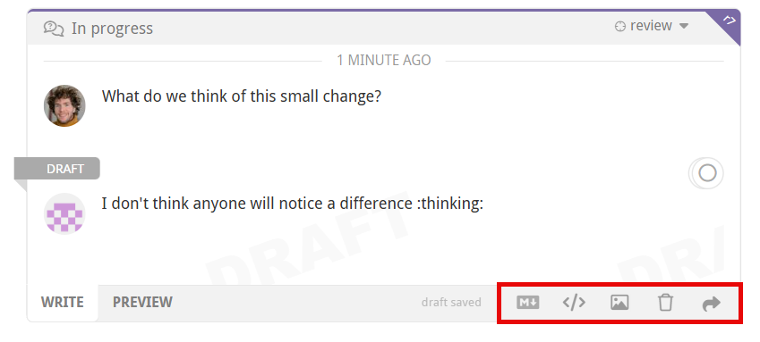
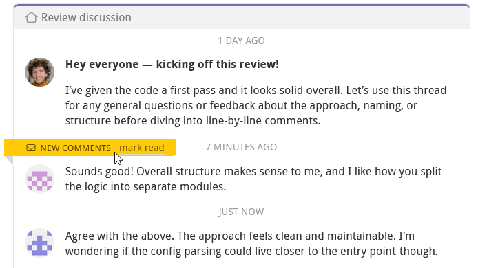
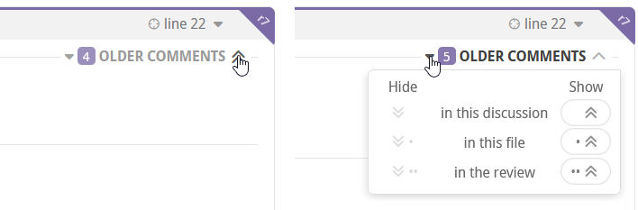
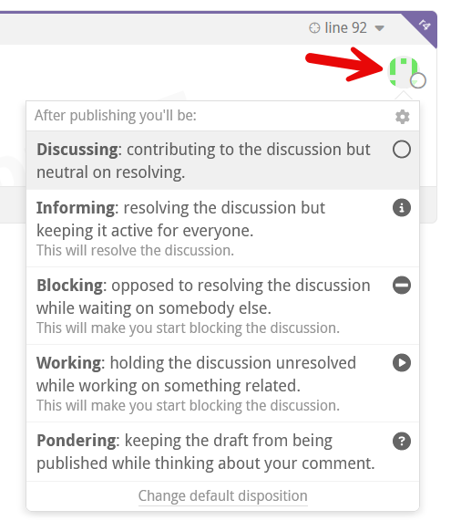
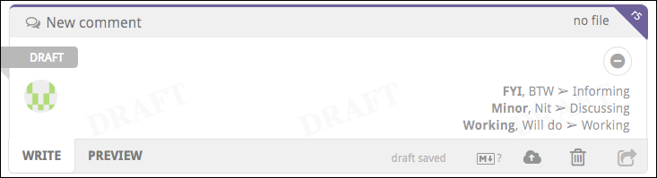

# Code review discussions

Review participants engage in discussions about the changes proposed in the pull request. A discussion is unresolved until it meets resolution criteria that corresponds to the dispositions of the participants. Any discussion will remain in place until it is resolved by the participants — irrespective of whatever changes occur to the files in the PR.  A discussion may also be unreplied for specific users; this state is independent of the discussion being resolved or not.

This chapter covers all types of Reviewable discussions, including the general discussion, other top-level discussions, and all the various line-specific discussions that occur among all review participants.

?> All draft comments, pending acknowledgements, disposition changes, and dismissals will be published along with the review. Learn more in the [Publishing section](reviews.md#publish).

Each comment indicates its author via an avatar, over which you can hover for more details. You can use the browser's find in page feature to search through all the comments for all instances of the author’s name or username. This technique will work even though the names and usernames aren’t actually visible on the page.

## Starting a new discussion

You can start a new discussion by clicking on a diff line, as explained [here](files.md#line-discussion).  If no diff is available for a file for some reason, you can also start a file-wide discussion by clicking on **Start new discussion** under the file header instead.

For discussions that are not specific to a file, click the **Start a new discussion** button at the bottom of the top-level discussions area (below the general discussion).  Typically, you would begin a top-level discussion if you want to have a distinct file-independent thread in which you can track the disposition of participants and an eventual resolution. You may also want to do it just to separate a thread out, even if you don't care about resolution.

## Replying to a discussion

At the bottom of each discussion box you can write a comment to add to the discussion. The draft is saved continuously as you write, but won’t be visible to others until it's [published](reviews.md#publish) or sent (see below).

?> While no one can read your drafts, other participants will be able to see that you have unsent drafts pending and how long ago you last touched the review (for example, by editing a draft).

All comments are formatted as [GitHub-flavored Markdown](https://guides.github.com/features/mastering-markdown/) — clicking the small Markdown logo in the draft toolbar will open a reference page.  You can also switch to the **Preview** tab at any time to check how your comment will be rendered.

You can add images to your comment by clicking the upload button, by dragging an image onto the draft, or by pasting an image from your clipboard (in some browsers). If desired, you can delete your draft by clicking the small trash icon. The trashed draft is retrievable by creating another comment in the same spot.

**Sending messages immediately:**  Click the <i class="fa fa-share-square-o"></i> button to immediately post the comment on the pull request. This doesn't affect any other pending comments, which is useful if a big review round is in progress, you have many drafts pending, and you need to send out an intermediate clarification or request. Since each recipient will receive an alert for each message you send this way (as configured by default in GitHub), it would normally be preferable to write all of your comments and then [publish](reviews.md#publish) them all together.

### Inline directives :id=inline-directives

You can add special directives inline to any comment (not just top-level ones) to add or remove labels, set the milestone, and add or remove assignees or reviewers.  Reviewable doesn't use a special UI for this so that it's easy to do without lifting your hands from the keyboard, works in all contexts (including when replying by email or on GitHub), and leaves an easily readable record.

The directives you can use are **±label**, **±milestone**, **±@username** (for assignees) and **±reviewer:@username** (for requested reviewers).  Reviewable will warn you about invalid assignees or reviewers — either directly or via email if necessary — but not about bad labels or milestones since false positives are too common there.

!> For email and GitHub comments, if the repo is not connected then directives won't take effect until somebody visits the review in Reviewable.  Editing directives in a previously sent message won't work either.

### Replying via email or on GitHub

Reviewable will do its best to parse incoming messages and split them up into the appropriate comment threads. This only works well, however, if you leave all the separators and comment links in place so be sure not to mangle a quoted message too much in your reply. Quoted chunks will be shown in Reviewable if they are woven into your reply, but omitted otherwise (whether the message is top- or bottom-quoted). Any parts of the message that can't be conclusively tied to a specific discussion will show up in a top-level comment instead.

Reviewable recognizes a number of case-insensitive shorthands in external comments.  You can reply with the single word **acknowledge** (or **ack**) to simulate clicking the primary button in Reviewable (whatever its label might actually be). You can also update the disposition in your reply by inserting on a line, by itself, **<i class="fa fa-circle-o"></i> Discussing**, **<i class="fa fa-check-circle"></i> Satisfied**, **<i class="fa fa-info-circle"></i> Informing**, **<i class="fa fa-play-circle"></i> Working**, or **<i class="fa fa-minus-circle"></i> Blocking**.

?> For information on how to use other shorthands that work in email and in-app comments alike, see [inline directives](#inline-directives) above and [initial keywords](#change-disposition) further down.

## Ending a discussion

If you don't need to reply to a discussion you can click the primary action button at the bottom instead. The button's label will indicate its precise action — corresponding to both your role and the state of the discussion — but the general meaning is “I have nothing further to say about this”. Clicking the button will always mark the discussion as read, and usually set your [disposition](#dispositions) to **<i class="fa fa-check-circle"></i> Satisfied** as well:

| Role | Discussion | Button label | Effect |
|------|------------|:------------:|--------|
| **<i class="fa fa-info-circle"></i> Informing** | Resolved with no other participants | **Retract** | Sets disposition to **<i class="fa fa-check-circle"></i> Satisfied** |
| **<i class="fa fa-info-circle"></i> Informing** | Resolved | **Conclude** | Sets disposition to **<i class="fa fa-check-circle"></i> Satisfied** |
| Active participant, not **<i class="fa fa-check-circle"></i> Satisfied** | Unresolved with no other participants | **Retract** | Sets disposition to **<i class="fa fa-check-circle"></i> Satisfied** |
| Active participant or PR author, not **<i class="fa fa-check-circle"></i> Satisfied** | Unresolved and switching to **<i class="fa fa-check-circle"></i> Satisfied** would resolve | **Resolve** | Sets disposition to **<i class="fa fa-check-circle"></i> Satisfied** |
| PR author not **<i class="fa fa-check-circle"></i> Satisfied**, or anyone **<i class="fa fa-play-circle"></i> Working** | **Unresolved** | **Done** | Sets disposition to **<i class="fa fa-check-circle"></i> Satisfied** and creates a "Done." message |
| **<i class="fa fa-minus-circle"></i> Blocking** | Unresolved and nobody **<i class="fa fa-play-circle"></i> Working** | **Accept** | Sets disposition to **<i class="fa fa-check-circle"></i> Satisfied** |
| Any | Unread comments | **Acknowledge** | Sets disposition to **<i class="fa fa-ellipsis-h"></i> Following** if passive participant or not a participant |

## Unreplied discussions

A discussion is unreplied for you when there are comments in the discussion that you haven't acknowledged, replied to, or marked as read. Unreplied discussions will increment your red discussions counter for the review. A discussion is also unreplied for you if one of the following rules applies, but _none of the preceding rules apply to anybody else_, even if you're caught up on the comments.

1. You are an active participant, or are **<i class="fa fa-at"></i> Mentioned**, or you are the PR author, or one of the participants is **<i class="fa fa-info-circle"></i> Informing**, and you have unread comments, or you are **<i class="fa fa-play-circle"></i> Working**.
2. You are the PR author and the discussion has only one active participant (which is not you). This applies even if you have no unread comments; that is, you acknowledged the discussion without replying.
3. You are not the PR author, the discussion has only the PR author as the active participant, and you have unread comments.
4. You are **<i class="fa fa-minus-circle"></i> Blocking** and the last comment is not yours.
5. You are **<i class="fa fa-circle-o"></i> Discussing** and the last comment is not yours.
6. You are **<i class="fa fa-minus-circle"></i> Blocking**.
7. You started the discussion, and remain an active participant.
8. You are an active participant.

If you have a draft reply to a discussion, the discussion is considered replied unless new comments were made since you last edited your draft. This is the case even if the draft state will cause it to become unreplied for you once published. Your published state is still used in the view of all other participants.

### New and old comments

The yellow **New comments** ribbon demarcates the point where comments that are new to you begin.  Normally they'd lose their “new” status implicitly once you reply or click the primary action button, but if you don't want to do that yet for some reason you can hover over the ribbon to reveal a **mark read** link instead.

?> Marking comments as read (by any means) is also buffered as a draft and revealed to others only when publishing.  This avoids situations where a discussion shows up as unreplied to somebody else before your reply was published.

Some older comments may be hidden, as indicated by the **Show N older comments** link in the discussion header. Click the link to toggle showing older comments for this discussion, or click the drop-down arrow to reveal options for displaying older comments in **this file** or in **all files**.

## Dispositions and resolution

When publishing comments in the discussion you’ll want to take note of your disposition, which indicates your attitude towards resolving the discussion. You take on a default disposition when you join a discussion and, to begin with, you’ll simply rely on these defaults and the normal action buttons. As you participate in more discussions, you may eventually decide to explicitly set your disposition or even change the defaults that Reviewable uses in various situations.

?> To commit disposition changes they must be published — even if you make no corresponding comment.  Disposition changes do not mark the discussion as read unless they are part of a reply.

These are the dispositions that make one an active participant in a discussion and that you can select explicitly (though not all may be available in every situation):

* **<i class="fa fa-circle-o"></i> Discussing** — Neutral on whether the discussion should be resolved; will possibly continue the discussion.
* **<i class="fa fa-minus-circle"></i> Blocking** — Opposed to resolving the discussion while waiting on another contributor.
* **<i class="fa fa-play-circle"></i> Working** — Keeping the discussion unresolved while working on a related task This differs from **<i class="fa fa-minus-circle"></i> Blocking**, in that you remain the party responsible for moving the discussion forward, and the discussion will not ask for actions from other participants.
* **<i class="fa fa-check-circle"></i> Satisfied** — In favor of resolving the discussion. If there are no other participants, then the discussion is resolved and will not be brought to the attention of others.
* **<i class="fa fa-info-circle"></i> Informing** — Discussion is resolved, but left active for others to comment.

Passive participants will exhibit other dispositions, such as **<i class="fa fa-ellipsis-h"></i> Following**, **<i class="fa fa-at"></i> Mentioned**, and **<i class="fa fa-ban"></i> Dismissed**.

A discussion is _resolved_ if and only if at least one participant is **<i class="fa fa-check-circle"></i> Satisfied** or **<i class="fa fa-info-circle"></i> Informing** and none of the participants are **<i class="fa fa-play-circle"></i> Working** or **<i class="fa fa-minus-circle"></i> Blocking**, or if there are no active participants left. (Participants whose disposition is **<i class="fa fa-circle-o"></i> Discussing** are abstaining from the decision.)

?> If you have draft state on the discussion (as in the case of a reply, for example), the proposed value is used when computing the resolved state in your view.

?> Participants in the general discussion have no dispositions, and it's always considered resolved.  Other top-level discussions created by clicking the **Start a new discussion** button behave normally.

### Checking and changing dispositions :id=change-disposition

Your avatar in the lower-right corner of every discussion box has a small icon that indicates your current disposition.  Hover over it (or swipe left) to show the avatars and dispositions of all the participants in the discussion.  Click on your avatar to change your disposition, or on another participant's avatar to see a description of their current disposition.

You can also change your disposition as you're writing your comment without touching the mouse. When you create a new draft notice — before you begin typing — the small list of disposition mappings in the lower-right corner of the draft box. These are some examples of what you'll find there:

*   FYI or BTW → **<i class="fa fa-info-circle"></i> Informing**
*   Minor or Nit → **<i class="fa fa-circle-o"></i> Discussing**
*   Working or Will do → **<i class="fa fa-play-circle"></i> Working**

Starting your draft with one of these words will switch to the corresponding disposition, letting you keep your hands on the keyboard. However, any manual change to the disposition will permanently override any keyword in the draft text.

You can also assign disposition changes to [keyboard shortcuts](accountsettings.md#custom-key-bindings) with the `setCurrentDiscussionDisposition` command.

?> You may find it necessary to dismiss a user from a discussion — if, for example, the user isn't responding, has gone on vacation, or has left the organization. If you have the necessary permissions on the repo, you can open the disposition dropdown for another active participant and click either **Dismiss from this discussion** or **Dismiss from all discussions** at the bottom of the drop-down.  (By default, anybody with write access to the repo can dismiss another participant, but you can change this in the [repo settings](repositories.md#discussion-participant-dismissers).)

### Resolution workflows

By default, a comment that creates a new discussion will set your disposition to **<i class="fa fa-minus-circle"></i> Blocking**. A user's first reply to an existing discussion will set their disposition to **<i class="fa fa-circle-o"></i> Discussing** if not already an active participant. You can change the default disposition to fit your workflow preference.

For example, consider that the default disposition is **<i class="fa fa-minus-circle"></i> Blocking** for both PR author-initiated and reviewer-initiated discussions. However, as the PR author, you may want to let the reviewer resolve these by changing the default disposition to **<i class="fa fa-circle-o"></i> Discussing**, or choose **<i class="fa fa-info-circle"></i> Informing** as the default to encourage purely informational discussions.

Similarly, if you're following an informal review process, you may want to set the default disposition of your reviewer-initiated discussions to **<i class="fa fa-circle-o"></i> Discussing**, which enables the author to resolve a discussion directly.

There are 4 default dispositions (the combinations of author/reviewer and new/reply), and you can set each one individually. The disposition dropdown has a **Change default disposition** link at the bottom that, once clicked, will lock in your next selection as the default for situations like that of the current comment.  (For clarity, the link will change to a description that states which default you're setting.)

?> If you are **<i class="fa fa-circle-o"></i> Discussing** and another participant resolves the discussion without writing a comment, you normally won't be notified about it and the discussion will simply disappear from your view.  If you'd like to double-check such resolutions without having to block the discussion, you can turn on **Trust but verify** mode via the small <i class="fa fa-cog"></i> settings icon in the top-right corner of any of your disposition dropdowns.

