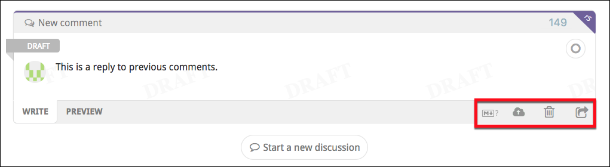

# Code review discussions

Reviewable lets participants review and discuss many different parts of a pull request. Each comment thread, whether it’s about the whole review or a single line of code, is called a **discussion**.  As discussions progress, participants may indicate their stance towards a resolution — whether they’re working on a related task, happy with the discussion's outcome, or simply adding context. These stances are called **dispositions**.  Once everyone’s on the same page about the outcome, the discussion is considered resolved.

Discussions stay visible until everyone involved reaches an agreement and marks them resolved. This state is independent of any file changes that might happen in the PR; even if the code changes, the discussion remains in place until it’s explicitly resolved.

A discussion can also be marked as unreplied for specific users — meaning someone still needs to respond — which is separate from whether the discussion itself is resolved.

Each comment in a discussion indicates its author via an avatar, which you can hover over for more details. You can use your browser's "find in page" feature (`⌘-f` or `ctrl-f`) to search through all comments for all instances of the author’s name or username. This technique will work even though the names and usernames aren’t actually visible on the page.

::: tip
When you publish a review, any draft comments in discussions — along with disposition changes or pending acknowledgements — are published too. Learn more in the [Publishing section](reviews.md#publish).
:::

## Starting a new discussion

You can start a new discussion by clicking on a diff line, as explained [here](files.md#line-discussion).  File-wide discussions can be started by clicking the file name and selecting **Start a new discussion** from the dropdown.

For discussions that aren’t tied to a specific file, click **Start a new discussion** at the bottom of the **<i class="discussions icon"></i>&nbsp;Top level discussions** panel (below the diffs panel).  Start a top-level discussion when you want to create a separate, file-independent thread to track participants’ dispositions (such as **<i class="blocking disposition icon"/>&nbsp;Blocking** or **<i class="satisfied disposition icon"/>&nbsp;Satisfied**) and the eventual resolution. You can also use it to branch off a topic that deserves its own focused thread.

## Replying to a discussion

At the bottom of each discussion box you can write a comment to add to the discussion. The draft comment is saved continuously as you write, but won’t be visible to others until it's [published](reviews.md#publish) or sent (see below).

::: tip
While no one can read your drafts, other participants will be able to see that you have unsent drafts pending and how long ago you last touched the review (for example, by editing a draft) via the [participants panel](reviews#participants).
:::

All comments are formatted as [GitHub-flavored Markdown](https://guides.github.com/features/mastering-markdown/) — clicking the small Markdown logo <i class="markdown icon"/> in the draft toolbar will open a reference page.  You can also switch to the **Preview** tab at any time to check how your comment will be rendered.

{width=620}

You can add images and videos to your comment by clicking the upload button <i class="upload cover icon"/>, by dragging an image onto the draft, or by pasting an image from your clipboard (in some browsers). **MP4**, **MOV**, and **GIF** formats are also supported, with a maximum upload size of 100MB.  Other file types such as documents, CSVs, or binaries, are not supported.

If desired, you can delete your draft by clicking the small trash icon <i class="delete draft icon"/>. The trashed draft is retrievable by creating another comment in the same spot.

**Sending messages immediately:**  Click the <i class="send icon"/>&nbsp;button to immediately post the comment on the pull request. This won't publish any other draft comments, which is useful when a large review is in progress and you need to send out a quick clarification or request. Since each recipient will receive an alert for each message sent this way (as configured by default in GitHub), it is usually better to write all of your comments first and then [publish](reviews.md#publish) them together.

### Inline directives

You can add inline directives in any comment to quickly manage labels, milestones, assignees, and reviewers. Reviewable keeps this feature text-based (rather than adding extra UI) so you can work entirely from the keyboard, whether you’re using the web app, replying by email, or posting on GitHub. It also leaves a clear, readable record in the comment itself.

::: tip
You can apply directives without publishing comments using the <i class="command icon"/>&nbsp; text field in the [pull request panel](reviews#pull-request-details) <i class="pull request icon"/>.
:::

While writing a comment, type a `+` sign to open an autocomplete menu of available directives. Use the arrow keys to navigate and `Tab` or `Enter` to select one. You can also use a `-` sign to remove a directive after it's been added.

Supported directives include:
* **+label**
* **+milestone**
* **+@username** (for assignees)
* **+reviewer:@username** (for requested reviewers)

Reviewable will warn you if you reference invalid assignees or reviewers — either immediately or via email — but not for labels or milestones, since false positives are common there.  If you’re referencing code or variables that look like directives (for example, @user or +dependencies), wrap them in backticks to prevent Reviewable from treating them as inline directives.


::: danger
For email and GitHub comments, if the repository isn’t connected, then directives won’t take effect until someone visits the review in Reviewable. Editing directives in a previously sent message won't work either.
:::

### Replying via email or on GitHub

Reviewable will do its best to parse incoming messages and match them to their corresponding discussion threads. This only works well if you leave all the separators and comment links in place - so be sure not to mangle a quoted message too much in your reply.

When replying by email, be sure to use interleaved style — placing your responses below the relevant quoted lines (rather than top-posting your entire reply). This helps Reviewable correctly match each comment to its thread.

Quoted chunks will be shown in Reviewable if they are woven into your reply, but omitted otherwise (whether the message is top- or bottom-quoted). Any parts of the message that can't be conclusively tied to a specific discussion thread will show up in a top-level discussion instead.

Reviewable also recognizes a number of case-insensitive shorthands in external comments.  You can reply with the single word **acknowledge** (or **ack**) to simulate clicking the primary button in Reviewable (whatever its label might actually be). You can also update the disposition in your reply by inserting on a separate line, by itself, "Discussing", "Informing", "Working", or "Blocking".

When replying by email, be sure to separate your comment and disposition with **one blank line**, otherwise GitHub may interpret the disposition as part of the comment text.  For example:
```
> This looks great. (this was the last comment on the discussion)
Hold up, I found a bug!

Blocking
```

::: tip
For information on how to use other shorthands that work in email and in-app comments alike, see [inline directives](#inline-directives) above and [initial keywords](#change-disposition) further down.
:::

## Dispositions

As you interact with a discussion, Reviewable tracks your disposition — your current stance toward resolving it.  You start with a default disposition when you first join a discussion.  As you write comments or use the primary action buttons below a discussion, Reviewable adjusts your disposition to reflect your actions and intent.

While dispositions are handled automatically, you can also set them explicitly or adjust the defaults that Reviewable uses in different situations.  Doing so gives you finer control over how the review progresses.

::: tip
Changes to your disposition must be published to take effect, even if you don’t add a comment.
Updating your disposition alone does not mark the discussion as read unless it’s part of a reply.
:::

These dispositions make you an active participant in a discussion. You can select them directly, though some may not appear in every context.

Disposition | Meaning
:---------- |---------
**<i class="discussing disposition icon"/>&nbsp;Discussing**| Neutral about resolution — continuing or exploring the topic.
**<i class="blocking disposition icon"/>&nbsp;Blocking**| Opposed to resolution while waiting on another contributor.
**<i class="working disposition icon"/>&nbsp;Working**| Keeps the discussion unresolved while you work on a related task. Unlike **<i class="blocking disposition icon"/>&nbsp;Blocking**, you’re responsible for moving the discussion forward, not others.
**<i class="satisfied disposition icon"/>&nbsp;Satisfied**| Indicates you’re ready to resolve.  If there are no other participants, then the discussion will be resolved and will not be brought to the attention of others.
**<i class="informing disposition icon"/>&nbsp;Informing**| Discussion starts out resolved but remains open for others to comment.

Participants who aren’t actively engaged may have other dispositions, such as:
**<i class="following disposition icon"/>&nbsp;Following**,
**<i class="mentioned disposition icon"/>&nbsp;Mentioned**, or
**<i class="dismissed disposition icon"/>&nbsp;Dismissed**.

Another special disposition is **<i class="pondering disposition icon"/>&nbsp;Pondering**, which indicates that you’re still thinking about your response. When this is selected, your drafted reply will not be published.

### Checking and changing dispositions {#change-disposition}

Your avatar in the lower-right corner of every discussion box has a small icon that indicates your current disposition.  Hover over it (or swipe left) to show the avatars and dispositions of all the participants in the discussion.  Click on your avatar to change your disposition, or on another participant's avatar to see a description of their current disposition.

{width=400}

You can also change your disposition while writing a comment using keywords. Before you begin typing on a new discussion or a reply, you'l notice a small list of disposition mappings in the lower-right corner of the draft box. Typing one of these keywords before your comment automatically sets the corresponding disposition:

* FYI or Tip → **<i class="informing disposition icon"/>&nbsp;Informing**
* Typo, Minor, or Nit → **<i class="discussing disposition icon"/>&nbsp;Discussing**
* LGTM or Done → **<i class="satisfied disposition icon"/>&nbsp;Satisfied**
* Working, TODO, or Will do → **<i class="working disposition icon"/>&nbsp;Working**
* Major, Bug, or Hold on → **<i class="blocking disposition icon"/>&nbsp;Blocking**
* ??? → **<i class="pondering disposition icon"/>&nbsp;Pondering**

Starting your draft with one of these words will switch to the corresponding disposition, letting you keep your hands on the keyboard. However, any manual change to the disposition will permanently override any keyword in the draft text.  If a keyword was accepted, it will be highlighted in yellow; if it was discarded, it will be crossed out.  Either way, you can click on it to view a short explanation of what happened.


::: tip
If you find yourself using these words to switch dispositions accidentally, you can disable the feature altogether in the panel accessed via the small <i class="settings icon"/>&nbsp;settings icon in the top-right corner of any of your disposition dropdowns.
:::

You can also assign disposition changes to [keyboard shortcuts](accountsettings.md#custom-key-bindings) with the `setCurrentDiscussionDisposition` command.

### Dismissing users from discussions {#dismissing-users}

You may find it necessary to dismiss a user from a discussion — if, for example, the user isn't responding, has gone on vacation, or has left the organization. If you have the necessary permissions on the repo, you can open the disposition dropdown for another active participant and click one of the links at the bottom of the dropdown to dismiss them from **this discussion** or **unresolved discussions**.

{width=570}

If your disposition is **<i class="satisfied disposition icon"/>&nbsp;Satisfied**, and you have started a draft, you may dismiss all blocking reviewers by clicking a **dismiss dissenter(s)** link on the top right side of the draft to the left of the grouped avatars.  By default, anybody with write access to the repo can dismiss another participant, but admins can change this in the [repo settings](repositories.md#discussion-participant-dismissers).)

## Unreplied discussions

A discussion is unreplied for you when there are comments in the discussion that you haven't acknowledged, replied to, or marked as read. Unreplied discussions will increment your red discussions counter <i class="discussions icon"/> <span class="red label">2</span> for the review. A discussion is also unreplied for you if one of the following rules applies, but _none of the preceding rules apply to anybody else_, even if you're caught up on the comments.

1. You are an active participant, or are **<i class="mentioned disposition icon"/>&nbsp;Mentioned**, or you are the PR author, or one of the participants is **<i class="informing disposition icon"/>&nbsp;Informing**, and you have unread comments, or you are **<i class="working disposition icon"/>&nbsp;Working**.
2. You are the PR author and the discussion has only one active participant (which is not you). This applies even if you have no unread comments; that is, you acknowledged the discussion without replying.
3. You are not the PR author, the discussion has only the PR author as the active participant, and you have unread comments.
4. You are **<i class="blocking disposition icon"/>&nbsp;Blocking** and the last comment is not yours.
5. You are **<i class="discussing disposition icon"/>&nbsp;Discussing** and the last comment is not yours.
6. You are **<i class="blocking disposition icon"/>&nbsp;Blocking**.
7. You started the discussion, and remain an active participant.
8. You are an active participant.

If you have a draft reply to a discussion, the discussion is considered replied to and the discussion counter will decrement, unless new comments were made since you last edited your draft. This is the case even if the draft state will cause it to become unreplied for you once published. Your published state is still used in the view of all other participants.

### New and old comments

The yellow **New comments** ribbon marks the point where unread comments begin.  Normally they'd lose their “new” status once you reply or click the primary action button. If you just want to clear the marker without responding, hover over the ribbon to reveal a **Mark read** link.

::: tip
Marking comments as read (by any means) is also buffered as a draft and revealed to others only when publishing.  This avoids situations where a discussion shows up as unreplied to somebody else before your reply was published.
:::

{width=580}

Some older comments may be hidden, as indicated by the purple **N older comments** label in the upper right corner of a discussion. Click the <i class="expand up icon"/>&nbsp;icon to show the **previous comment** for this discussion, or hold your click before releasing to show all older comments in the discussion.  For more options, click the drop-down arrow to reveal options for displaying or hiding all older comments in **this discussion**, **this file**, or **the review**.

{width=580}

## Ending a discussion

When you're finished with a discussion, click the primary action button at the bottom to resolve your part in it. Its label changes depending on your role and the discussion's state, but it generally means "I'm all set here".

{width=580}

Clicking it marks the discussion as read and usually sets your [disposition](#dispositions) to **<i class="satisfied disposition icon"/>&nbsp;Satisfied**:


 Role | Discussion | Button label | Effect
------|------------|:------------:|--------
 **<i class="informing disposition icon"/>&nbsp;Informing** | Resolved with no other participants | **Retract** | Sets disposition to **<i class="satisfied disposition icon"/>&nbsp;Satisfied**
 **<i class="informing disposition icon"/>&nbsp;Informing** | Resolved | **Conclude** | Sets disposition to **<i class="satisfied disposition icon"/>&nbsp;Satisfied**
 Active participant, not **<i class="satisfied disposition icon"/>&nbsp;Satisfied** | Unresolved with no other participants | **Retract** | Sets disposition to **<i class="satisfied disposition icon"/>&nbsp;Satisfied**
 Active participant or PR author, not **<i class="satisfied disposition icon"/>&nbsp;Satisfied** | Unresolved and switching to **<i class="satisfied disposition icon"/>&nbsp;Satisfied** would resolve | **Resolve** | Sets disposition to **<i class="satisfied disposition icon"/>&nbsp;Satisfied**
 **<i class="working disposition icon"/>&nbsp;Working** | Unresolved | **Done** | Sets disposition to **<i class="satisfied disposition icon"/>&nbsp;Satisfied** and creates a "Done." message
 PR author | Unresolved and nobody **<i class="working disposition icon"/>&nbsp;Working** | **Done** | Sets disposition to **<i class="satisfied disposition icon"/>&nbsp;Satisfied** and creates a "Done." message
 **<i class="blocking disposition icon"/>&nbsp;Blocking** | Unresolved and nobody **<i class="working disposition icon"/>&nbsp;Working** | **Accept** | Sets disposition to **<i class="satisfied disposition icon"/>&nbsp;Satisfied**
 Any | Unread comments | **Acknowledge** | Sets disposition to **<i class="following disposition icon"/>&nbsp;Following** if passive participant or not a participant

### Resolution

A discussion is considered resolved when at least one participant is **<i class="satisfied disposition icon"/>&nbsp;Satisfied** or **<i class="informing disposition icon"/>&nbsp;Informing**, and no participants are **<i class="blocking disposition icon"/>&nbsp;Blocking** or **<i class="working disposition icon"/>&nbsp;Working**.

If there are no active participants left, the discussion is also treated as resolved.
Participants marked **<i class="discussing disposition icon"/>&nbsp;Discussing** are neutral and don’t affect the resolution either way.

::: tip
If you have a draft in the discussion (for example, a pending reply), the draft’s proposed disposition is used when calculating the resolved state in your own view.
:::

::: tip
The main Review discussion <i class="main discussion icon"/> has no dispositions and is always considered resolved. Other top-level discussions created with the **Start a new discussion** button behave normally.
:::

### Resolution workflows

By default, a comment that creates a new discussion will set your disposition to **<i class="blocking disposition icon"/>&nbsp;Blocking** if you're a reviewer, or to **<i class="discussing disposition icon"/>&nbsp;Discussing** if you're the pull request's author. Your first reply to an existing discussion will set your disposition to **<i class="discussing disposition icon"/>&nbsp;Discussing** if you're not already an active participant.

::: tip
For enterprise installs, these defaults can change overridden using the [REVIEWABLE_DISPOSITION_DEFAULTS](https://github.com/Reviewable/Reviewable/blob/master/enterprise/config.md#ui-customization) environment variable.
:::

You can change your default disposition to match your workflow.  For example, if you're following an informal review process, you might set the default disposition for reviewer-initiated discussions to **<i class="discussing disposition icon"/>&nbsp;Discussing**, which allows the author to resolve those discussions directly.

There are 4 default dispositions — one for each combination of author/reviewer and new/reply — and you can set each individually.  When drafting your first comment in a discussion, open the disposition dropdown, click **Change default disposition** at the bottom, and then select the new default disposition.  Your selection will be saved as the new default for that situation.

You can leave a discussion to remove your disposition toward its resolution. For any ongoing discussion, click **Disengage from the discussion** at the bottom of the disposition dropdown.  This sets your disposition to **<i class="disposition dismissed icon"/>&nbsp;Disengaged**. You’ll no longer be awaited when new comments appear, and any previous dispositions (such as **<i class="blocking disposition icon"/>&nbsp;Blocking**) will be cleared. You can rejoin the discussion at any time by selecting a new disposition.

::: tip
If you are **<i class="discussing disposition icon"/>&nbsp;Discussing** and another participant resolves the discussion without writing a comment, you normally won't be notified about it and the discussion will simply disappear from your view.  If you'd like to double-check such resolutions without having to block the discussion, you can turn on **Trust but verify** mode via the small <i class="settings icon"/>&nbsp;settings icon in the top-right corner of any of your disposition dropdowns.
:::
