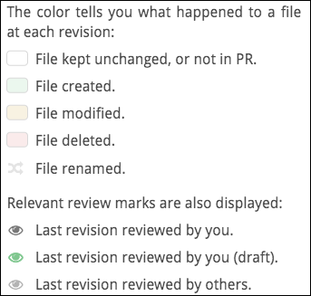
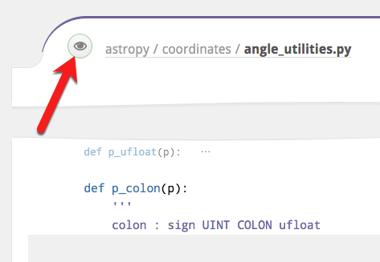
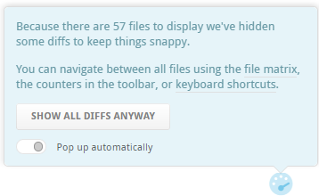
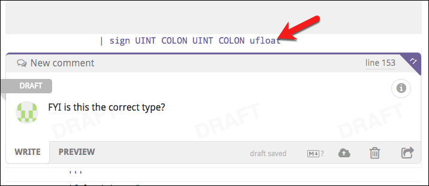
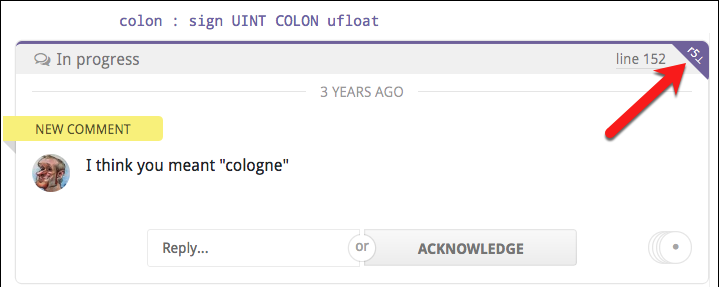

# File Diffs 

Below the [Discussion](discussions.md) section, you'll find the File Diff panel. 

At the top of the File Diff panel, you'll see a file path. Click it to jump to the file's diff. Hold down **⌘** or **⇧** to open it in a new tab. File paths that are shown in italic script have been hidden from view but will appear if you click the link.


<br>
<br>

## Changing the diff bounds

You'll also notice a group of cells that indicate the evolution and state of the files for this diff. The brackets define the left and right diff bounds. To modify these bounds, click-and-drag a bracket to where it should be.


<br>
<br>

In the File Diff panel, you can see the diff between the two revisions of the file, currently set as the diff bounds.


<br>
<br>

## Diff width control 

As you decrease the width of the browser window, the File Diff panel will convert from a side-by-side view to a unified view, and vice-versa. Also, a reasonable, round number of columns at which to wrap the code will automatically be arranged.

You can override this behavior using the small caret in the top right corner of every File Diff panel. Drag the caret to manually set the number of columns at which to wrap code, and Reviewable will automatically go to a side-by-side view if your window is wide enough. Otherwise, it will stick with a unified view. Click **Auto** to revert line wrapping control back to Reviewable. Finally, in either state, you can toggle on **Single** to force a unified diff view even if the window is wide enough to fit two columns. \

<table border ="1", bgcolor="ADE9FB">
<tbody>
<tr>
<td><strong>NOTE</strong>: All of these settings are personal but global across all files, PRs, and repos.</td>
</tr>
</tbody>
</table>


<br>

## Mark the file as reviewed  

Click the small button to the left of a the file path (see the figure above) to indicate that you have reviewed that file. 


<br>
<br>

This marks a file as reviewed up to its current right diff bound. This doesn't necessary mean that you are indicating that the file is ready for merging, but rather only that you reviewed it at the current diff's right bound revision and added all of your review comments.

Click on a red button to change it to green, which makes it easy in the future to diff against the last revision that you reviewed.

The button color reflects the current state:

*  — The file has not yet been reviewed at or after the right diff-bound. Click the button to mark the file as reviewed.

*  — Reviewed by you at the right diff-bound. Click to rescind your review marking.

*   — The file has not yet been reviewed at or after the right diff-bound. However, marking is not advised because some unreviewed changes are not shown in the current diff—or you are the author of the PR.
  
*  — Reviewed by you or someone else at or after the right diff-bound. It is redundant to mark the file as reviewed.


## Expanding and collapsing 
se the small **EXPAND** buttons to reveal more context of the file diff; use the **COLLAPSE** button to return to the default view.

Near the **COLLAPSE** button, you may see numbers which represent the following:

*   **No changes** — lines with no changes at all between your current diff bounds.
*   **Whitespace changes** — this is the count of lines in which only the whitespace has changed (marked with a _ when expanded).
*   **Base commit changes** — are lines in which only the base branch has changed, likely not due to work on this pull request (marked with a **⊥** when expanded)
*   **Resolved discussion** — are lines with resolved discussions attached (marked with a ☑ when expanded).

Clicking on any of these collapsed line categories will expand only those lines (plus a bit of context around them).


<br>

## Collapsed drop-down

Click the **COLLAPSED** drop-down to view options for expand everything—either for **this file** or **all files**.

Click the toggle button to collapse all **whitespace changes**.

<table border ="1", bgcolor="ADE9FB">
<tbody>
<tr>
<td><strong>NOTE</strong>: The settings here will apply to all future diffs in this review, and sets your default for new reviews.</td>
</tr>
</tbody>
</table>
<br>


<br>


## Single file mode 

This mode triggers automatically when the number of visible files exceeds a threshold (currently 25 files). In this mode, only one file will appear at a time. You'll also see a summary explanation just above the File Diff panel, together with a button which you can click to force all files to appear until you leave the page. 

<table border ="1", bgcolor="ADE9FB">
<tbody>
<tr>
<td><strong>NOTE</strong>: The "10 files" in the figure below would usually be 25 or more files. This is for illustration only.</td>
</tr>
</tbody>
</table>
<br>



<br>
<br>

Single-file mode is similar to—but not identical to—the mode that you enter when you {ctrl,cmd}-click a file open into a separate tab. 

This panel will also appear if any diffs were throttled or big diffs were elided from display. However, in those cases the page will remain in multi-file mode. The text in the panel will also reflect the specific conditions.


### Diff-suppressing states 

There are many situations in which a diff won't be produced—either to ensure good performance, or because it isn't sensible to dos so. Some examples include:

*   files that appear to be binary or minified, 
*   diffs that are too big or were taking too long to compute, 
*   files with too many lines, 
*   files with custom diffs specified in .gitattributes that Reviewable cannot respect

In such cases, the file will appear together with a message explaining  why the diff is missing. Typically, there will also be a button such as **Try Again**, **View on GitHub**—by which you can override or bypass the condition.  These should be self-explanatory, but it's important to be aware of the possibility if you’re trying to use ctrl-f to find something in the diffs (and some diffs are not there).


#### Support for rebasing workflows 

Reviewable gracefully supports rebasing and force-pushing to your branch PR in the middle of a review.  Previous revisions are preserved and marked as obsolete (with a strikethrough), even if the commits they’re composed of have disappeared during the rebase.  You’ll still be able to diff against those revisions, and changes between the old and new base will automatically collapse in the diff so as to avoid distraction from deltas that don’t relate to this PR.

<table border ="1", bgcolor="ADE9FB">
<tbody>
<tr>
<td><strong>NOTE</strong>: To avoid garbage collection, Reviewable pins these commits in your repo using special refs—as long as the repository is connected.</td>
</tr>
</tbody>
</table>
<br>

Reviewable also uses heuristics to match rebased commits to their ancestors using commit messages.  When successful, this enables Reviewable to suggest minimum-delta revision pairs for diffing in the “review each commit” style even if you reordered the commits.  Arcs that link blocks of revisions above the file matrix show a high-level overview of this mapping.  (We don’t show matches between individual revisions because that can quickly lead to an unreadable diagram.)

#### Reviews in forked repos that track upstream changes 

Some advanced workflows require overwriting the target branch of a PR with the head branch when it's ready to merge. This is necessary, for example, if you're maintaining a fork and rebasing from the upstream master. In such cases, both GitHub and Reviewable will choose the wrong base commit to compare files, and display not only all of the upstream changes—but also all the extra changes made in your fork over time.

To get the diff that you want, add the **Merge manually by overwriting target** label (exact spelling!) to your PR. This will cause Reviewable to compare files against the current head of the target branch. Now, you'll see upstream changes and any conflicts you resolved during the rebase, while leaving out modifications in your fork that survived unscathed. 

<table border ="1", bgcolor="ADE9FB">
<tbody>
<tr>
<td><strong>NOTE</strong>: For best results, add the label to the PR when you first create it.</td>
</tr>
</tbody>
</table>
<br>

### Begin a new discussion 

Click on a line to being a new discussion. This new discussion will also appear in the diffs of other revisions, at the nearest corresponding line. It won’t disappear until that discussion is resolved or withdrawn, even if the underlying file changes drastically.


<br>
<br>

### Switch the diff to the original revision 
Click the small purple dog-ear button to switch the diff to the original revision on which the comment was made.

The button may be red, which indicates that the current context may be inaccurate because of significant changes that have been made since the time the comment was made in the original revision. Click the red button to see the discussion in its original context.


<br>
<br>


## Customizing the source code display 

There are a number of options for configuring how source code appears in Reviewable.


### Resizing the window 
Resize the window to get either a two column (side-by-side) or single column (unified) diff. Or, click the small down-arrow in the top-right corner of the File Diff panel. Click **Single** to get the unified view; click **Auto** to get the side-by-side view.


<br>
<br>


### Margin adjustment {#margin-adjustment}

You can adjust the margin used to wrap the code by dragging the small triangle near the top right of every file. The wrapped portion of a line will display a vertical bar (similar to a change-bar) on the left side.

### Customizing the diff display {#customizing-the-diff-display}

Reviewable respects the diff settings in your .gitattributes files. For example, to disable diffs for any files in the vendor directory and use PHP highlighting for all .phpt files, you could insert a **.gitattributes** file in the root of your repo, like this:


```
    /vendor/** -diff
    *.phpt diff=php
```


For details on the syntax, see the [gitattributes reference doc](https://git-scm.com/docs/gitattributes).

Simply add these special files to your repo and Reviewable will detect them and follow the diff-related directives within to the best of its ability.

