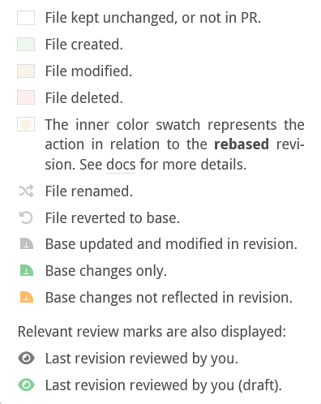
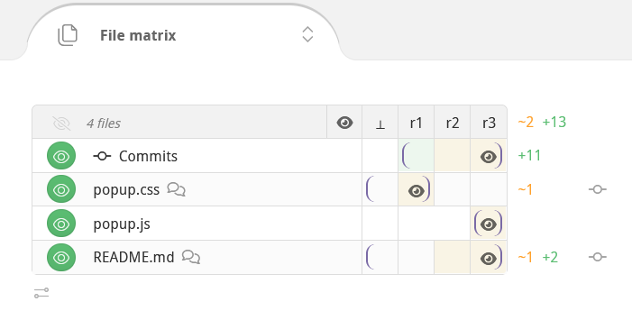
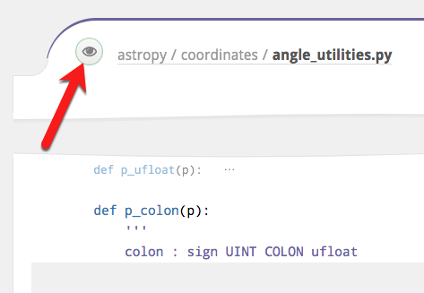
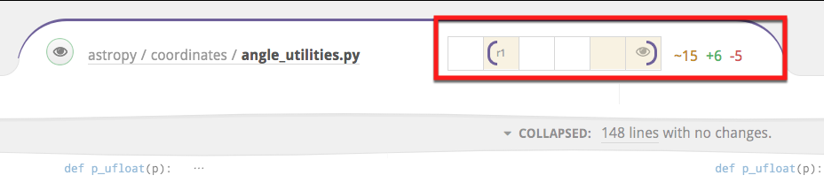
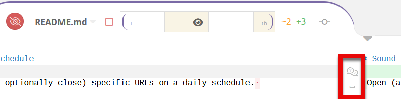
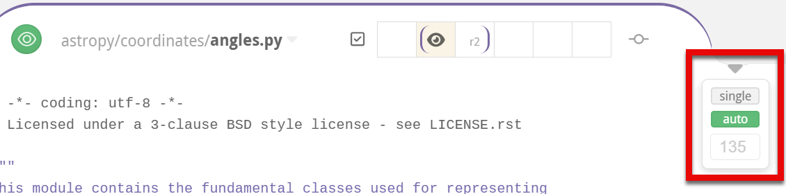
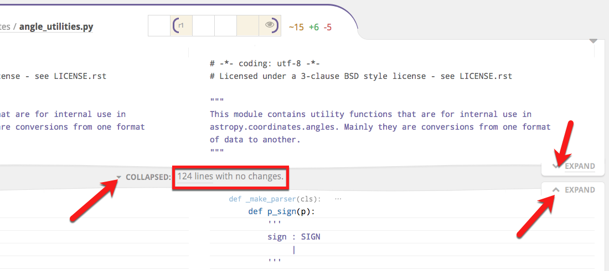
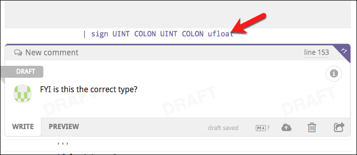
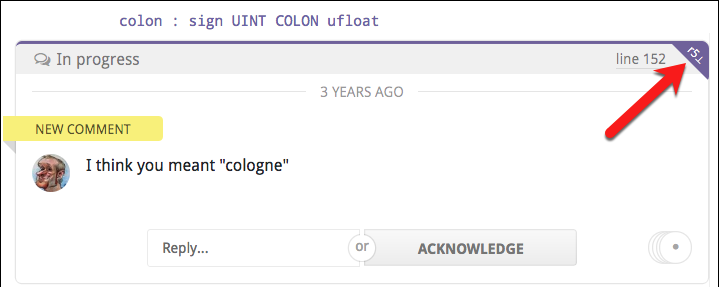
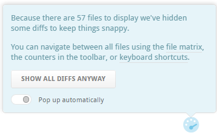

# Code review files

This chapter explains in detail how you manage and review files in Reviewable.  The file matrix provides an overview of the files in the pull request, while the individual file areas show diffs and line-specific discussions.

## Revision cells :id=revision-cells

A file's evolution over the course of the pull request is summarized in both the file matrix and the file areas by a row of revision cells.  Each cell represents one revision, with the leftmost ⊥ cell being a virtual base revision that changes to match the right diff bound.  Colors and icons in the revision cells summarize what happened in the pull request at each revision, as well as the latest review marks.



The brackets in a row are the current left and right diff bounds for the file. To adjust the diff bounds, click on one desired revision bound and drag to the other one.  You can also just click on a revision to adjust the nearest bound.



## Mark as reviewed :id=mark-reviewed

One of Reviewable's core features is letting you track the reviewed state of each file at each revision, for each reviewer.  This enables you to easily remember — and indicate to others — where you left off in the review and easily view only subsequent changes.  Marking a file as reviewed doesn't necessarily mean that you think it's ready for merging, but rather only that you reviewed it at the given revision and added all your comments.



The small button to the left of the file path indicates your current reviewed state for the file at the right diff bound and lets you change it.  Typically, as a reviewer, the button will be red to indicate that you need to review this diff, and will turn green when clicked to indicate that you've marked the file as reviewed.  There are other less common states as well:

| Color | Meaning |
|:-----:|---------|
|  | The file has not yet been reviewed at or after the right diff bound. Click to mark the file as reviewed. |
|  | Reviewed by you at the right diff-bound. Click to immediately rescind your review marking. |
|  | The file has not yet been reviewed at or after the right diff bound. Click to mark as reviewed, but marking is not advised because some unreviewed changes are not shown in the current diff, or you are the author of the PR. |
|  | Reviewed by you or someone else at or after the right diff bound. Click to mark as reviewed but it's probably redundant. |

Review marks remain in a draft state and are only visible to you until [published](reviews.md#publish).  Recissions are publicized immediately however.

## File matrix :id=file-matrix
Click the toggle to display a history matrix showing all files and revisions. Here, you can:

- View a summary of the PR's change history for each file.
- Set diff bounds for any and all files.
- Mark files as reviewed.
- View the most recent reviewers of each file.
- Jump to a file's diff.
- See delta stats for a diff and all diffs.


### File list

The file matrix lists all the files in the pull request.  They're organized hierarchically, with files listed before subdirectories at every level.  Hover over a nested directory path to see the full path.  Obsolete files that once had changes but now have no differences with the target branch are hidden by default, but can be revealed with a switch in the [Changes summary box](reviews.md#changes-summary).

Click the file path to move directly to the diff for that file. Hold down the `⌘`, `Ctrl` or `⇧` key (as appropriate for your browser) when clicking to open the file diff in a new browser tab.  To open every file in a new tab at once, hold down the modifier key and click the **All** button that appears in the header of the file matrix.

File paths in italics indicate that the file is currently elided from the file contents area because there's nothing interesting to see in it at the current diff bounds, but clicking will force it to appear.

To the left of the file path there's a button to [mark the file as reviewed](#mark-reviewed).

To the right of the file path is a list of the last published reviewers for the file.  It may be that those people did not review the latest revision, and other people may have reviewed previous revisions.  Hover over an avatar for details about the user.

Off the right side of the matrix are delta stats for the current diffs, showing lines <span style="color:#cc9900">changed</span>, <span style="color:#5BBD72">added</span>, and <span style="color:#D95C5C">deleted</span>.  If a file is binary or isn't currently diffed no delta stats will be shown.  The total of all displayed delta stats is displayed overhead, in the lower-right corner of the Changes summary.

Files can also be grouped, like for the **Tests** group in the screenshot above.  You can use this to reorder the file list somewhat (groups are listed alphabetically), and to enable marking a subset of files as reviewed with one click.  See the section on [custom review completion conditions](repositories.md#condition-output) for instructions on how to group files in your repository.

### Column headings

Each column in the matrix represents a single revision of each of the files in the review. Each revision consists of one or more commits.  The headings vary in style to indicate the different kinds of revisions.

| Label | Meaning |
|:-----:|---------|
| r1    | An immutable revision (even if the branch is rebased). |
| _r1_  | A provisional revision whose commits may still change. |
| ~r1~  | Outdated revision, no longer part of the pull request due to being force-pushed out.  Retained so you can still diff against it. |
| <span style="font-size: 1.25em">👁</span> | A (virtual) last revision that you marked as reviewed for each file, defaulting to ⊥.  You can click it to set the diff bounds to be between the last reviewed revision and the latest revision for each file, or drag-select to any other revision of your choice. |
| ⊥     | This is the base version for a file in the target branch of the PR. The exact commit may depend on the right diff bound if the pull request has been rebased. |

You can also drag in the diff header to bulk-select the diff bounds. Doing so in the header will set the diff bounds for all files as close as possible to the new setting. Many reviewers choose to set diff bounds this way instead of file-by-file to see one coherent set of diffs at a time.


## File contents

Below the [top-level discussions](discussions.md) you'll find the file contents.

### File header

At the top of each file diff panel there's a file path. Hold down `⌘`, `Ctrl`, or `⇧` (as appropriate for your browser) to open it in a new tab.  If the file paths are too long some may be collapsed in places with an &hellip;; hover over the path or swipe to expand and see the full path.  You can also double-click on or near the path to select it — even when collapsed — for easy copying.

The header holds the standard [mark as reviewed](#mark-reviewed) button and [revision cells](#revision-cells) for adjusting diff bounds.

To the right of the cells you'll see the delta stats for the current diff, showing lines <span style="color:#cc9900">changed</span>, <span style="color:#5BBD72">added</span>, and <span style="color:#D95C5C">deleted</span>.



?> Any special messages will appear immediately underneath the header.  These include rename sequence details, explanations for why a diff isn't showing, etc.

### File diff

In the File Diff panel, you can see the diff between the two revisions of the file currently set as the diff bounds.  Deletions are indicated with a red highlight and additions with a green one.  You can [adjust the contrast](accountsettings.md#adjust-contrast) in the account settings panel.

Most languages also get automatic syntax highlighting.  If your file isn't getting highlighted, please [open an issue](https://github.com/reviewable/reviewable/issues) so that we can add the right file extension mapping.  If the language is not one of the 120+ that have syntax highlighting in [highlight.js](https://highlightjs.org/), you'll need to open an issue with that project or contribute a language definition module yourself.



In the gutter (either beside or between the diffs) you may see any of the following markers that indicate some otherwise invisible property of the adjoining line(s):

| Marker | Meaning |
|:------:|---------|
|  `⊥`   | This line only has changes in the base branch, between the base commits corresponding to the current diff bounds. |
|  `␣`   | This line only has whitespace changes. |
| <code><i class="fa fa-check-square-o"></i></code> | There are one or more resolved discussions on this line.  Click to reveal. |

?> Reviewable only supports text file diffs at this time.  For images and other file types you'll need to go view the diff on GitHub — a convenient link will usually be provided.  You will still be able to post comments against such files but they won't be attached to a specific line.

If a file requires your review, you'll see a tab at the bottom of the diff to [mark the file as reviewed](#mark-reviewed) and automatically advanced to the next file to review.

### Diff layout

As you decrease the width of the browser window, the diff will convert from a side-by-side view to a unified view and vice-versa. Also, the code will automatically be wrapped at a reasonable, round number of columns proportional to the window width.  (Lines that are wrapped get a thick vertical bar on the left side.)

You can override this behavior using the small caret in the top right corner of every diff:



Drag the caret to manually set the number of columns at which to wrap code.  If you do, Reviewable will _always_ use this margin and show a side-by-side diff only if your window is wide enough.  Click **Auto** to revert line wrapping control back to Reviewable. Finally, in either state, you can toggle on **Single** to force a unified diff view even if the window is wide enough to fit two columns.

?> All of these settings are personal but global across all files, PRs, and repos.

### Collapsed sections

Reviewable will automatically collapse sections of the diff with no meaningful changes and no discussions.  You can selectively expand these collapsed sections in a number of ways:



1. You can click the small **Expand** tabs on the right to manually reveal more context above or below the collapsed section, a few lines at a time.

2. If you see a small, light-colored declaration immediately below the collapsed section, this indicates the nearest syntactic unit that the code below is a part of — e.g., a function or a class.  You can click this signature to expand the diff to show all of the syntactic unit.

3. In the collapsed section gap, you will see some subset of the following line counts.  Clicking on any of these collapsed line categories will expand only those lines (plus a bit of context around them).
  *   **No changes** — lines with no changes at all between your current diff bounds.
  *   **Whitespace changes** — this is the count of lines in which only the whitespace has changed (marked with a `␣` when expanded).
  *   **Base commit changes** — are lines in which only the base branch has changed, likely not due to work on this pull request (marked with a `⊥` when expanded)
  *   **Resolved discussion** — are lines with resolved discussions attached (marked with a <code><i class="fa fa-check-square-o"></i></code> when expanded).

4. Click the **Collapsed** drop-down to view options for expanding everything — either for **this file** or **all files**.  The toggle button selects whether to **collapse whitespace changes** in all files in this review.  The setting will also be your default for new reviews.


?> The only way to collapse expanded diff lines back down is to change the diff bounds.


## Line-specific discussions :id=line-discussion

Click on any line in a diff — even one that already has a discussion attached to it or that is far away from any changes — to begin a new discussion.  If you select some code first, it will automatically be quoted and copied into your message.



This new discussion will also appear in the diffs of other revisions, at the nearest corresponding line. It won’t disappear until that discussion is resolved or withdrawn, even if the underlying file changes drastically.  Click the small purple dog-ear button to switch the diff to the exact one on which the comment was made.

!> If the dog-ear is red, this indicates that the current context may be inaccurate because of significant changes that have been made since the time the comment was made in the original revision. Click the red button to see the discussion in its original context.



Next to the dog-ear you'll find the line number that this discussion is on (relative to the file contents of the current diff), which links to GitHub's view of the file by default.

?> You can [customize the line link](accountsettings.md#line-link-template) to open your favorite editor on the given line instead.

For lots more information on discussions, please see the [next chapter](discussions.md).


## Diff customization

You can customize which files are diffed and how the diffs are displayed at the repository level.

### Generated files

Reviewable will automatically detect many kinds of generated files and hide the diff by default. If you'd like to add a new common pattern (based either on the filename or the contents of the file), don't hesitate to let us know. If your generated files are specific to your project, you have two options:

*   You can tweak your build to insert the exact text `GENERATED FILE DO NOT EDIT` as a comment on a line by itself into the generated file. There can be up to 4 additional characters on the line before and after the marker text. We have this restriction so that Reviewable doesn't accidentally consider your build script itself to be generated!
*   You can use `.gitattributes` files checked into your repo to control diffing — see below.

### Diff suppression and file type

Reviewable respects the diff settings in your `.gitattributes` files to the best of its ability. For example, to disable diffs for any files in the vendor directory and use PHP highlighting for all .phpt files, you could insert a `.gitattributes` file in the root of your repo, like this:

```
    /vendor/** -diff
    *.phpt diff=php
```

For details on the syntax, see the [gitattributes reference doc](https://git-scm.com/docs/gitattributes).


## Special states

The way diffs are displayed is suject to some special states, on both file-by-file and whole-review bases.

### Diff-suppressing states

There are many situations in which a diff won't be produced for a given file — either to ensure good performance, or because it isn't sensible to do so. Some examples include:

*   files that appear to be binary or minified,
*   diffs that are too big or were taking too long to compute,
*   files with too many lines,
*   files with custom diffs specified in `.gitattributes` that Reviewable cannot respect.

In such cases, the file will appear together with a message explaining why the diff is missing. Typically, there will also be a button such as **Try Again** or **View on GitHub** by which you can override or bypass the condition.

!> Be careful if you’re trying to use `⌘-f` or `ctrl-f` to find something in the diffs when some are not shown.

?> If diffs that make sense to be shown were omitted for some reason, you'll find a special notice above the first file diff that explains what happened and lets you override the decision.  (See screenshot below.)

### Single file mode

Reviewable automatically enters a single file mode to preserve performance when the number of visible files exceeds a threshold (25 files as of this writing). In this mode, only one file will appear at a time. You'll also see a summary explanation just above the first (and only) file diff, together with a button which you can click to force all files to appear anyway until you leave the page.



Single-file mode is similar — but not identical — to the mode that you enter when you `⌘`, `Ctrl`, or `⇧` click a file open into a separate tab.

This panel will also appear if any diffs were throttled or big diffs were elided from display. However, in those cases the page will remain in multi-file mode. The text in the panel will also reflect the specific conditions.


## Support for specific workflows

Reviewable has extra built-in support for some specific development workflows.

### Rebasing

Reviewable gracefully supports rebasing and force-pushing to your branch PR in the middle of a review.  Previous revisions are preserved and marked as obsolete (with a strikethrough), even if the commits they’re composed of have disappeared during the rebase.  You’ll still be able to diff against those revisions, and changes between the old and new base will automatically collapse in the diff so as to avoid distraction from deltas that don’t relate to this PR.

?> To avoid garbage collection, Reviewable pins these commits in your repo using special refs under `refs/reviewable` — as long as the repository is connected.

Reviewable also uses heuristics to match rebased commits to their ancestors using commit messages.  When successful, this enables Reviewable to suggest minimum-delta revision pairs for diffing in the “review each commit” style even if you reordered the commits.  Arcs that link blocks of revisions above the file matrix show a high-level overview of this mapping.  (We don’t show matches between individual revisions because that can quickly lead to an unreadable diagram.)

### Forked repos tracking upstream changes

Some advanced workflows require overwriting the target branch of a PR with the head branch when it's ready to merge. This is necessary, for example, if you're maintaining a fork and rebasing from the upstream master. In such cases, both GitHub and Reviewable will choose the wrong base commit to compare files, and display not only all of the upstream changes—but also all the extra changes made in your fork over time.

To get the diff that you want, add a `Merge manually by overwriting target` label (exact spelling!) to your PR. This will cause Reviewable to compare files against the current head of the target branch. Now, you'll see upstream changes and any conflicts you resolved during the rebase, while leaving out modifications in your fork that survived unscathed.

?> For best results, add the label to the PR when you first create it.


