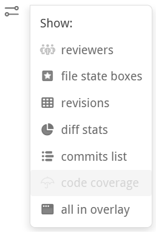
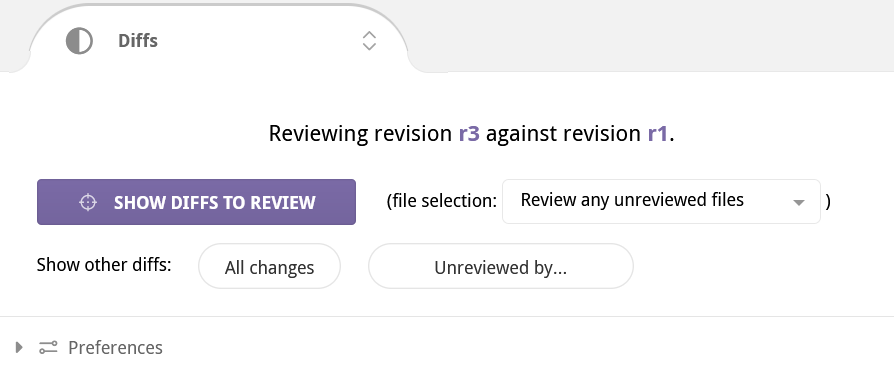
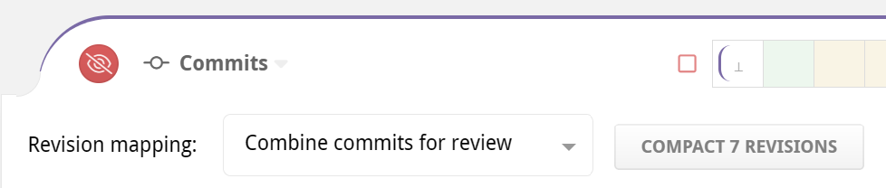
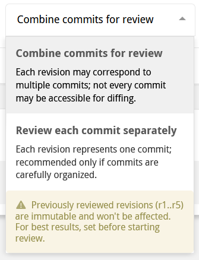
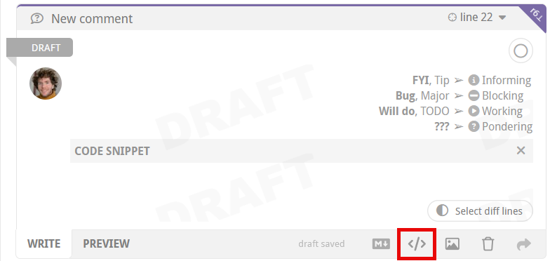
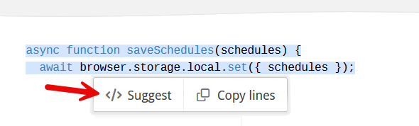
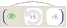

# Code review files

This chapter explains in detail how you manage and review files in Reviewable.  The file matrix provides an overview of the files in the pull request, while the individual file areas show diffs and line-specific discussions.


## Revision cells

A file's evolution over the course of the pull request is summarized in both the file matrix and the file areas by a row of revision cells.  Each cell represents one revision, with the leftmost ⊥ cell being a virtual base revision that changes to match the right diff bound.  Colors and icons in the revision cells summarize what happened in the pull request at each revision, as well as the latest review marks.

{width=300px}

The brackets in a row are the current left and right diff bounds for the file. To adjust the diff bounds, click on one desired revision bound and drag to the other one.  You can also just click on a revision to adjust the nearest bound.


## Mark as reviewed {#mark-reviewed}

One of Reviewable's core features is letting you track the reviewed state of each file at each revision, for each reviewer.  This enables you to easily remember — and indicate to others — where you left off in the review and easily view only subsequent changes.  Marking a file as reviewed doesn't necessarily mean that you think it's ready for merging, but rather only that you reviewed it at the given revision and added all your comments.


The small button to the left of the file path indicates your current reviewed state for the file at the right diff bound and lets you change it.  Typically, as a reviewer, the button will be red to indicate that you need to review this diff, and will turn green when clicked to indicate that you've marked the file as reviewed.  There are other less common states as well:

Color | Meaning
:----:|---------
<i class="opaque circular inverted red unreviewed icon"></i> | The file has not yet been reviewed at or after the right diff bound. Click to mark the file as reviewed.
<i class="opaque circular inverted green reviewed icon"></i> | Reviewed by you at the right diff-bound. Click to immediately rescind your review marking.
<i class="opaque circular red-rim unreviewed icon"></i> | The file has not yet been reviewed at or after the right diff bound. Click to mark as reviewed, but marking is not advised because some unreviewed changes are not shown in the current diff, the review is <a href="reviews.md#deferring-a-review">deferred</a>, or you are the author of the PR.
<i class="opaque circular green-rim unreviewed icon"></i> | Reviewed by you or someone else at or after the right diff bound. Click to mark as reviewed but it's probably redundant.

Review marks remain in a draft state and are only visible to you until [published](reviews.md#publish).  Recissions are publicized immediately however.

## File review state

While the review button above indicates your personal state for the file at the current right diff bound, the square "review chip" shows the file's overall state at the latest revision.  The two may not always agree:  for example, a file may need your overall review but not at your current diff bounds, or a file may have been sufficiently reviewed but you set your [review overlap strategy](reviews#file-review-type) to personally review all files.

The various possible states are:

State | Meaning
:----:|---------
<i class="red designation you icon"/>&nbsp;| Your review of this file has been requested, either directly or due to team membership, and you have not yet reviewed it at the latest revision.
<i class="red designation anyone icon"/>&nbsp;| Anyone is welcome to review this file, including you.
<i class="designation anyone icon"/>&nbsp;| Anyone is welcome to review this file, but you've either already done so or are not a reviewer.
<i class="green designation anyone icon"/>&nbsp;| Anyone will be welcome to review this file after you've published your review.
<i class="designation others icon"/>&nbsp;| Specific other people have been requested to review this file, but you either already did so or your review was not requested.
<i class="green designation others icon"/>&nbsp;| Specific other people will still need to review this file after you've published your review.
<i class="designation done icon"/>&nbsp;| The file has been sufficiently reviewed.
<i class="green designation done icon"/>&nbsp;| The file will be sufficiently reviewed once you've published your review.

Clicking on the state icon will reveal all the details about a file's current review state:  who needs to review it and why, who has already reviewed it, and (when relevant) who reviewed it at revisions prior to the latest one.


By default, Reviewable can only tell who has reviewed a file and infer some basic information about who should review it from a `CODEOWNERS` file, if present.  To unlock the full power of this feature — including indicating the scope (e.g., "security" or "accessibility") of each requested review, when a scope has been satisfied, or whether only specific people's reviews are needed — you'll need to [create designated reviewers](repositories#designated-reviewers) in the custom review completion condition.

## File matrix

The Files panel displays a history matrix showing all files and revisions. Here, you can:

- View a summary of the PR's change history for each file.
- Set diff bounds for any and all files.
- Mark files as reviewed.
- View the latest review state of each file.
- Jump to a file's diff.
- See delta stats for a diff and all diffs.

{width=1144px}

### File list

The file matrix lists all the files in the pull request.  They're organized hierarchically, with files listed before subdirectories at every level.  Hover over a nested directory path to see the full path.  Obsolete files that once had changes but now have no differences with the target branch are hidden by default, but can be revealed with a switch in the [Changes summary box](reviews.md#changes-summary).

Click the file path to move directly to the diff for that file. Hold down the `⌘`, `Ctrl` or `⇧` key (as appropriate for your browser) when clicking to open the file diff in a new browser tab.  To open every file in a new tab at once, hold down the modifier key and click the **All** button that appears in the header of the file matrix.

File paths in italics indicate that the file is currently elided from the file contents area because there's nothing interesting to see in it at the current diff bounds, but clicking will force it to appear.

To the left of the file path there's a button to [mark the file as reviewed](#mark-reviewed).  The header has a corresponding button to mark all files as reviewed (if certain conditions hold — otherwise, a tooltip will tell you why it's disabled), with an option to undo the action immediately afterwards.

To the right of the file path you can optionally see reviewer avatars that provide a quick overview of a file's reviewers.  The avatars get progressively more faded out as a user's review becomes less recent.  You can hover over an avatar for details, or click on it to show the diff between that user's last reviewed revision (for each file) and the latest revision.

Further to the right is the [file review state](#file-review-state) chip that you can click on for full details regarding who has reviewed a file and whether anyone still needs to review it.  Chips for fully reviewed files are hidden from the file matrix to reduce visual noise, but will show up on hover.

Off the right side of the matrix are delta stats for the current diffs, showing lines <span class="text-orange">changed</span>, <span class="text-green">added</span>, and <span class="text-red">deleted</span>.  If a file is binary or isn't currently diffed no delta stats will be shown.  The total of all displayed delta stats is displayed overhead, in the lower-right corner of the Changes summary.  Other information you may find here includes test coverage statistics and a dropdown with a list of commits included in the current diff bounds.

The elements above can be turned on or off via a small menu below the file matrix.  You can also force all elements to appear when the file matrix is opened as a modal dialog.



Files can also be grouped, like for the **Tests** group in the screenshot above.  You can use this to reorder the file list somewhat (groups are listed alphabetically), and to enable marking a subset of files as reviewed with one click.  Reviewable will automatically group some files for you, such as files that were only renamed, that appear in a vendored directory, or that were reverted back out of the pull request.  See the section on [custom review completion conditions](repositories.md#condition-output) for instructions on how to make custom file groups in your repository.

### Column headings

Each column in the matrix represents a single revision of each of the files in the review. Each revision consists of one or more commits.  The headings vary in style to indicate the different kinds of revisions.

Label | Meaning
:----:|---------
r1    | An immutable revision (even if the branch is rebased).
_r1_  | A provisional revision whose commits may still change.
<s>r1</s> | Outdated revision, no longer part of the pull request due to being force-pushed out.  Retained so you can still diff against it.
<i class="cell reviewed icon"/> | A (virtual) last revision that you marked as reviewed for each file, defaulting to ⊥.  You can click it to set the diff bounds to be between the last reviewed revision and the latest revision for each file, or drag-select to any other revision of your choice.
<i class="cell participants on icon"/> | A (virtual) last revision that anyone marked as reviewed for each file, defaulting to ⊥.  You can click it to set the diff bounds to be between the last revision reviewed by anyone and the latest revision for each file, or drag-select to any other revision of your choice.
⊥     | This is the base version for a file in the target branch of the PR. The exact commit may depend on the right diff bound if the pull request has been rebased.

You can also drag in the diff header to bulk-select the diff bounds. Doing so in the header will set the diff bounds for all files as close as possible to the new setting. Many reviewers choose to set diff bounds this way instead of file-by-file to see one coherent set of diffs at a time.

## Diff controls

Where the file matrix gives you fine-grained manual control over the diff bounds, the Diffs panel allows you to tweak the diffs that Reviewable automatically selects for you and make other coarse-grained adjustments.



At the top of the panel you'll find an informational description of your current diff bounds.

### Show default diffs to review

The large purple **Show Diffs to Review** button immediately below (exact wording varies) will set the diff bounds on all the files to the next range that Reviewable thinks you need to examine. By default, when you first load the review page this button has in essence already been clicked for you — that is, the initial diffs will be what Reviewable thinks you should be looking at, not necessarily the ones that you were looking at on your last visit.  <more>If you're a reviewer in a **combined commits** style review, this will be the range between the last reviewed revision (for each file) and the latest revision. If you're using **review each commit** style, this will be the range between the last fully reviewed commit and the next one. If you're the PR author, this will be the range between the last snapshotted revision and the latest one, so you can review the diffs that you have just pushed.</more>

Next to the button there's a dropdown with three **review overlap strategy** options. This setting changes which file diffs are suggested for the user to review when there are multiple participating reviewers and implicitly sets the default for any future reviews.

- **Skip files claimed by others** suggests files that have been previously reviewed by you, or that nobody has reviewed yet. Select this if you want to divide work by skipping files already reviewed by someone at an earlier version.
- **Review any unreviewed files** suggests files to review if they have not been reviewed by anyone at the current revision. Select this if you want to combine efforts and review any file that needs reviewing.
- **Review all files personally** suggests files you have not personally reviewed. Select this if you want to ensure that you review every file yourself, ignoring other reviewers.

::: tip
Regardless of which option you select you will still be able to manually diff and review any file you want.
:::

### Show other diffs

Next you'll find a row of buttons that let you set other frequently used diff bounds.


- **All changes** will show the full diffs between the base and the latest revision for each file.  This will show you exactly the full deltas that will be applied if the PR is merged.
- **Unreviewed by...** will show the changes that have not yet been reviewed by a specific person (either you or another reviewer), or that have not yet been reviewed by anyone at all.  (If a reviewer doesn't show up in this list then they haven't marked any files as reviewed yet.)

### Preferences

Below these primary diff controls you can expand a section that lets you set diff-related preferences.  All settings are personal to you and apply to all organizations and repositories.

The **initial diff bounds** dropdown allows you to select the diff bounds that will be applied automatically when you load a review page from among the options available for manual use above.  In essence, you'll be telling Reviewable which button to automatically click for you when a review loads.  The selection for when you're a reviewer vs a pull request author are tracked separately.

**Max diffs displayed** lets you customize when a review will switch into [single file mode](#single-file-mode).  You might want to set it higher if you have a powerful machine and don't mind trading off page loading time against faster access once it's loaded.  Conversely, you may want to set it lower if you find that reviews with many files are having a noticeable impact on performance.  Set it to `1` to force all reviews into single file mode.

The **diff layout** and **line length** options replicate the more compact [diff layout](#diff-layout) controls available on every file panel.


## Revision / commit mapping {#revision-commits}

Each revision in a review is an automatic, unmodifiable capture of one or more commits.  The mapping between commits and revisions is shown in a synthetic **Commits file**.  This virtual file is kept up-to-date automatically by Reviewable and will always be listed first in the files list.  It behaves just like a normal file in that it will be diffed against the selected revision and supports discussions, however it *will not* impact your repository or pull request in anyway — it's solely used by Reviewable for presenting and reviewing commit messages.


::: tip
While the commit file is virtual, it still needs to be marked as reviewed as much (or as little) as normal files.  It's included in review file [counters](#counters), but not counted in review status messages unless it's the only unreviewed file.  It's also handled separately from normal files when evaluating a custom review completion condition; see [custom completion condition](repositories.md#custom-review-completion-condition) for details.
:::

This special file also provides some additional controls over the mapping between revisions and commits.



### Review style

The **Review Style** dropdown lets you choose the style of this review, affecting how commits are grouped into revisions and the suggested sequence of diffs to review.



There are two review styles, and changing the style will require from a few seconds to a minute or so to restructure the provisional revisions in the review.

* **Combine commits for review** — review commits that are grouped together according to the time at which they were pushed and a few other factors. Keep in mind that some commits might not be accessible for diffing.
* **Review each commit separately** — a revision is created for each commit, even if a successive commit wrote over previous changes. We recommend choosing this review style only if the commits have been carefully organized. Keep in mind that there are some built-in limits on how many revisions can be created together. This means that commits may get aggregated if those limits are exceeded.  Please contact support to discuss raising the limits for your repos if you feel this would be useful.

If you're a repository administrator, you can also set the default review style for the repository via repository settings.

::: warning
Snapshotted revisions won’t get restructured, so you may encounter surprising results if you switch the review style after beginning the review.  An exception to this is the case in which a revision was snapshotted only because somebody other than the PR author looked at it, in which case it appears snapshotted but is OK for restructuring. The purpose of this is to enable a reviewer to switch the review style, since just loading the page will show the diff and snapshot the revisions.
:::

### Compacting revisions

Since revisions are immutable, long running reviews can end up with a lot of them, which impacts the performance and usability of the review.  You can have Reviewable reduce the number of revisions for all participants by clicking the **Compact revisions** button if you have write access to the repository.  This will attempt to eliminate and combine redundant revisions but the process is slightly lossy:

* Discussions may be reassigned to an equivalent revision, and you may no longer be able to display the original diff context.
* Code blocks may be reassigned to an equivalent revision.
* Only the latest review mark from every reviewer is guaranteed to be retained.
* Matched prior revisions may be removed for rebased or merged revisions, making diffs less useful.

Access to the review will be blocked until the process completes (typically within 10 to 15 seconds).  Revisions that are kept will retain their old numbers, which means that revision numbers may no longer be sequential.

::: danger
This is an experimental feature and may break the review.  If something goes dreadfully wrong, you can ask admin staff to recover the original review from a backup automatically snapshotted at the start, though this will discard any changes made in the meantime.
:::


## File contents

Below the [top-level discussions](discussions.md) you'll find the file contents.

### File header

At the top of each file diff panel there's a file path.  If the file paths are too long some may be collapsed in places with a &hellip;; hover over the path or swipe to expand and see the full path.  You can click on the path to activate a dropdown menu with relevant actions, such as opening the file in your editor, copying the file path, or starting a new file-level discussion.

The header holds the standard [mark as reviewed](#mark-reviewed) button, a [review state chip](#file-review-state), and [revision cells](#revision-cells) for adjusting diff bounds.

To the right of the cells you'll see the delta stats for the current diff, showing lines <span class="text-orange">changed</span>, <span class="text-green">added</span>, and <span class="text-red">deleted</span>.

If you've set up a [code coverage](repositories#code-coverage) feed you may also see an umbrella in the header with a coverage percentage, and a dropdown menu that has further details.  The diffs will then also show coverage bars; you can [customize the colors](tips#code-coverage-bars) if desired.


::: tip
Any special messages will appear immediately underneath the header.  These include notices of renamed files, explanations for why a diff isn't showing, etc.
:::


### File diff

In the File Diff panel, you can see the diff between the two revisions of the file currently set as the diff bounds.  Deletions are indicated with a red highlight and additions with a green one.  You can [adjust the contrast](accountsettings.md#adjust-contrast) in the account settings panel.

Most languages also get automatic syntax highlighting.  If your file isn't getting highlighted, please [open an issue](https://github.com/reviewable/reviewable/issues) so that we can add the right file extension mapping.  If the language is not one of the 120+ that have syntax highlighting in [highlight.js](https://highlightjs.org/), you'll need to open an issue with that project or contribute a language definition module yourself.


In the gutter (either beside or between the diffs) you may see any of the following markers that indicate some otherwise invisible property of the adjoining line(s):

 Marker | Meaning
:------:|--------
  `⊥`   | This line only has changes in the base branch, between the base commits corresponding to the current diff bounds.
  `␣`   | This line only has whitespace changes.
 <code><i class="resolved discussion icon"/></code> | There are one or more resolved discussions on this line.  Click to reveal.

::: tip
Reviewable only supports text file diffs at this time.  For images and other file types you'll need to go view the diff on GitHub — a convenient link will usually be provided.  You will still be able to post comments against such files but they won't be attached to a specific line.
:::

If a file requires your review, you'll see a tab at the bottom of the diff to [mark the file as reviewed](#mark-reviewed) and automatically advanced to the next file to review.

### Diff layout

As you decrease the width of the browser window, the diff will convert from a side-by-side view to a unified view and vice-versa. Also, the code will automatically be wrapped at a reasonable, round number of columns proportional to the window width.  (Lines that are wrapped get a thick vertical bar on the left side.)

You can override this behavior to shrink or expand the view using the small caret in the top right corner of every diff:


Drag the caret to manually set the number of columns at which to wrap code.  If you do, Reviewable will _always_ use this margin and show a side-by-side diff only if your window is wide enough.  Click **Auto** to revert line wrapping control back to Reviewable. Finally, in either state, you can toggle on **Single** to force a unified diff view even if the window is wide enough to fit two columns.

::: tip
All of these settings are personal but global across all files, PRs, and repos.
:::

### Collapsed sections

Reviewable will automatically collapse sections of the diff with no meaningful changes and no discussions.  You can selectively expand these collapsed sections in a number of ways:


1. You can click the small **Expand** tabs on the right to manually reveal more context above or below the collapsed section, a few lines at a time.

2. If you see a small, light-colored declaration immediately below the collapsed section, this indicates the nearest syntactic unit that the code below is a part of — e.g., a function or a class.  You can click this signature to expand the diff to show all of the syntactic unit.


3. In the collapsed section gap, you will see some subset of the following line counts.  Clicking on any of these collapsed line categories will expand only those lines (plus a bit of context around them).

* **No changes** — lines with no changes at all between your current diff bounds.
* **Whitespace changes** — this is the count of lines in which only the whitespace has changed (marked with a `␣` when expanded).
* **Base commit changes** — are lines in which only the base branch has changed, likely not due to work on this pull request (marked with a `⊥` when expanded)
* **Resolved discussion** — are lines with resolved discussions attached (marked with a <code><i class="resolved discussion icon"/></code> when expanded).

4. Click the **Collapsed** drop-down to view options for expanding everything — either for **this file** or **all files**.  The toggle button selects whether to **collapse whitespace changes** in all files in this review.  The setting will also be your default for new reviews.


::: tip
The only way to collapse expanded diff lines back down is to change the diff bounds.
:::

## Line-specific discussions {#line-discussion}

Click on any line in a diff — even one that already has a discussion attached to it or that is far away from any changes — to begin a new discussion.


This new discussion will also appear in the diffs of other revisions, at the nearest corresponding line. It won’t disappear until that discussion is resolved or withdrawn, even if the underlying file changes drastically.  Click the small purple dog-ear button to switch the diff to the exact one on which the comment was made.

::: danger
If the dog-ear is red, this indicates that the current context may be inaccurate because of significant changes that have been made since the time the comment was made in the original revision. Click the red button to see the discussion in its original context.
:::


Next to the dog-ear you'll find the line number that this discussion is on (relative to the file contents of the current diff), which links to GitHub's view of the file by default.

::: tip
You can [customize the line link](accountsettings.md#line-link-template) to open your favorite editor on the given line instead.
:::

For lots more information on discussions, please see the [next chapter](discussions.md).

### Code Snippets, Quoting Code, and Making Code Suggestions

It's easy to add new code, quote existing code, or make explicit code suggestions that show a diff of your proposed changes all right inside your comment. The most basic way to add a snippet of code to a comment is by clicking the <i class="icon create codeblock"/>&nbsp;button in the actions menu and typing your code in the codeblock.



::: tip
You can add as many codeblocks as you want to your comment!
:::

You can also insert existing code from the diffs into your codeblock. There are a couple of ways to get the code into the codeblock at your disposal.

#### Before making a comment
Select the line (or lines) of code before making a comment. Once you have made a selection you can use the command palette to insert the comment at the last selected line with a codeblock containing your selected code.



#### Adding code to an existing comment

If you have already started writing a comment, you can click the <i class="icon create codeblock"/>&nbsp;button in the actions menu and an empty codeblock will appear. The way to insert existing code at this point is to use the 'select diff lines' button that appears inside the codeblock. This will bring up a pair of text selection pinchers that allow you to indicate the lines you want to insert. Once you have made your selection, hit the 'accept selection' button to add the code to your codeblock.


::: tip
Double click the 'select diff lines' button to quickly grab the current, single line of code from inside an existing comment.
:::

Code in the codeblock remains a code quote until you make a change to it inside the codeblock. Once a change is made, the codeblock becomes a suggestion and in preview mode you can preview the diff or turn off the preview by clicking the toggle in the codeblock header.


## Diff customization

You can customize which files are diffed and how the diffs are displayed at the repository level.

### Generated files

Reviewable will automatically detect many kinds of generated files and hide the diff by default. If you'd like to add a new common pattern (based either on the filename or the contents of the file), don't hesitate to let us know. If your generated files are specific to your project, you have two options:

* You can tweak your build to insert the exact text `GENERATED FILE DO NOT EDIT` as a comment on a line by itself into the generated file. There can be up to 4 additional characters on the line before and after the marker text. We have this restriction so that Reviewable doesn't accidentally consider your build script itself to be generated!
* You can use `.gitattributes` files checked into your repo to control diffing — see below.

### Diff suppression and file type

Reviewable respects the diff settings in your `.gitattributes` files to the best of its ability. For example, to disable diffs for any files in the vendor directory and use PHP highlighting for all .phpt files, you could insert a `.gitattributes` file in the root of your repo, like this:

```
    /vendor/** -diff
    *.phpt diff=php
```

For details on the syntax, see the [gitattributes reference doc](https://git-scm.com/docs/gitattributes).

## Special states

The way diffs are displayed is subject to some special states, on both file-by-file and whole-review bases.

### Diff-suppressing states

There are many situations in which a diff won't be produced for a given file — either to ensure good performance, or because it isn't sensible to do so. Some examples include:

* files that appear to be binary or minified,
* diffs that are too big or were taking too long to compute,
* files with too many lines,
* files with custom diffs specified in `.gitattributes` that Reviewable cannot respect.

In such cases, the file will appear together with a message explaining why the diff is missing. Typically, there will also be a button such as **Try Again** or **View on GitHub** by which you can override or bypass the condition.

::: danger
Be careful if you’re trying to use `⌘-f` or `ctrl-f` to find something in the diffs when some are not shown.
:::

::: tip
If diffs that make sense to be shown were omitted for some reason, you'll find a special notice above the first file diff that explains what happened and lets you override the decision.  (See screenshot below.)
:::

### Single file mode

Reviewable automatically enters a single file mode to preserve performance when the number of visible files exceeds a threshold (configurable in the [diff preferences panel](#diff-controls)). In this mode, only one file will appear at a time. You'll also see a summary explanation in a toast, together with a button which you can click to force all files to appear anyway until you leave the page.


Single-file mode is similar — but not identical — to the mode that you enter when you `⌘`, `Ctrl`, or `⇧` click a file open into a separate tab.

This toast will also appear if any diffs were throttled or big diffs were elided from display. However, in those cases the page will remain in multi-file mode. The text in the toast will also reflect the specific conditions.

## Support for specific workflows

Reviewable has extra built-in support for some specific development workflows.

### Rebasing

Reviewable gracefully supports rebasing and force-pushing to your branch PR in the middle of a review.  Previous revisions are preserved and marked as obsolete (with a strikethrough), even if the commits they’re composed of have disappeared during the rebase.  You’ll still be able to diff against those revisions, and changes between the old and new base will automatically collapse in the diff so as to avoid distraction from deltas that don’t relate to this PR.

::: tip
To avoid garbage collection, Reviewable pins these commits in your repo using special refs under `refs/reviewable` — as long as the repository is connected.
:::

Reviewable also uses heuristics to match rebased commits to their ancestors using commit messages.  When successful, this enables Reviewable to suggest minimum-delta revision pairs for diffing in the “review each commit” style even if you reordered the commits.  Arcs that link blocks of revisions above the file matrix show a high-level overview of this mapping.  (We don’t show matches between individual revisions because that can quickly lead to an unreadable diagram.)

By design, Reviewable doesn't track files that haven't deviated from their base form &mdash; including files that have been modified back to their original state.  However, when using heuristics, Reviewable will sometimes "force" a revision when it otherwise wouldn't to prevent you from missing a critical diff.  When applicable, revision cells in both the [file matrix](#file-matrix) and [file header](#file-header) will also have a unique styling.

Symbol | Meaning
:----: |---------
 | <strong>Inner Disc Color</strong>: File action against matched prior rebased revision. <br/> <strong>Outer Background Color</strong>: File action against immediately preceding revision. <br/> In this example, <i>r6</i> is not modified compared to <i>r4</i>, but is modified compared to <i>r5</i>.
<br/>

### Forked repos tracking upstream changes

Some advanced workflows require overwriting the target branch of a PR with the head branch when it's ready to merge. This is necessary, for example, if you're maintaining a fork and rebasing from the upstream master. In such cases, both GitHub and Reviewable will choose the wrong base commit to compare files, and display not only all of the upstream changes—but also all the extra changes made in your fork over time.

To get the diff that you want, add a `Merge manually by overwriting target` label (exact spelling!) to your PR. This will cause Reviewable to compare files against the current head of the target branch. Now, you'll see upstream changes and any conflicts you resolved during the rebase, while leaving out modifications in your fork that survived unscathed.

::: tip
For best results, add the label to the PR when you first create it.
:::
