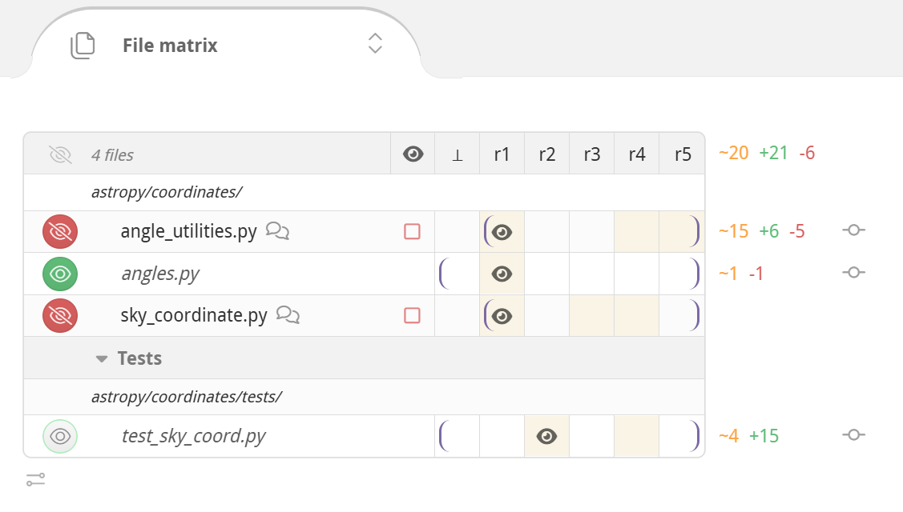
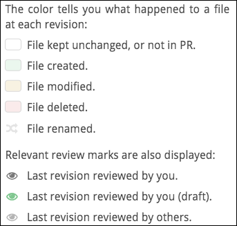

# Code review files

## File matrix :id=file-matrix
Click the toggle to display a history matrix for each file in the revision. Here, you can:

- View a summary of the PR's change history for each file.
- Set diff bounds for any and all files.
- Mark files as reviewed.
- View the most recent reviewers of each file.
- Jump to a file's diff.
- See delta stats for a diff and all diffs.



### File list

The file matrix lists all the files in the pull request.  Obsolete files that once had changes but now have no differences with the target branch are hidden by default, but can be revealed with a switch in the [Changes summary box](reviews.md#changes-summary).

Click the file name to move directly to the diff for that file. Hold down the ⌘, Ctrl or ⇧ key when clicking to open the file diff in a new browser tab.  To open every file in a new tab at once, hold down the modifier key and click the **All** button that appears in the header of the file matrix.

To the left of the file path there's a button that lets you mark the file as reviewed.  This works the same as in the individual file headers; [see here](#mark-reviewed) for a full explanation.

To the right of the file path is a list of the last published reviewers for the file.  It may be that those people did not review the latest revision, and other people may have reviewed previous revisions.  Hover over an avatar for details about the user.

Off the right side of the matrix are delta stats for the current diffs, showing lines <span style="color:#cc9900">changed</span>, <span style="color:#5BBD72">added</span>, and <span style="color:#D95C5C">deleted</span>.  If a file is binary or isn't currently diffed no delta stats will be shown.  The total of all displayed delta stats is displayed overhead, in the lower-right corner of the Changes summary.

### Column headings

Each column in the matrix represents a single revision of each of the files in the review. Each revision consists of one or more commits. A revision is immutable, even if the branch is rebased.

You can also drag in the diff header to bulk-select the diff bounds. Doing so in the header will set the diff bounds for all files as close as possible to the new setting. Many reviewers choose to set diff bounds this way instead of file-by-file to see one coherent set of diffs at a time.

| Revision | Meaning |
|:--------:|---------|
| r1       | An immutable revision. |
| _r1_     | A provisional revision whose commits may still change. |
| ~r1~     | Outdated revision, no longer part of the pull request due to being force-pushed out.  Retained so you can still diff against it. |
| <span style="font-size: 1.25em">👁</span> | A (virtual) last revision that you marked as reviewed for each file, defaulting to ⊥.  You can click it to set the diff bounds to be between the last reviewed revision and the latest revision for each file, or drag-select to any other revision of your choice. |
| ⊥        | This is the base version for a file in the target branch of the PR. The exact commit may depend on the right diff bound if the pull request has been rebased. |

### Revision rows

Colors and icons in a file's revision cells summarize what happened in the pull request at each revision, and the latest review marks.


The brackets in each row are the current left and right diff bounds for each file. To adjust the diff bounds for each file, simply drag between the two revisions you'd like to diff or click on a revision to adjust the nearest bound.


## File diffs

Below the [Discussion](discussions.md) section, you'll find the File Diff panel.

At the top of the File Diff panel, you'll see a file path. Click it to jump to the file's diff. Hold down `⌘` or `⇧` to open it in a new tab.


### Changing the diff bounds

You'll also notice a group of cells that indicate the evolution and state of the files for this diff. The brackets define the left and right diff bounds. To modify these bounds, click-and-drag a bracket to where it should be.



In the File Diff panel, you can see the diff between the two revisions of the file, currently set as the diff bounds.


### Diff width control

As you decrease the width of the browser window, the File Diff panel will convert from a side-by-side view to a unified view, and vice-versa. Also, a reasonable, round number of columns at which to wrap the code will automatically be arranged.

You can override this behavior using the small caret in the top right corner of every File Diff panel. Drag the caret to manually set the number of columns at which to wrap code, and Reviewable will automatically go to a side-by-side view if your window is wide enough. Otherwise, it will stick with a unified view. Click **Auto** to revert line wrapping control back to Reviewable. Finally, in either state, you can toggle on **Single** to force a unified diff view even if the window is wide enough to fit two columns.

?> All of these settings are personal but global across all files, PRs, and repos.


### Mark the file as reviewed :id=mark-reviewed

Click the small button to the left of a file name (see the figure above) to indicate that you have reviewed that file.


This marks a file as reviewed up to its current right diff bound. This doesn’t necessary mean that you are indicating that the file is ready for merging, but rather only that you reviewed it at the right bound revision of the current diff and added all of your review comments. In a future review round, you can easily diff each file against the last revision you marked as reviewed.

Click on a red button to change it to green, which makes it easy in the future to diff against the last revision that you reviewed.

The button color reflects the current state:

| Color | Meaning |
|:-----:|---------|
|  | The file has not yet been reviewed at or after the right diff bound. Click the button to mark the file as reviewed. |
|  | Reviewed by you at the right diff-bound. Click to rescind your review marking. |
|  | The file has not yet been reviewed at or after the right diff bound. However, marking is not advised because some unreviewed changes are not shown in the current diff, or you are the author of the PR. |
|  | Reviewed by you or someone else at or after the right diff bound. It is redundant to mark the file as reviewed. |


### Expanding and collapsing
se the small **EXPAND** buttons to reveal more context of the file diff; use the **COLLAPSE** button to return to the default view.

Near the **COLLAPSE** button, you may see numbers which represent the following:

*   **No changes** — lines with no changes at all between your current diff bounds.
*   **Whitespace changes** — this is the count of lines in which only the whitespace has changed (marked with a _ when expanded).
*   **Base commit changes** — are lines in which only the base branch has changed, likely not due to work on this pull request (marked with a **⊥** when expanded)
*   **Resolved discussion** — are lines with resolved discussions attached (marked with a ☑ when expanded).

Clicking on any of these collapsed line categories will expand only those lines (plus a bit of context around them).


### Collapsed drop-down

Click the **COLLAPSED** drop-down to view options for expand everything—either for **this file** or **all files**.

Click the toggle button to collapse all **whitespace changes**.

?> The settings here will apply to all future diffs in this review, and sets your default for new reviews.


### Single file mode

This mode triggers automatically when the number of visible files exceeds a threshold (currently 25 files). In this mode, only one file will appear at a time. You'll also see a summary explanation just above the File Diff panel, together with a button which you can click to force all files to appear until you leave the page.

?> The "10 files" in the figure below would usually be 25 or more files. This is for illustration only.


Single-file mode is similar to—but not identical to—the mode that you enter when you {ctrl,cmd}-click a file open into a separate tab.

This panel will also appear if any diffs were throttled or big diffs were elided from display. However, in those cases the page will remain in multi-file mode. The text in the panel will also reflect the specific conditions.


### Diff-suppressing states

There are many situations in which a diff won't be produced—either to ensure good performance, or because it isn't sensible to dos so. Some examples include:

*   files that appear to be binary or minified,
*   diffs that are too big or were taking too long to compute,
*   files with too many lines,
*   files with custom diffs specified in .gitattributes that Reviewable cannot respect

In such cases, the file will appear together with a message explaining  why the diff is missing. Typically, there will also be a button such as **Try Again**, **View on GitHub**—by which you can override or bypass the condition.  These should be self-explanatory, but it's important to be aware of the possibility if you’re trying to use ctrl-f to find something in the diffs (and some diffs are not there).


### Support for rebasing workflows

Reviewable gracefully supports rebasing and force-pushing to your branch PR in the middle of a review.  Previous revisions are preserved and marked as obsolete (with a strikethrough), even if the commits they’re composed of have disappeared during the rebase.  You’ll still be able to diff against those revisions, and changes between the old and new base will automatically collapse in the diff so as to avoid distraction from deltas that don’t relate to this PR.

?> To avoid garbage collection, Reviewable pins these commits in your repo using special refs — as long as the repository is connected.

Reviewable also uses heuristics to match rebased commits to their ancestors using commit messages.  When successful, this enables Reviewable to suggest minimum-delta revision pairs for diffing in the “review each commit” style even if you reordered the commits.  Arcs that link blocks of revisions above the file matrix show a high-level overview of this mapping.  (We don’t show matches between individual revisions because that can quickly lead to an unreadable diagram.)

### Reviews in forked repos that track upstream changes

Some advanced workflows require overwriting the target branch of a PR with the head branch when it's ready to merge. This is necessary, for example, if you're maintaining a fork and rebasing from the upstream master. In such cases, both GitHub and Reviewable will choose the wrong base commit to compare files, and display not only all of the upstream changes—but also all the extra changes made in your fork over time.

To get the diff that you want, add the **Merge manually by overwriting target** label (exact spelling!) to your PR. This will cause Reviewable to compare files against the current head of the target branch. Now, you'll see upstream changes and any conflicts you resolved during the rebase, while leaving out modifications in your fork that survived unscathed.

?> For best results, add the label to the PR when you first create it.


### Begin a new discussion

Click on a line to being a new discussion. This new discussion will also appear in the diffs of other revisions, at the nearest corresponding line. It won’t disappear until that discussion is resolved or withdrawn, even if the underlying file changes drastically.


### Switch the diff to the original revision
Click the small purple dog-ear button to switch the diff to the original revision on which the comment was made.

The button may be red, which indicates that the current context may be inaccurate because of significant changes that have been made since the time the comment was made in the original revision. Click the red button to see the discussion in its original context.


### Customizing the source code display

There are a number of options for configuring how source code appears in Reviewable.


### Resizing the window
Resize the window to get either a two column (side-by-side) or single column (unified) diff. Or, click the small down-arrow in the top-right corner of the File Diff panel. Click **Single** to get the unified view; click **Auto** to get the side-by-side view.


#### Margin adjustment {#margin-adjustment}

You can adjust the margin used to wrap the code by dragging the small triangle near the top right of every file. The wrapped portion of a line will display a vertical bar (similar to a change-bar) on the left side.

#### Customizing the diff display {#customizing-the-diff-display}

Reviewable respects the diff settings in your .gitattributes files. For example, to disable diffs for any files in the vendor directory and use PHP highlighting for all .phpt files, you could insert a `.gitattributes` file in the root of your repo, like this:


```
    /vendor/** -diff
    *.phpt diff=php
```


For details on the syntax, see the [gitattributes reference doc](https://git-scm.com/docs/gitattributes).

Simply add these special files to your repo and Reviewable will detect them and follow the diff-related directives within to the best of its ability.

### Generated files {#generated-files}

Reviewable will automatically detect many kinds of generated files and hide the diff by default. If you'd like to add a new common pattern (based either on the filename or the contents of the file), don't hesitate to let us know. If your generated files are specific to your project, you have two options:

*   You can tweak your build to insert the exact text `GENERATED FILE DO NOT EDIT` as a comment on a line by itself into the generated file. There can be up to 4 additional characters on the line before and after the marker text. We have this restriction so that Reviewable doesn't accidentally consider your build script itself to be generated!
*   You can use `.gitattributes` files checked into your repo to control diffing. For more information, see [Customizing the diff display in the File Diffs page](filediffs.md).

