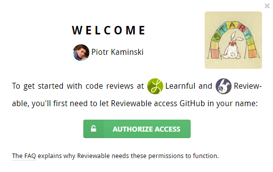
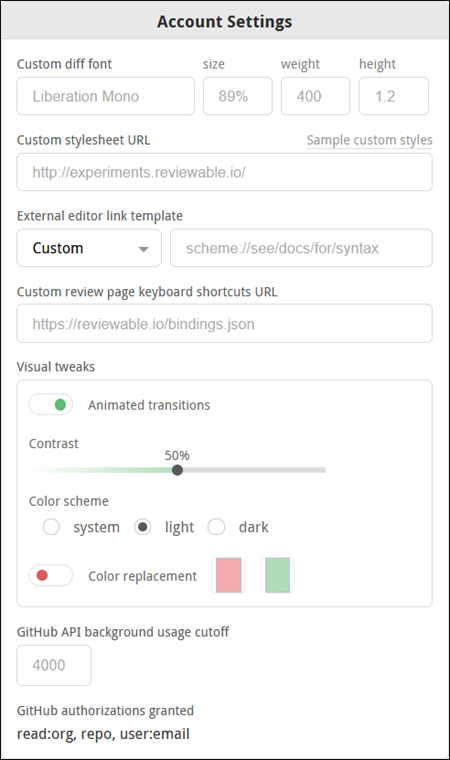
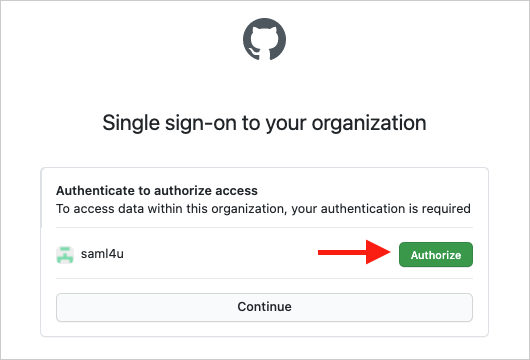

# Registration and GitHub Authorization

It is necessary to have a GitHub account to sign-in to Reviewable. Simply click the **Sign in** button in the upper-right corner of the page, and then enter your GitHub credentials in the popup window. If necessary, you can create a GitHub account from there.

{width=415px}

## Subscribing organizations member sign-up

To ease onboarding for members of organizations with a private repo subscription, a popup window will appear that provides a clear call to action (on the first sign-in):

Learn more in [Subscriptions](#subscriptions).

## OAuth app access restrictions {#oauth-restrictions}

[OAuth app access restrictions](https://help.github.com/articles/about-oauth-app-access-restrictions/) can completely block Reviewable from an organization. This often happens inadvertently and is usually undetectable by Reviewable. If some of your PRs/repo/organizations are inexplicably missing, make this one of the the first things that you check.

::: danger
Forked repositories inherit the access restrictions of their source organization. If the original organization does not allow Reviewable, then the fork may not appear on the Reviewable Repositories page. In this case, enable Reviewable in the source organization or make a manual copy instead of a fork.
:::

## GitHub authorizations

It is necessary for you to grant authorizations to Reviewable in GitHub. Your current GitHub authorization scopes appear at the bottom of the Account Settings drop-down window:

Here's how we use the [GitHub authorizations](https://developer.github.com/apps/building-oauth-apps/scopes-for-oauth-apps/) you grant to Reviewable:

* `public_repo` — Reviewable will post pull request comments on your behalf, merge pull requests, delete branches on your request, and pin revision commits in the repo so they don't disappear if you rebase.
* `repo` — Reviewable will list your private repos and organizations, read source code (only in the browser), read pull request metadata and comments, post pull request comments on your behalf, merge pull requests, delete branches on request, and pin revision commits in the repo so they don't disappear if you rebase.
* `admin:repo_hook` — Reviewable will add or remove an event hook when connecting or disconnecting a repo, so that Reviewable is notified of relevant events (e.g., pull request updates).
* `admin:org_hook` — So that Reviewable is notified of relevant events — such as organization membership changes — Reviewable will add or remove an event hook when subscribing to a plan or unsubscribing from a plan.
* `read:org` — Reviewable will get a list of the organizations of which you’re a member—even if your membership is private. Reviewable will also retrieve a list of all the repos which you can access as an organization member, and a list of your team memberships.
* `user:email` — Notifications specific to Reviewable are sent to your email address, such as failed subscription charges, quota overages, or failures to parse an emailed comment.

::: tip
Reviewable staff may also contact you directly in exceptional circumstances — such as when something has gone wrong with your account. All day-to-day review email from Reviewable is sent indirectly through GitHub, and is controllable with GitHub notification settings.
:::

::: danger
GitHub lets you connect multiple email accounts and define how to route notifications based on which organization they pertain to. Unfortunately, this routing table isn't available through their API, so Reviewable always sends non-review email messages to the primary email address for your account.  Review emails are handled by GitHub, which has access to the routing configuration and will honor it.
:::

While Reviewable only needs read access to your repositories to function, GitHub permission scopes don't distinguish between read and read/write access.  Write access is also required to post pull request reviews on your behalf, and let you merge PRs from within Reviewable.

::: tip
GitHub Apps do support finer-grained permissions scoping, and it's a long term goal of the team at Reviewable to shift over to this platform (currently, it's an “OAuth app”). So far, though, this platform doesn’t support all the APIs that Reviewable requires.
:::

You can revoke any or all of these permissions at any time in your [GitHub authorized applications](https://github.com/settings/applications) settings page on GitHub. Remember to disconnect your repos before revoking, otherwise Reviewable will bug you about the lost permissions.

## Authorization scopes

GitHub authorization scopes cannot be narrowed to a particular organization. For more information, GitHub also has some docs on [authorization scopes](https://developer.github.com/v3/oauth/#scopes). Specifically, we recommend that you take a moment to learn about [OAuth App access restrictions](https://help.github.com/articles/about-oauth-app-access-restrictions/).

## SAML Authorization {#saml-authorization}

Github allows organizations to protect resources with a SAML SSO server.  If your organization has enabled SAML you'll need to explicitly authorize Reviewable to access your organization; your previous generic authorization will not be enough. If Reviewable can safely notify you of this change, we'll prompt you to re-authorize your current session.  Otherwise, we'll have to terminate your current authorization and prompt you to sign back in.

