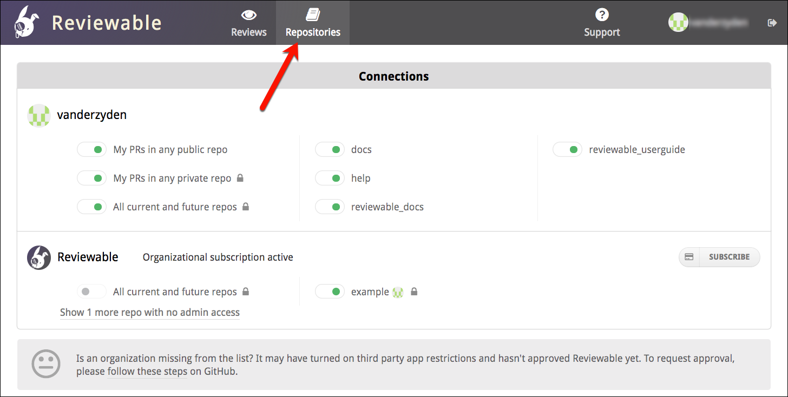

# Repositories

The Repositories page lists all of your repos. From this page, you can authorize access to new Github repositories, and also navigate to the repositories that you already connected to Reviewable. 



<br>

## Repo Settings 

Click on a repo name to access the repo settings panel. 

At the top, you'll see the owner of this group of repositories. If you don't see an organization of which you're a member, ensure that you click **SHOW ALL ORGANIZATIONS**. Of course, it's important that your admin has approved Reviewable. 


<br>

### Applying changes to settings

If you make any changes to the settings here, click the **APPLY** button at the top of the page to commit your changes for the repo you originally chose. Click the drop-down button adjacent to the **APPLY** button to view a panel for specifying additional repos to which your changes will apply. 

Click **Cancel** to discard any change to the settings.


<br>

### Basic options 

#### Reviewable badge  

Choose where the Reviewable badge is to be inserted on the GitHub website:

*   **Description** — at the bottom of the description for the PR.  This is convenient since the link will be in a consistent place. However, a manual edits to the PR may cause an immediate update after it's created, which might rarely causing the description to be lost.
*   **Comment** — in a new PR comment. Optionally specify who should be the author of the comment (organization members with access to the repo only). Otherwise, this defaults to the repo connector or review visitor.
*   **None** — no badges will be visible (private repos only).

<br>
<table border ="1", bgcolor="ADE9FB">
<tbody>
<tr>
<td><strong>NOTE</strong>:  Changes here are retroactive, except that an existing description badge won’t be moved to a comment. Rather, it will be applied passively as reviews are visited.</td>
</tr>
</tbody>
</table>
<br>

#### Default review style 
In this drop-down, choose the default review style (see the [Commits section of the Summary of changes](summary.md)) for this repo. The choice here affects how commits are grouped into revisions, and the suggested sequence of diffs to review.

This setting can be overridden on a particular review (by a user that has push permissions).

There are two types of default review styles:

*   **Combine commits for every review** — this combines overall aggregated changes proposed for merging; not every commit may be accessible for diffing.
*   **Review each commit separately** — even if the changes were overwritten by a later commit. This choice is only recommended if commits are well organized.


#### Approve button output 
You can customize the function of the **Approve** button (aka **LGTM** button), which appears on the general discussion when the conditions are right. You can customize what will be inserted into the draft when you click it. By default it inserts <strong> : lgtm : </strong>, which renders a custom emoji. But, some teams customize it to insert a form, or a different approval message. The button also always sets the publication status to **Approved**.


#### Review status in GitHub PR 
This setting determines whether or not to post completion of the review as a status check on GitHub. Choose **On for visited reviews** to post only after a review has been accessed at least once in Reviewable.

<table border ="1", bgcolor="ADE9FB">
<tbody>
<tr>
<td><strong>NOTE</strong>:  Changes here are retroactive, except that an existing description badge won’t be moved to a comment. Rather, it will be applied passively as reviews are visited.</td>
</tr>
</tbody>
</table>
<br>


### Condition code to determine when a review is complete

In the **Condition Code** panel, you can edit the code that determines when a review is complete. Typically, you'll use this to customize the number of reviewers required, or switch from the GitHub approval system to a more flexible one based on explicit LGTMs.  Some people have created more unusual conditions, though, such as:

*   preventing review completion for N hours after PR was created, so people get a chance to check it out,
*   Requiring reviews from certain people based on the labels attached to the PR, or
*   preventing merging of PRs that have commits with "WIP" in the title.

The current state of the review is accessible in the **<code>review</code></strong> variable, the contents of which are similar to what is seen in the Review State panel (explained below). You must return an object with a <strong><code>completed</code></strong> boolean and a <strong><code>description</code></strong>, and can optionally include other useful values, like so:

```
{
  completed: false,                      // whether review is complete
  description: '2 of 5 files reviewed',  // full description of current status
  shortDescription: '2 files left',      // optional short description (to fit into 50 chars)
  // optionally, users whose action is needed to advance the review; will be appended to description
  pendingReviewers: [ {username: 'pkaminski'} ],
  // optionally, per-file per-revision flags to override reviewed status (defaults to reviewers.length >= 1)
  // (it's OK to just augment the input files structure with reviewed flags and return the whole thing here)
  files: [
    {path: 'LICENSE', revisions: [key: 'r1', reviewed: true]}
  ]
}
```

The condition code will run in an isolated NodeJS 6.x environment (as of this writing -- this gets updated regularly) that includes the 3.x lodash module available through the customary <strong> <code>_</code> </strong> binding. You can require other built-in Node modules, though some may be disallowed. Each invocation of your code must return a result within three seconds.

For testing, your code will be continuously evaluated against the review state on the right (see the section below for more information). The results will appear in the **Evaluation result** pane at the bottom of the settings page.

From the small **Examples** drop-down menu, you can choose a template for the condition code. These templates can help you learn about different conditions and serve as a starting point for editing your own custom condition code.


<br>

### Review state panel
Edit the contents of the Review State panel, which is used for testing your condition code. The initial state corresponds to the state of the current review. To load the review state of a specific PR in this repository, enter a PR number in the small field above this panel. Note that this is only sensible if a review has already been created for the PR. It will replace the contents of the review state editor.

The sample review state below explains the various properties. All timestamp values indicate milliseconds since the epoch, and all lists are ordered chronologically (when appropriate). If you find that you'd like more data please ask and we'll see what we can do.

```
{
  summary: {
    lastRevision: 'r1',             // The key of the last revision
    numUnresolvedDiscussions: 1,    // The number of unresolved discussions
    numFiles: 1,                    // Total number of active files in the review
    numUnreviewedFiles: 1,          // Number of files not reviewed by anyone at latest revision
    numFilesReviewedByAtLeast: [1]  // Number of files reviewed by at least N people (as index)
      // e.g., numFilesReviewedByAtLeast[2] is the number of file reviewed by at least 2 people
  },
  pullRequest: {
    author: {username: 'pkaminski'},
    assignees: [
      // A user is participating iff they commented or reviewed a file.
      {username: 'pkaminski-test', participating: true},
      {username: 'mdevs5531', participating: false}
    ],
    requestedReviewers: [
      {username: 'pkaminski-test', participating: true}
    ],
    number: 44,
    numCommits: 3,
    creationTimestamp: 1436825000000,  // added recently, it could be missing for older reviews
    target: {owner: 'pkaminski', repo: 'sample', branch: 'work'},
    source: {owner: 'pkaminski', repo: 'sample', branch: 'pkaminski-patch-9'}
  },
  revisions: [  // List of all revisions, in chronological order
    {
      key: 'r1',
      snapshotTimestamp: 1436825047000,  // When this revision was snapshotted (missing if provisional)
      obsolete: false,
      commitSha: '435ae39a89e6992c9ed72fd154bc3c45290d8a97',
      baseCommitSha: '3cd017d236fe9174ab22b4a80fefb323dbefb50f',
      commits: [
        {sha: '435ae39a89e6992c9ed72fd154bc3c45290d8a97', timestamp: 1436825047000}
      ]
    }
  ],
  labels: [  // List of all labels applied to the pull request
    'Comments only in Reviewable'
  ],
  sentiments: [  // List of sentiments (currently just emojis) extracted from comments
    {username: 'pkaminski', emojis: ['lgtm', 'shipit'], timestamp: 1449045103897}
  ],
  discussions: [  // List of the discussions in the review (metadata only)
    {
      numMessages: 1,
      resolved: false,  // Whether the overall discussion is resolved
      participants: [
        {
          username: 'pkaminski',
          disposition: 'discussing',  // Participant's current disposition
          resolved: true  // False if this participant is blocking resolution
        }
      ],
      target: {  // Target file location; the top-level discussion doesn't have a target
        file: 'LICENSE', revision: 'r1', base: false, line: 4
      }
    }
  ],
  files: [  // List of files in the review
    {
      path: 'LICENSE',
      revisions: [  // List of the revisions where this file was changed
        {
          key: 'r1',
          obsolete: false,
          reviewers: [  // List of users who marked file as reviewed at this revision
            {username: 'somebody'}
          ]
        }
      ]
    }
  ]
}
```

### Evaluation result
This panel contains the result of running your condition code on the review state object. It is continuously updated, and will begin with something similar to this:

```
{ completed: false,
  description: '0 of 4 files reviewed, 7 unresolved discussions',
  shortDescription: '4 files, 7 discussions left',
  pendingReviewers:
  ...
```

You can set a **debug** property as part of your result to inspect any data structure from your code in the output panel.


## Subscriptions

Organizations are shown below your personal repos. If you are a contributing member of a subscribing organization, those will also appear on the Repositories page.

While Reviewable only needs read access to your repositories to function, GitHub permission scopes don't distinguish between read and read/write access.


<table border ="1", bgcolor="ADE9FB">
<tbody>
<tr>
<td><strong>Permissions and GitHub apps</strong>: GitHub Apps do support finer-grained permissions scoping, and it's a long term goal of the team at Reviewable to shift over to this platform (currently, it's an "OAuth app"). So far, though, this platform doesn’t support all the APIs that Reviewable requires.</td>
</tr>
</tbody>
</table>
<br>

Every subscription gets a 30-day free trial, which requires no credit card up front. Reviewable uses Stripe to process payments and store your credit card information—so you can have full confidence that your financial information is secure.

**Private organizational repos require a subscription:** While public and private personal repos don't need a subscription, it is necessary to initiate a Reviewable subscription to create reviews in private, _organizational_ repos. 

If you don't explicitly start a subscription, an automatic trial subscription will begin at the moment you create the first review.


### Write access is mandatory 

Reviewable posts any pull request comments on your behalf, and GitHub considers this as writing to the repo. Naturally, this requires write access. Reviewable must therefore gain write access to any repo. Keep in mind that another advantage of having write access to your repos will also give you the option to merge a pull request once the review is complete.


<table border ="1", bgcolor="ADE9FB">
<tbody>
<tr>
<td> <strong>NOTE</strong>: OAuth app restrictions may entirely block Reviewable from an organization. Learn more in the <strong>OAuth app access restrictions</strong>section of the [Registration](registration.md) page.</td>
</tr>
</tbody>
</table>
<br>

### Counting contributors

Each plan has a maximum number of monthly contributors. Rather than forcing you to maintain yet another user list, we count each distinct PR author as a contributor—at the time a review is created and linked to the PR. Once a review has been created, any number of people can view it and participate.

When the addition of a new contributor exceeds this maximum, you will receive immediate notification. If you have chosen a subscription plan that has a flexible overage, Reviewable will permit all additional contributors if you did not exceed your maximum in the previous billing cycle. This flexibility provides you additional time to upgrade your subscription without disruption. If you are confident that the overage will not continue into the next month, you can simply ignore it. If your plan doesn't have the flexible overage feature, or you exceeded the maximum in the prior month, Reviewable won't create the review until you upgrade your subscription—or the contributor count resets on your next billing date. 

<table border ="1", bgcolor="ADE9FB">
<tbody>
<tr>
<td><strong>NOTE</strong>: We'll continue updating all previously created reviews, though, and keep creating reviews for contributors that were already counted this month.</td>
</tr>
</tbody>
</table>
<br>

### Managing the scope of your subscription
By default, a subscription covers all reviews in a single organization. Optionally, you can restrict or expand this scope. 


#### Restricting to contributor teams
To restrict access to your Reviewable subscription, simply designate a contributor team. Only PRs from team members can be submitted for review, even if others outside the team create PRs in a connected repository. Establishing a team is one approach to  ensure that you won't exceed the contributor maximum for your subscription.


#### Extending to other organizations
If you want to open your subscription to various contributors, or if your company requires the use of multiple GitHub organizations, then you may want to consider some of the subscription plans that permit access from explicitly designated organizations. 

If you do extend your subscription to multiple organizations, it will not be possible to designate a contributor team. Also, keep in mind that any one person who creates reviews in different extended organizations counts as a single contributor—so this may be a less expensive alternative to maintaining separate subscriptions.


### Canceling a private organization subscription 
You can change or cancel a subscription at any time—with immediate effect—but there will be no refunds or proration of fees. If you cancel, previously created reviews will continue to be accessible and synchronized with GitHub. However, you'll no longer have the ability to create new reviews.


### Transferring an organizational subscription—not yet possible
One question that comes up regularly is how to transfer an organizational subscription between owners. Presently, this is not possible. While a subscription may indeed cover one or more organizations, it's strictly owned by a single individual. To transfer, have the new owner begin another (duplicate) subscription, then have the original subscriber cancel their subscription. This way, there will be no interruption in service.

We have plans to accommodate this better in the future, though it is not yet a top priority.


### Reauthorizing access
If you previously connected repos, but later revoked the authorization for Reviewable, you will need to re-authorize access to maintain the connection. You will see messages at the top of the repo page that prompt you to take action.

## Your source code always remains secure

Reviewable will never store your source code on its servers. Each session will fetch the code directly from GitHub into the browser over a secure HTTPS connection. For transparency, here’s a non-exhaustive list of the kinds of data stored on Reviewable servers:

*   Comments, including drafts.
*   Pull request metadata, such as filenames, and commit and file SHAs.
*   Basic account data, such as id, username, and email address.
*   The OAuth access token that you authorized (encrypted for extra security).
*   Settings for all levels: organization, repository, user, and review.
*   Subscription data, but only the last 4 of the credit card and expiration date are kept.
*   Issue titles and commit messages are cached and flushed regularly, as are the GitHub branch protection settings.
*   Repo permissions and organization memberships. 

Access is controlled by a set of standalone security rules that are enforced directly by the database. Access permissions are inherited from GitHub and rechecked every half hour. All data is always transmitted across secure connections. The access token remains encrypted, at rest, with a key known only to Reviewable servers, and used only to access GitHub on your behalf. Unless you grant explicit written authorization (e.g., to debug an intractable issue), Reviewable staff will never use the token to access your repository contents.  And of course under no circumstances will we disclose any of your private information to other parties beyond what's needed to provide our service—please see our [terms of service](https://github.com/Reviewable/Reviewable/blob/master/legal/terms.md) and [privacy policy](https://github.com/Reviewable/Reviewable/blob/master/legal/privacy.md) for the legal details.

If you need more details about our security architecture or have any other concerns we can address, please contact us at [support@reviewable.io](mailto:support@reviewable.io).


## Connecting PRs from repositories 
If the **My PRs in any public repo** toggle is on, Reviewable will regularly scan your public PRs and create reviews for them, which is will enable connecting reviews to all of your open source contributions. The same applies to private PRs for the **My PRs in any private repo** toggle, which gives you the flexibility to have only a subset of users in a private repo use Reviewable.  (This last is a legacy feature that may get removed in the future, since it was mainly used to constrain the set of contributors to avoid going over quota, and this can now be specified directly in a subscription's configuration.)


<br>
<br>


<table border ="1", bgcolor="ADE9FB">
<tbody>
<tr>
<td><strong>Limitation for private repos</strong>: This will only work if the relevant repo has an active subscription at the time the PR is created. If no subscription is found, you'll get a warning email, the review won't be created, and Reviewable will not try again. If a subscription is added later you'll need to create the review manually by clicking on the PR in your dashboard.
</td>
</tr>
</tbody>
</table>
<br>


## Connect all current and future repos (organization owners only)


If the **All current and future repos** toggle is on, Reviewable will connect to all current and future repos in your organization and automatically create reviews for those repos. Reviewable will not connect to any repos that were previously toggled off.


<table border ="1", bgcolor="ADE9FB">
<tbody>
<tr>
<td><strong>NOTE</strong>: Take care in using this option, since Reviewable will insert a link into all open PRs in all repos.
</td>
</tr>
</tbody>
</table>
<br>

## Repository Connections 
The indicator next to each repository name shows the connection state for this repo. While a repo is connected, Reviewable automatically creates review for any open PR and inserts a link into all open PRs in the repo.


<br>
<br>


You must have admin permissions to change this toggle to either disconnected or connected (see below). Connecting to a private organizational repo may cause you to automatically begin the 30-day free trial.

This toggle will appear in one of these colors:

*   **Black** — This repo is disconnected. Reviewable will not automatically create reviews for this repo, but it is possible to initiate a review from the **Reviews** dashboard.
*   **Green** — Connected repo. Reviewable will automatically create reviews for all open PRs and insert a link to the review into the description for each PR. **NOTE:** Optionally, this is customizable in the repo settings to appear as a separate comment, or to not appear at all (for private repos), but this is not retroactive and must be configured before connecting the repo.
*   **Red** — Broken connection. Look for the error message on this page. Though some reviews may be created under this condition, it is necessary to fix the problem to ensure all reviews function properly.

<br>
It is entirely safe to connect or disconnect from a repo—at any time—without risk of data loss. After a review is created, it will not be affected by this toggle.<br>
<br>


<table border ="1", bgcolor="ADE9FB">
<tbody>
<tr>
<td><strong>NOTE</strong>: If a user has a connected repo but later leaves an organization, it will be necessary for an admin to toggle the repo off and then on to assume control of the connection.
</td>
</tr>
</tbody>
</table>
<br>


## Using Reviewable for all PRs

You may find it impracticable to use Reviewable for all PRs, especially for small changes. While every pull request from a connected repo will automatically display a button that links it to a Reviewable review, you can simply ignore it and conduct the review in GitHub. Reviewable will close the review when you close the PR. 


<table border ="1", bgcolor="ADE9FB">
<tbody>
<tr>
<td><strong>NOTE</strong>: If a private organizational repo is covered by a subscription, each PR will count against your user maximum—whether you use the review or not.
</td>
</tr>
</tbody>
</table>
<br>


## Disadvantages of ad-hoc PR and review connections 

When you connect a repo, you get links to all PRs in that repo; connecting your PRs links all PRs you author across all repos.

By contrast, Reviewable doesn't get write access to the repo if you individually connect all your own PRs or conduct ad-hoc reviews. These are the disadvantages of this approach:

*   New commits, GitHub comments, labels, and the PR assignee don't immediately sync with the review, but will only synchronize after somebody loads the review. The dashboard will display stale information for such reviews. Comments posted in Reviewable will propagate immediately.
*   Assignee and label directives in GitHub and emailed comments won't apply until a user loads the review.
*   Review status checks won't post to the PR, since Reviewable isn't subscribed to repo events and unable to make timely updates.
*   Reviewable may not be able to reliably detect and apply your branch protection settings in its UI. (The branch protection settings will be enforced by GitHub no matter what, though, so this is safe but potentially confusing.)
*   It may not be possible for Reviewable to pin revision commits, so if you use <strong><code>git rebase</code></strong> and <strong><code>git push --force</code></strong>, some of them may get garbage collected and will no longer be accessible in the review. They'll usually get pinned when the reviewer (with push authority) accesses the review.

Though the differences above may be minor, it's much more convenient and reliable to connect a repo directly.

<table border ="1", bgcolor="ADE9FB">
<tbody>
<tr>
<td><strong>NOTE</strong>: Force-pushing can remove commits from any commit trees that are anchored at branch heads. Since they have become unreachable, those orphaned commits will eventually be garbage-collected by <strong>git</strong>. However, they may still be referenced by some revisions in Reviewable, because those are immutable (even in the face of force pushing that modifies the history). If Reviewable doesn't have reliable access to an admin account through a repo connection, then there is no guarantee that it will be able to make those potentially-orphaned commits reachable and prevent them from elimination in the next garbage collection.
</td>
</tr>
</tbody>
</table>
<br>


