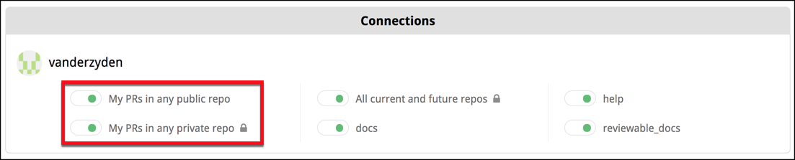

# Admin Center {#repositories}

The Admin Center lets you manage settings for all of your personal and organizational repositories.  From this page, you can connect Reviewable to GitHub repos, adjust connection settings, manage your Reviewable subscriptions (for which, please see the [next chapter](subscriptions.md)), and connect a Slack workspace to enable review notifications.


Repositories are grouped by owner via the **Organization** dropdown at the top of the page.  If you don't see an organization of which you're a member, ensure that you click **Show all organizations** if it's there.  If the organization is still missing, check whether you need to [request approval for Reviewable](https://help.github.com/articles/requesting-organization-approval-for-oauth-apps/) from your organization owners.

## Security concerns

Reviewable will never store your source code on its servers. Each session will fetch the code directly from GitHub into the browser over a secure HTTPS connection. For transparency, here’s a non-exhaustive list of the kinds of data stored on Reviewable's servers:

* Comments, including drafts.
* Pull request metadata, such as filenames, and commit and file SHAs.
* Basic account data, such as ID, username, and email address.
* The OAuth access token that you authorized (encrypted for extra security).
* Repo permissions and organization memberships.
* Settings for all levels: organization, repository, user, and review.
* Basic subscription information (payment details are stored on Stripe).
* Issue titles, commit messages, and GitHub branch protection settings are cached and flushed regularly.

Access is controlled by a set of standalone security rules that are enforced directly by the database. Access permissions are inherited from GitHub and rechecked every 15 minutes to 2 hours, depending on the permission's power. All data is always transmitted across secure connections.

The access token remains encrypted at rest with a key known only to Reviewable servers, and used only to access GitHub on your behalf. Unless you grant explicit written authorization, Reviewable staff will never use the token to access your repository contents or mutate data.  When debugging an issue tied to your account, we may use it to make harmless read-only metadata requests.

Reviewable does need write permissions for your repos.  See the [GitHub authorizations](registration.md#github-authorizations) section for a full explanation.

Because Reviewable is an OAuth app, the [commit statuses](#review-status-in-github-pr) it posts on pull requests cannot be authenticated and could be posted by any user or app with status write permissions under the same context.  This could let someone bypass branch protection settings by faking a "review complete" status.  If this is a concern in your environment, you may wish to exercise discretion in granting such permissions to users or apps, or institute an audit process that checks whether the statuses' author is the same user who connected the repository to Reviewable.

Under no circumstances will we disclose any of your private information to other parties beyond what's needed to provide our service — please see our [terms of service](https://github.com/Reviewable/Reviewable/blob/master/legal/terms.md) and [privacy policy](https://github.com/Reviewable/Reviewable/blob/master/legal/privacy.md) for the legal details.

If you need more details about our security architecture or have any other concerns we can address, please contact us at [support@reviewable.io](mailto:support@reviewable.io).

## Connecting repositories

The toggle next to each repository name indicates its connection status. While a repo is connected, Reviewable automatically creates a review for any open PR and inserts a link to the review into the PR description on GitHub.

{width=550}

The toggle's color reflects the state of the connection:

* **Gray (off)** — The repo is disconnected. Reviewable will not automatically create reviews for this repo, but it is possible to initiate a review from the [Reviews dashboard](dashboard.md#open-review).
* **<span class="text-green">Green</span>** — The repo is connected and healthy. Reviewable will automatically create and update reviews for all open PRs and insert a link to the review into the PR description.  (You can customize this latter behavior in the [repo settings](#repo-settings), but must do so _before_ connecting the repo!)
* **<span class="text-red">Red</span>** — The repo was connected, but the connection is now broken. Look for the error message on this page. Though some reviews may be created under this condition, it is necessary to fix the problem to ensure all reviews function properly.

You must have repo admin permissions to connect or disconnect a repo. Connecting to a private organizational repo may cause you to automatically begin the 30-day free trial.

It is entirely safe to connect or disconnect a repo at any time without risk of data loss. After a review is created, it will not be affected by this toggle.

::: tip
If you previously connected repos, but later revoked the authorization for Reviewable, you will need to re-authorize access to maintain the connection. You will see messages at the top of the repo page that prompt you to take action.
:::

::: danger
If a user has connected a repo but later leaves an organization, another admin will need to toggle the repo off and then on again to assume control of the connection.  Reviewable will send a warning email to the original connector if it detects this situation.  To avoid this, **we recommend creating a dedicated "service account" user to assume control over connections.**
:::

Each connected repository will have an "N open reviews" link under it that will take you to a repository-specific [reviews dashboard](dashboard.md).

### Connect all current and future repos {#current-and-future}

There's also a special **All current and future repos** toggle.  When turned on by an organization owner, Reviewable will connect all current _and future_ repos in this organization and automatically create reviews for those repos. Reviewable will not connect any repos that were previously manually toggled off.

::: danger
You may wish to confirm the [settings](#repo-settings) of current repos and designate a [prototype repo](#prototype-repo) for future ones before you turn on this feature.  For more flexibility, [use a master `settings.yaml` file](#applying-a-settings-yaml-file-to-multiple-repositories) instead.  By default, Reviewable will insert a link into all open PRs in all repos unless you've changed this setting beforehand.
:::

### Create reviews for your own PRs

Reviewable can create reviews for all PRs that you author across all repos.  If the **My PRs in any public repo** toggle is on, Reviewable will regularly scan your public PRs and create reviews for them (inserting a link into the PR), covering all of your open source contributions.

{width=450}

The same applies to private PRs for the **My PRs in any private repo** toggle, which gives you the flexibility to have only a subset of users in a private repo use Reviewable.

::: danger
The **My PRs in any private repo** setting is a legacy feature that may get removed in the future, since it was mainly used to constrain the set of contributors to avoid going over quota, and this can now be specified directly in a [subscription's configuration](subscriptions.md#team-constraints).  It will only work if the relevant repo has an active subscription at the time the PR is created and won't backfill if a subscription is created later.
:::

### Reviews in connected vs unconnected repos

When you connect a repo, you get links to the reviews from all PRs in that repo and immediate updates whenever anything changes in GitHub.

By contrast, Reviewable doesn't get write access to the repo if you individually connect all your own PRs or create ad-hoc reviews via the dashboard. There are some disadvantages to this approach:

* New commits, GitHub comments, labels, and the PR assignee don't immediately sync with the review, but will only synchronize after somebody loads the review. The dashboard will display stale information for such reviews. Comments posted in Reviewable will propagate immediately.
* Assignee and label directives in GitHub and emailed comments won't apply until a user loads the review.
* Review status checks won't post to the PR, since Reviewable isn't subscribed to repo events and unable to make timely updates.
* Reviewable may not be able to reliably detect and apply your branch protection settings in its UI. (The branch protection settings will be enforced by GitHub no matter what, though, so this is safe but potentially confusing.)
* It may not be possible for Reviewable to pin revision commits, so if you use `git rebase` and `git push --force`, some of them may get garbage collected and will no longer be accessible in the review. They'll usually get pinned when the reviewer (with push authority) accesses the review.
* [Publish on push](reviews.md#publish-on-push) will be unavailable.
* `.gitattributes` properties injection into the custom review completion condition may not be available.

Though the differences above may seem minor, it's much more convenient and reliable to connect a repo directly.

::: tip
You may find it impractical to use Reviewable for all PRs, especially for small changes. While every PR from a connected repo will automatically display a button that links it to a Reviewable review, you can simply ignore it and conduct the review in GitHub. Reviewable will close the review when you close the PR.  However, if the PRs are in a private organizational repo, each review will count against your contributor maximum — whether you use it or not.
:::

## Slack integration

Reviewable can send review notifications to a connected Slack workspace via Direct Messages (DMs).  Reviewable will use the Slack profile listed under your GitHub profile's [Social accounts](https://docs.github.com/en/account-and-profile/tutorials/personalize-your-profile#adding-links-to-your-social-accounts). 

To connect a Slack workspace to an organization, an organization owner who is also an admin of the Slack workspace must click the **Add to Slack** button in the Admin Center and complete the OAuth setup steps there. 

Click the **Slack DM** toggle in the Account Settings dropdown to turn review notifications via Slack on and off.  When turned on, you can choose between having notifications delivered **instantly** or **daily** (batched) at a given time.

::: tip 
If *review notifications* aren't available, one or more of the following requirements may not be satisfied:
* Your organization must be covered by a subscription.
* Your organization must be connected to a Slack workspace per the instructions above.
* The URL of your Slack profile from the same workspace must be added to your [Social accounts](https://docs.github.com/en/account-and-profile/tutorials/personalize-your-profile#adding-links-to-your-social-accounts) in your GitHub profile.
:::


## Repository settings {#repo-settings}

Reviewable inherits most repository settings from GitHub, but some advanced features require their own configuration.

### Settings configuration strategies

Reviewable repository settings can either be managed from the [repository page](https://reviewable.io/repositories) or through a configuration file in the `.reviewable` directory at the root of your repo.

#### Accessing repository settings in Reviewable {#Accessing-repository-settings-with-the-GUI}

From the Repositories page, click on a repository name to access the repo settings page.  This works whether the repo is connected or not.


Click the **Apply** button at the top-right of the page to commit your changes for the repo.  Click the adjacent dropdown button to view a panel for specifying additional repos to apply these settings to (_all_ the settings will be overwritten, not just your current changes).  Click **Cancel** to discard any change to the settings.

#### Prototype settings for new repos {#prototype-repo}

If you are an organization owner, you can set a repo as the settings prototype for any repos that haven't been accessed or created yet.  Simply click the **Set as prototype for new repos** button near the top of the page, and Reviewable will copy the prototype's settings the first time it accesses a new repository.  The prototype repo will be indicated by a star <i class="master repo icon"/> icon on the Repositories page.

::: tip
This feature is particularly useful if you chose to connect [all current and future repos](#current-and-future). If you would like more flexibility configuring your connected repositories, you can [use a master `settings.yaml` file.](#applying-a-settings-yaml-file-to-multiple-repositories).
:::

Hovering over the **Set as prototype for new repos** button will display a tooltip with more details about the state of the prototype repo:

* "Checking permissions...", "Loading current state..."
  * Please wait a few seconds.
* "Restricted to organization owners."
  * You cannot view or edit this setting unless you're an organization owner.
* "No prototype repository set."
* "This is the current prototype repository."
* "The current prototype repository is ____.".

#### Storing repository settings using the `.reviewable` directory {#file-based-settings}

The `.reviewable` directory provides a file-based way to manage review settings within your project.

You can move your settings from the Repository settings page to the `.reviewable` directory by clicking the **"Store settings in repo?"** link near the top of the repo settings page and following the provided instructions.

::: danger
In order to use the `.reviewable` settings directory, the repository needs to be [connected](#connecting-repositories). Otherwise, the `.reviewable` directory will be ignored.
:::

::: danger
Reviewable reads the contents of the `.reviewable` directory from the repository's default branch; this is your `main` or `master` branch unless changed on GitHub. The contents of other branches don't affect the repository settings until they get merged into the default branch.
:::

The `.reviewable` directory can contain a `settings.yaml` file and/or a [completion condition script](#completion-condition-script) (or more than one in case you're using repository-specific [overrides](#overrides)).

The `settings.yaml` file provides several options used to configure the settings for one or more of your repositories. Settings listed at the top level of this file are used as the default settings for the current repository.

[View an example `settings.yaml` file here](https://github.com/Reviewable/Reviewable/tree/master/examples/settings/settings.yaml).

::: tip
When the `settings.yaml` file is used for a repository, the repository settings page in Reviewable is hidden; a message will be displayed informing you that the settings for that repository are managed via the `settings.yaml` file.
:::

::: danger
If your `settings.yaml` file contains any invalid options, an error message will be displayed on the repositories page.  Reviewable will continue using the last synced value for any invalid options. If the file itself is invalid, Reviewable will default to the last synced value for all settings and the [completion condition script](#completion-condition) if any. Local settings will override any invalid master settings.
:::

#### Organization-wide settings using a master `settings.yaml` file {#applying-a-settings-yaml-file-to-multiple-repositories}

You can designate a master repository to store your `settings.yaml` file and any completion condition scripts.  The settings in this master repository will be used for all repositories in your organization (with the exception of [overrides](#overrides)), including newly created repos.

To set this up, ensure the repository contains a `.reviewable/settings.yaml` file, , then type that repository name into the **Master repository** field under Organization settings in the Admin Center.  Reviewable will mark the master repository with a star <i class="master repo icon"/> icon.

::: tip
You may add a local `settings.yaml` file in an individual repository to override settings from the master settings file.
:::

##### Overrides

In addition to organization-wide defaults, you can define more targeted settings using an override in your master `settings.yaml` file. The overrides block applies specific settings to groups of repositories.

The overrides block has two fields:
* repositories — a list of repository names or fnmatch (glob) patterns.
* settings — the settings to apply to those repositories.

For example, to apply custom defaults to any repository whose name starts with dev or fire, you can add the following override to your master `settings.yaml`:

```yaml
default-review-style: one-per-commit
overrides:
  - repositories:
    - dev*
    - fire*
    settings:
      # All repositories with names that start with `dev` or `fire` will use "combined commits" for the `default-review-style` setting.
      default-review-style: combined-commits
```

Multiple repository groups and settings can be listed in an overrides block:

```yaml
overrides:
  - repositories:
    - dev*
    settings:
      default-review-style: one-per-commit
  - repositories:
    - fire*
    settings:
      default-review-style: combined-commits
```

::: danger
Overrides *replace* entire top-level settings (shallow merge) rather than merging nested fields.
If a setting contains multiple sub-options, you must specify all desired values in the override, as unspecified sub-fields are not inherited.
:::

Overrides in a master `settings.yaml` file take precedence over the master defaults defined elsewhere in the same file. An individual repository’s own `settings.yaml` file takes precedence over all master settings, even without using overrides.

Final settings resolve in this order (lowest to highest precedence):

1. Master base settings.
2. Master overrides.
3. Local base settings.
4. Local overrides (rarely used).

##### Finalizing master settings

If you wish to manage all repository settings in one central place without allowing the master settings to be overridden by local settings, you can set `final: true` in the master settings.  This causes any local settings files and completion condition scripts to be ignored.

### Available settings

A list of available settings follows, each describing the available options and how they appear in a `settings.yaml` file.   You can view an [example `settings.yaml` file here](https://github.com/Reviewable/Reviewable/tree/master/examples/settings/settings.yaml).

#### Reviewable badge

Choose *where* and *when* the Reviewable badge (link to the review) is inserted on a GitHub pull request.  This setting looks a bit different in the Reviewable repo settings page, though the same logic applies to both. See [contextual help](index.md#help-on-using-reviewable) for an explanation of those options.

```yaml
badge:
  # The default setting for `location` is `description-bottom`.
  location: description-bottom | description-top | comment | none
  # `commenter` is optional, and only available if `location` is `comment`.
  commenter: *
  # `when` is optional, defaults to 'created'.
  when: created | accessed | published | requested
```

`location` controls *where* the Reviewable badge appears on a PR. Options include:
* `description-top` / `description-bottom` — at the top or bottom of the PR's description.  This is convenient since the link will be in a consistent place. However, manual edits to the PR immediately after it's created will race, and might occasionally cause the edits to be lost.
* `comment` — in a new PR comment. Optionally specify who (`commenter`) should be the author of the comment (organization members with access to the repo only). Otherwise, this defaults to the repo connector or review visitor.
* `none` — no badges will be created (private repos only).

`when` controls *when* the badge is inserted.  By default, the badge is added when the review is created. If you have a current Reviewable subscription or trial, you may optionally choose when to show the badge. On the repo settings page, this is controlled via a checkbox and dropdown underneath the badge location setting.  Options include:
* `created` — show the badge once a PR has been created.
* `accessed` — show the badge once a review has been accessed for the first time. *(Appears as "visited" on the repo settings page.)*
* `published` — only show the badge once a review has been published.  *(Appears as "started" on the repo settings page.)*
* `requested` — only show the badge once a review has been requested. This excludes any PR that never left the draft status, since no review is requested for draft PRs.

::: tip
Changes here are retroactive (except that an existing description badge won’t be moved to a comment), but will be applied lazily as reviews are visited.
:::

#### Default review style

Choose the default [review style](files.md#review-style) for all reviews in this repo.  The choice here affects how commits are grouped into revisions, and the suggested sequence of diffs to review.

This setting can be overridden on a particular review by any user with push permissions.

```yaml
# The default setting is `combined-commits`.
default-review-style: combined-commits | one-per-commit
```

#### Default review overlap strategy

Use the current review status of each file to determine how they are presented to a user for review.

```yaml
# The default setting is `user-default`
default-review-overlap-strategy: user-default | unclaimed | unreviewed | personally-unreviewed
```
* `user-default` — leave the review strategy up to the users preference.
* `unclaimed` — skip any file claimed by another team member in an earlier revision.
* `unreviewed` — Review any file that requires attention.
* `personally-unreviewed` — Ensure that you review every file yourself, ignoring other reviewers.

::: tip
These settings can be overridden by anyone, but will only apply to the individual user.
:::

#### Approve button output

Customize the text inserted into discussions by the **Approve** button (aka **LGTM** button), which appears on the general discussion when the conditions are right.  By default it inserts `:lgtm:`, which renders a custom LGTM (Looks Good To Me) emoji.  Some teams customize it to insert a form, or a different approval message. The button always sets the [approval level](reviews.md#approval-levels) to **Approve**.

```yaml
# The `approval-text` option accepts any text.
# The default setting is `:lgtm:`.
approval-text: ":lgtm:" | *
```

#### Discussion dismissal authority {#discussion-participant-dismissers}

This setting controls the permission level required to [dismiss](discussions.md#dismissing-users) participants from a discussion.  By default, anybody with write permissions can do so. You can limit it to only repo admins for a stricter approach.

```yaml
# The default setting is `push`
discussion-dismissal-restriction: push | maintain | admin
```

#### Merge mechanism

This setting lets Reviewable know how developers are expected to merge pull requests in the repository, so that we can adapt our UI and backend processes accordingly.  **This setting can only be changed using a `settings.yaml` file.**

```yaml
merge:
  # The default setting is `github`.
  mechanism: github | label:* | external
```

The options are:
- `github` — GitHub's built-in default merge functionality, whether immediate or via a merge queue.  Reviewable will present the appropriate flavor of merge button.
- `label:NAME` — A special label on the PR triggers a custom merge queue.  Replace `NAME` with the exact name of your label, correctly capitalized.  Reviewable will present a merge button that adds the label and will treat PRs with the label as queued.
- `external` — The merge process is separate and cannot be integrated.  Reviewable will hide the merge button altogether.

::: danger
Any option other than `github` will cause Reviewable to stop checking GitHub's opinion on mergeability.  This means that the mergeability "check" will no longer be shown on the review page, nor the attendant button that lets you update or rebase your head branch.  Furthermore, if you have branch protection configured, Reviewable won't know if any condition outside a small built-in set is preventing the branch from merging.  Finally, mergeability-related flags will not be passed into your [custom review completion condition](#completion-condition).
:::

::: tip
If you have a different merge process that you'd like to integrate with Reviewable, please [get in touch](mailto:support@reviewable.io) and we'll see what we can do!
:::

#### Review status in GitHub PR

This setting determines whether or not to post the current completion status of the review as a commit status on GitHub under the context `code-review/reviewable`.  Choose `accessed` to post only after a review has been visited at least once in Reviewable.

```yaml
github-status:
  # The default setting is `accessed`
  updates: accessed | always | never
  # Optional username used to post the status; default to any repository admin
  creator: *
```

#### Code coverage

You can configure Reviewable to display code coverage information next to diffs by letting it know where to fetch code coverage reports from.

```yaml
coverage:
  # The `url` option allows you to provide a url template for code coverage reports.
  url: *
  headers:
    # Optional, the `Authorization` header for private repos.
    # You can specify other headers as well (either encrypted or in plain text).
    Authorization: encrypted/rsa2:*
```

`url`: The URL template that Reviewable can use to fetch a report for all files at a given commit.  This setting appears as **Report URL template** in the repository settings panel.  The template can make use of these variables:

* `{{owner}}` — the repo owner (or organization) username.
* `{{repo}}` — the repo name.
* `{{pr}}` — the pull request number.
* `{{commitSha}}` — the full SHA of the target commit.

`headers`: Optional list of headers to send along with the request.  When using a `settings.yaml` file, you can specify additional headers in plain text or use https://reviewable.io/encrypt to generate encrypted text to use in the file instead.

When using the repository settings panel, the **Header** field can be used to send one additional header that is automatically encrypted via https://reviewable.io/encrypt. This is typically used as an `Authorization` header for private repos, though you can specify a different header in this field as well.

::: danger
The URL template will be available to all users with read permissions on this repo, so make sure to put any sensitive secrets in the header instead.
:::

::: tip
If your URL template includes a header, then Reviewable will proxy the request through its servers to keep the header value private. Only a short list of domains are allowed for this proxying. If your URL isn’t on the list, you’ll see an error and will need to [contact us](mailto:support@reviewable.io) to have the domain whitelisted.
:::

::: tip
A quick way to check your code coverage request settings is to try to issue a sample request manually via `curl`.  This will help you verify that your URL template and any authorization headers are correct.
:::

There's a button to let you easily set the report source to [Codecov](https://codecov.io), a popular code coverage report aggregation service.  For private repos, you can generate an API access token under your account settings > Access, and paste it as the value of the `Authorization` header.  If you're using a self-hosted instance of Codecov Enterprise then you'll need to set the URL to something like this instead:  `https://LOCAL_CODECOV_HOSTNAME/api/ghe/{{owner}}/{{repo}}/commits/{{commitSha}}?src=extension`, with `LOCAL_CODECOV_HOSTNAME` replaced by the name of the host where you're running Codecov.

The coverage reports must be in a format that Reviewable understands.  Currently, we only support the Codecov native API format (both v1 and v2) and Codecov's generic [inbound report format](https://docs.codecov.com/docs/codecov-custom-coverage-format).  Additionally, if the report has a top-level `error` string property we'll report that through the UI (and ignore any other data), and render any Markdown-style links it contains.  If you need support for a different format please [let us know](mailto:support@reviewable.io) and we'll consider it, but in general we're biased towards fetching normalized reports from aggregators.

#### Completion condition script

The `settings.yaml` file allows you to specify one or more completion condition files for an individual repository, or any repository listed in the `repositories` object of the master `settings.yaml` file.  Note that the Repository settings panel only allows for one completion condition file.  Reviewable will use a file named `completion.js` by default if it exists and no override specifies a different completion file to use.

::: danger
Completion condition files must be stored in `/.reviewable` or a subdirectory.
:::

Below is an example `settings.yaml` file that specifies different completion conditions for repositories listed in the [`overrides`](#overrides) object.

```yaml
overrides:
  - repositories: reviewable-*
    settings:
      completion-file: reviewable-completion.js
  - repositories: hubkit
    settings:
      completion-file: hubkit-completion.js
```

## Custom review completion condition {#completion-condition}

Reviewable allows you to write custom code that determines when a review is complete and controls other details of a review's progress.  Typically you'll use this to customize the number of reviewers required, or switch from the GitHub approval system to a more flexible one based on explicit LGTMs.  Other use cases include:

* Preventing review completion for N hours after a PR was created.
* Requiring reviews from specific users based on the labels attached to a PR.
* Preventing merging of PRs that have commits with “WIP” in the title.

### Development environment

The **Review completion condition** section of the repository settings page helps you refine your code in a live evaluation environment.

::: tip
If you would like to test a completion condition independently of a repo, you can use the [completion condition playground](https://reviewable.io/playground). This allows you to test a completion script against any PR or Reviewable review by pasting a URL in the **PR** box on the top-right of the page.
:::


In the **Condition function** panel on the left, you can edit the code that determines when a review is complete and otherwise tweaks low-level review data.  [Simple things](https://github.com/Reviewable/Reviewable/blob/master/examples/conditions/ignore_system_files.js) are pretty easy to accomplish but you have the power to implement arbitrarily [complex logic](https://github.com/Reviewable/Reviewable/blob/master/examples/conditions/pull_approve.js) if you need to.  You can find [a number of examples](https://github.com/Reviewable/Reviewable/tree/master/examples/conditions) in our repository to get you started.

The condition code will run in an isolated NodeJS 24.x environment, which gets updated regularly.  The environment includes the 4.x `lodash` module available through the customary `_`. You can require other built-in Node modules, though some may be disallowed. Each invocation of your code must return a result within three seconds.

::: tip
`lodash` 4.x became the default on _9/9/2021_.  You can use a [pragma](#pragmas) to control the `lodash` version made available to your code.
:::

For testing, your code will be continuously evaluated against the **Review state** on the right.  It will auto-populate with the current state of some PR in your repo, but you can fill in the state of any PR # via the small box above it, or edit the state manually to your liking.  See the [review state input](#review-state-input) section below for an explanation of the state's properties.

The results of your code will appear in the **Evaluation result** pane at the bottom of the page.  They must follow a specific structure described in the [condition ouput](#condition-output) section below.


### Pragmas

You can control certain aspects of completion condition execution with special comments (aka "pragmas").  You can have at most one of each kind of pragma, and each must appear alone on a line with no indentation.

The available pragmas are:
- `// dependencies:` — lists implicit dependencies for your code.  Available values are `lodash3` and `lodash4`.
- `// inputs:` — controls what information is supplied as part of the `review` input (separate multiple values with spaces).  Turning properties on and off has knock-on effects on upstream processing.  If you don't specify an `inputs` pragma, Reviewable will attempt to infer unused inputs by running a regex against the code in search of each input’s property name (the last segment of the flag).

  - `-review.pullRequest.target.headCommitSha` — disables this property and skips invoking the completion condition for each push to the base branch.
  - `-review.pullRequest.target.branchProtected` — disables this property and skips invoking the completion condition when branch protection is turned on or off.
  - `-review.pullRequest.mergeability` — disables this property and skips invoking the completion condition when a PR's mergeability status changes.

### Review state input

The current state of the review is accessible to your code via the `review` variable.  The sample review state below explains the various properties. All timestamp values indicate milliseconds since the epoch, and all lists are ordered chronologically (when appropriate). If you find that you'd like more data please ask and we'll see what we can do.

```js
{
  summary: {
    lastRevision: 'r1',             // The key of the last revision
    numUnresolvedDiscussions: 1,    // The number of unresolved discussions
    numFiles: 1,                    // Total number of active files in the review
    numUnreviewedFiles: 1,          // Number of files not reviewed by anyone at latest revision
    numFilesReviewedByAtLeast: [1]  // Number of files reviewed by at least N people (as index)
      // e.g., numFilesReviewedByAtLeast[2] is the number of file reviewed by at least 2 people
    commitsFileReviewed: true
  },
  pullRequest: {
    title: 'Work work work',
    repository: {name: 'Reviewable'},
    number: 44,
    state: 'open',  // one of 'open', 'merged' or 'closed'
    body: 'There is so much work to be done, and this PR does it all.',
    // All users are annotated with a full list of teams they're members of; if the property is
    // undefined then Reviewable wasn't able to fetch this list.
    author: {username: 'pkaminski', teams: ['reviewable/developers'], bot: false},
    coauthors: [
      {username: 'pkaminski-test', teams: ['reviewable/semi-developers'], bot: false, participating: true}
    ],
    creationTimestamp: 1436825000000,  // added recently, it could be missing for older reviews
    draft: false,
    assignees: [
      // A user is participating iff they commented or reviewed a file.
      {username: 'pkaminski-test', participating: true},
      {username: 'mdevs5531', participating: false}
    ],
    requestedReviewers: [
      // When executing the condition prior to publishing a review, this list won't include any
      // reviewers added by the "sync requested reviewers" option if it's checked.  Doing so would
      // create a dependency cycle.  This only affects the posted message -- the condition will be
      // re-evaluated after publishing with the full list of requested reviewers to determine the
      // actual review status.
      {username: 'pkaminski-test', participating: true}
    ],
    requestedTeams: [
      {slug: 'developers'}
    ],
    sanctions: [
      // Lists PR reviews by user along with the latest state (one of 'approved',
      // 'changes_requested', 'commented', or 'dismissed').  Like other user lists it'll also
      // include each user's team memberships.
      {username: 'pkaminski-state', state: 'changes_requested', timestamp: 1436828040000}
    ],
    numCommits: 3,
    target: {
      owner: 'pkaminski', repo: 'sample', branch: 'work',
      branchProtected: true,  // whether GitHub's branch protection is turned on for this branch
      headCommitSha: '3cd017d236fe9174ab22b4a80fefb323dbefb50f'  // may be missing in old reviews
    },
    source: {owner: 'pkaminski', repo: 'sample', branch: 'pkaminski-patch-9'},
    // one of dirty, unknown, blocked, behind, unstable, has_hooks, clean, or draft
    mergeability: 'clean',
    // whether this completion is running on a merge queue commit or on a normal one
    mergeQueueCheck: false,
    checks: {
      Shippable: {
        state: 'failure',
        description: 'Builds failed on Shippable',
        timestamp: 1432363555000
      }
    }
  },
  pendingReviewers: [  // List of proposed pending reviewers computed by Reviewable
    {username: 'pkaminski', teams: ['reviewable/developers'], bot: false}
    // If the PR author was added as a last resort, the object will have `fallback: true`
  ],
  deferringReviewers: [ // List of reviewers who are deferring and will be removed from pendingReviewers
  // by default unless your completion condition accesses pendingReviewers or deferringReviewers
    {username: 'cgiroux'}
  ],
  revisions: [  // List of all revisions, in chronological order
    {
      key: 'r1',
      snapshotTimestamp: 1436825047000,  // When this revision was snapshotted (missing if provisional)
      obsolete: false,
      commitSha: '435ae39a89e6992c9ed72fd154bc3c45290d8a97',
      baseCommitSha: '3cd017d236fe9174ab22b4a80fefb323dbefb50f',
      commits: [
        {sha: '435ae39a89e6992c9ed72fd154bc3c45290d8a97', timestamp: 1436825047000, title: 'Fix foo'}
      ]
    }
  ],
  stage: '2. In progress',  // The latest review stage set by the completion condition
  labels: [  // List of all labels applied to the PR
    'Comments only in Reviewable'
  ],
  sentiments: [  // List of sentiments (currently just emojis) extracted from comments
    {username: 'pkaminski', teams: ['reviewable/developers'], bot: false, emojis: ['lgtm', 'shipit'], timestamp: 1449045103897}
  ],
  discussions: [  // List of the discussions in the review (metadata only)
    {
      numMessages: 1,
      resolved: false,  // Whether the overall discussion is resolved
      participants: [
        {
          username: 'pkaminski',
          teams: ['reviewable/developers'],
          bot: false,
          disposition: 'discussing',  // Participant's current disposition
          resolved: true,  // False if this participant is not in favor of resolving and it's their turn to follow up
          read: true,  // False if this participant has unread messages in this discussion
          lastActivityTimestamp: 1436828040000  // Last time user sent a message or changed disposition
        }
      ],
      target: {  // Target file location; the top-level discussion doesn't have a target
        file: 'LICENSE', revision: 'r1', base: false, line: 4
      }
    }
  ],
  files: [  // List of files in the review
    {
      path: 'LICENSE',
      revisions: [  // List of the revisions where this file was changed
        {
          key: 'r1',
          action: 'modified',  // one of 'added', 'modified', 'removed', or 'renamed' (without changes)
          obsolete: false,
          reverted: false,  // true if this revision of the file is the same as base
          baseChangesOnly: false,  // true if all changes can be attributed to the base branch, undefined if not yet known
          reviewers: [  // List of users who marked file as reviewed at this revision
            {username: 'somebody', timestamp: 1436828040000}  // timestamp null for legacy or inferred reviews
          ]
        }
      ],
      gitAttributes: {  // All .gitattributes properties from base that apply to this file
        diff: 'false'   // Values are normalized and will always be strings
      },
      designatedReviewers: [  // Designations inferred from CODEOWNERS
        {team: 'reviewable/legal'},
        {builtin: 'anyone'}
      ]
    }
  ],
  systemFiles: [ // System files generated by Reviewable, including commit file
    {
      path: '-- commits',
      revisions: [  // List of the revisions where this file was changed
        {
          key: 'r1',
          action: 'added',  // one of 'added', 'modified', 'removed'
          obsolete: false,
          reverted: false,
          reviewers: [  // List of users who marked file as reviewed at this revision
            {username: 'somebody', timestamp: 1436828040000}
          ]
        }
    }
  ]
}
```

The `files[].revisions` property requires a bit of additional explanation.  First, renamed file matching and base change detection is performed only in clients, so the condition will get incomplete input data until a user with appropriate permissions visits the review.

Second, the `baseChangesOnly` flag is computed relative to its revision's *prior revision*, which is not necessarily the immediately preceding one.  This becomes important when rebasing multiple commits while using the "review each commit separately" [review style](files.md#review-style), as Reviewable tries to match each "new" commit to the corresponding commit it replaced.  We don't expose the logic in the data structure above, but our algorithm is robust and biased towards needing strong evidence for a match. As a result, false positive `baseChangesOnly` flags should be extremely rare.

### Condition output

Your completion condition code must return an object containing any of the following properties.  Any missing properties (at the top level) will be filled in using the built-in [default condition](https://github.com/Reviewable/Reviewable/blob/master/examples/conditions/default.js).  This means that you can safely return, e.g., just the `disableGitHubApprovals` flag and the rest will be defaulted for you.

If your condition code is asynchronous, you can return a promise or just `await` whatever you're blocking on.  You can also use a callback style where you don't return any value synchronously and instead call `done({...})` with your return value once it's ready, or `fail(new Error('...'))` to signal an error.

#### `completed`
A boolean indicating whether the review is complete or not.

#### `description`
A string describing the current status of the review, such as `2 of 5 files reviewed, 4 unresolved discussions`.

#### `shortDescription`
A string of no more than 50 characters describing the current status of the review, used for GitHub status checks.  If not provided, Reviewable will automatically truncate the `description` instead.

#### `stage`
A short string describing the "stage" in some process that this review has reached so far.  This value will be saved and returned to the completion condition when it next executes, so it can be used to store a bit of state.  It's not currently surfaced in the UI but may be in the future, in which case it's likely that values will be sorted alphabetically - so you may want to number your stages.  If no value is returned by the condition, Reviewable will automatically assign one of `1. Preparing`, `2. In progress`, or `3. Completed`.

#### `pendingReviewers`
An array of objects with a `username` property listing the users whose attention is needed to advance the review, like `[{username: 'pkaminski'}]`.  The contents of this list will be automatically formatted and appended to the `description` and `shortDescription`.  You can either compute this value from scratch, or crib from the `review.pendingReviewers` input value, which contains Reviewable's guess as to who the pending reviewers should be.  If you compute your own `pendingReviewers` from scratch, Reviewable will remove any users who are [deferring](reviews.md#deferring-a-review) from the list of `pendingReviewers` unless your code accesses `review.deferringReviewers`.

You can read a description of the [default pending reviewers logic](reviews.md#waiting-on) and take a look at the [code](https://github.com/Reviewable/Reviewable/blob/master/examples/conditions/pending_reviewers.js) that computes the default value.

#### `lgtms`
An array of objects with a `username` property listing the users who have LGTM'd (Looks Good To Me) the review, like `[{username: 'pkaminski'}]`.  Users on this list will be treated as review participants and display an LGTM emoji where appropriate.  This lets you override the default semantics that would otherwise be applied on the client (based on comment emojis, equivalent to [this condition example](https://github.com/Reviewable/Reviewable/blob/master/examples/conditions/lgtm.js)) but does _not_ impact review completion.

#### `files`
An array of objects that looks like `{path: 'full/path/to/file', group: 'Some Group', revisions: [key: 'r1', reviewed: true]}`.  (You can augment the `review.files` structure with additional properties and return the whole thing here.)
  - To [group files in the file matrix](files.md#file-list), set an optional `group` property on each file with any name you'd like; all files with the same `group` value will be arranged into a group with that name.  Files with no group set will belong to the default, unnamed group.  Groups will be sorted alphabetically, so you can force a specific arbitrary order by starting each group name with a digit.
  - To mark files as vendored, set an optional `vendored` property to `true` on any such file.  These files will default to a special Vendored group, won't participate in file rename matching, and won't display a diff by default.  Reviewable has hardcoded path-based heuristics for vendored files, which you can override by setting `vendored` to `false` on any files you'd like to exempt.
  - To override whether a file has been reviewed at a revision, set a `reviewed` boolean property there.  By default, a file revision is considered reviewed if it was marked so by at least one user.
  - To [designate specific people for review](files.md#file-review-state), set a `designatedReviewers` property on the file as detailed below.

::: tip
If you want to set these properties for system files (such as the [Commits file](files.md#revision-commits)), you'll need to add them to your `files` array explicitly as they're part of `review.systemFiles` rather than `review.files`.
:::

##### Designated reviewers
`designatedReviewers` is a list of individuals and teams who have been requested to review a given file.  They are grouped into "scopes", which you can use to indicate the focus of the requested review (e.g., "security"), hint at multiplicity requirements (e.g., "one lead or two devs"), or provide any other context for a group of designations that you'd like.  There's an implicit and unnamed default scope; you can mix named scopes with the default one but this can result in confusing UX so it's best avoided.

The per-file `designatedReviewers` property should be an array of any of the following:
  - A specific user identified by their username: `{username: 'pkaminski'}`.
  - A team identified by their team slug: `{team: 'reviewable/security-team'}`.
  - A special marker to indicate that anyone is welcome to review the file: `{builtin: 'anyone'}`.  This marker cannot be scoped, but it's fine to mix with scoped designations as it gets special treatment in the UI.  Leaving it out won't prevent undesignated users from reviewing the file, but rather only make it clear that their review isn't needed.
  - A special marker to indicate that a given scope has been fulfilled and no further reviewers are needed for it: `{builtin: 'fulfilled', scope: 'security'}`.  If used without a `scope` it indicates that the default scope (which includes `{builtin: 'anyone'}`) is fulfilled.  It differs from just removing designations targeting that scope altogether as the scope will still be used to group reviewers and indicate that its review requirements have been fulfilled.

Unless otherwise stated, each entry in the array can be modified with any combination of the following:
  - A `scope` property to group it into the given scope, e.g., `{username: 'pkaminski', scope: 'security'}`.  A given user or team can be added to multiple scopes (though you'll need one entry per scope), in which case a single review will count against all such scopes at once.  A scope can have any number of designations.
  - An `omitBaseChanges` flag to indicate that this designatee's reviews should carry over any file revisions affected only by base changes, e.g., `{username: 'pkaminski', omitBaseChanges: true}`.

::: danger
The contents of `designatedReviewers` are _only_ used to compute the [file review state](files#file-review-state) and will _not_ affect whether a file is considered reviewed or not.  You'll need to do that yourself, though you can crib from a [sample script](https://github.com/Reviewable/Reviewable/blob/master/examples/conditions/apply_designated_reviewers.js) that matches designated reviewers against actual file reviewers to determine whether each revision of a file has been reviewed, and which scopes have been fulfilled.
:::

Here's an example of a `designatedReviewers` property:

```js
file.designatedReviewers = [
  // fahhem to review at the latest revision
  {username: 'fahhem'},
  // pkaminski to review at the latest revision as well, though reviews at earlier
  // revisions will be accepted if all later revisions are `baseChangesOnly: true`
  {username: 'pkaminski', omitBaseChanges: true},
  // also need a review from security-team, focused on security
  {team: 'reviewable/security-team', scope: 'security'},
  // and anyone else is welcome to review as well!
  {builtin: 'anyone'}
];
```

If `designatedReviewers` is not set, then it will fall back to inferred defaults.  If `CODEOWNERS` designations apply to a file, those are used; otherwise, it defaults to `{builtin: 'anyone'}`.

Reviewable also automatically creates additional scopes for designations inferred from `CODEOWNERS` (`code owners`), unsolicited reviewers when `{builtin: 'anyone'}` is missing (`unsolicited`), and the author of the pull request if they mark a file as reviewed against recommendations (`author`).

::: tip
If you have a `CODEOWNERS` file in the repository, the `review.files` input structure will include precomputed `designatedReviewers` derived from the code owners. You can leave these as-is, tweak them (e.g., by removing `{builtin: 'anyone'}` from the array), or overwrite them altogether.

When `designatedReviewers` is inferred from `CODEOWNERS`, `{builtin: 'anyone'}` is only included (in addition to the actual code owners) if code owners are not required by branch protection settings.
:::


#### `refreshTimestamp`
A timestamp in milliseconds since the epoch for when the completion condition should be re-evaluated.  Useful if some of your logic depends on the current time.  You can obtain the current time in a compatible format via `Date.getTime()`.  If you try to schedule a refresh less than 5 minutes from now it'll get clamped to 5 minutes, but on-demand refreshes (e.g., triggered by a review visit) will always fire immediately.  Any subsequent executions of the condition will override previous `refreshTimestamp`s.

#### `webhook`
A URL string that Reviewable will send review status update notifications to.  You can hook this up directly to a Slack webhook or, through something like [Zapier](https://zapier.com/) or [Make](https://www.make.com/), to most any other communication tool.  Specifically, whenever the `completed`, `description`,  `pendingReviewers`, or merge state of a review changes, and after a short debouncing delay, Reviewable will `POST` a JSON structure like the following to the webhook URL:
```js
{
  // for Slack, this is Slack's Markdown flavor. See https://www.markdownguide.org/tools/slack/ for details.
  "text": "<https://reviewable.io/reviews/reviewable/demo/1|*Demo code review (shared)*>  [Reviewable/demo #1]\nReview in progress: 1 of 4 files reviewed, 2 unresolved discussions\nWaiting on: *pkaminski*",
  // for other Markdown-based applications using more standard Markdown
  "markdown": "[Demo code review (shared)](https://reviewable.io/reviews/reviewable/demo/1)  \\[Reviewable/demo #1\\]\nReview in progress: 1 of 4 files reviewed, 2 unresolved discussions\nWaiting on: **pkaminski**",
  // for text-based applications
  "plainText": "Demo code review (shared)   [Reviewable/demo #1]\nReview in progress: 1 of 4 files reviewed, 2 unresolved discussions\nWaiting on: pkaminski",
  // for HTML-based applications
  "html": "<b><a href=\"https://reviewable.io/reviews/reviewable/demo/1\">Demo code review (shared)</a></b> &emsp; [Reviewable/demo #1]<br>Review in progress: 1 of 4 files reviewed, 2 unresolved discussions<br>Waiting on: <b>pkaminski</b>",
  // for email gateways
  "subject": "Demo code review (shared) [Reviewable/demo #1]",
  "key": "Reviewable/demo/1",  // you can use this identifier for threading

  // The following is meant for other workflows that separate the subject from the body, such as email-like applications:
  "htmlBody": "<a href=\"https://reviewable.io/reviews/reviewable/demo/1\">Review in progress</a>: 1 of 4 files reviewed, 2 unresolved discussions<br>Waiting on: <b>pkaminski</b>",
  "body": {
    "text": "<https://reviewable.io/reviews/reviewable/demo/1|*Review in progress: 1 of 4 files reviewed, 2 unresolved discussions*>\nWaiting on: *pkaminski*",
    "plainText": "Review in progress: 1 of 4 files reviewed, 2 unresolved discussions\nWaiting on: pkaminski",
    "html": "<a href=\"https://reviewable.io/reviews/Reviewable/demo/1\">Review in progress</a>: 1 of 4 files reviewed, 2 unresolved discussions\n<br>Waiting on: <b>pkaminski</b>",
    "markdown": "[Review in progress](https://reviewable.io/reviews/Reviewable/demo/1): 1 of 4 files reviewed, 2 unresolved discussions  \nWaiting on: **pkaminski**"
  },
  // And now the ultimate in customizability:
  // For if you want to build your own string, or interconnect with another system,
  // or really anything else!
  "data": {
    "pullRequest": {
      "title": "Demo code review (shared)",
      "owner": "Reviewable",
      "repository": "Reviewable",
      "number": 1,
      "state": "open",
      "labels": ["bug"]
    },
    "review": {
      "url": "https://reviewable.io/reviews/Reviewable/demo/1",
      "completed": false,
      "status": "0 of 4 files reviewed, 3 unresolved discussions"
    },
    "usernames": {
      "author": "pkaminski",
      "waitingOn": ["pkaminski"],
      "commentsFor": []
    }
  },
}
```
If a webhook request fails, an error will be displayed to repository admins on the corresponding review page.  (The error message returned by your server will technically be accessible to anyone with pull permissions on the repo, but the webhook URL itself will never be disclosed.)

::: tip
Archived reviews will not generally update their state even if relevant events occur, and hence will not trigger the webhook.
:::

#### `disableGitHubApprovals`
A boolean that, if true, will disable the “Approve” and “Request changes” [publish options](reviews.md#approval-levels) in Reviewable.  This can be useful to prevent confusion if your condition uses some other values (e.g., LGTMs) to determine completion, but note that users will still be able to publish approving and blocking reviews directly via GitHub.

#### `syncRequestedReviewers`
A boolean that, if true, will force synchronization of GitHub requested reviewers from `pendingReviewers`.  (You should only set it if the repository is connected to Reviewable.)  This can be useful to standardize the workflow (e.g., to make metrics provided by another tool more reliable), but note that users will still be able to manually request and unrequest reviewers anyway.  When set to `true`, the server will automatically update requested reviewers whenever `pendingReviewers` changes (including when the PR is first created) using any repo admin account.  The client will also force enable (`true`) or disable (`false`) the ["Sync requested reviewers"](reviews.md#sync-requested-reviewers) option when publishing via Reviewable.

#### `requestedTeams`
A list of teams whose review should be requested for this PR.  The elements of the list are in the same format as `review.pullRequest.requestedTeams`, i.e. `{slug: 'org/team-slug'}`.  The PR's requested teams will be adjusted so they end up matching the list given here, adding or removing teams as necessary.

#### `disableBranchUpdates`
A boolean that, if true, will disable the ability to merge the target (base) branch into the source (head) branch in Reviewable's UI.  This is to avoid misclicks in workflows where developers are expected to rebase rather than merge.  (It's not possible to trigger a rebase through Reviewable's UI unfortunately.)

#### `mergeStyle`
One of `'merge'`, `'squash'` or `'rebase'`.  If set, Reviewable forces the merge style for a PR _in Reviewable only_.  (Does not affect merging via the GitHub UI or API.)  If this conflicts with GitHub's permitted merge styles then it's ignored.

#### `defaultMergeCommitMessage`
A string that will be used as the default commit message when merging a pull request from Reviewable in the normal (Merge) mode.  The user can edit it before merging as usual.

#### `defaultSquashCommitMessage`
A string that will be used as the default commit message when merging a pull request from Reviewable in Squash mode.  The user can edit it before merging as usual.

#### `debug`
Any data structure you'd like to be able to inspect when debugging your condition.  It'll be displayed in the **Evaluation result** pane but otherwise ignored.
