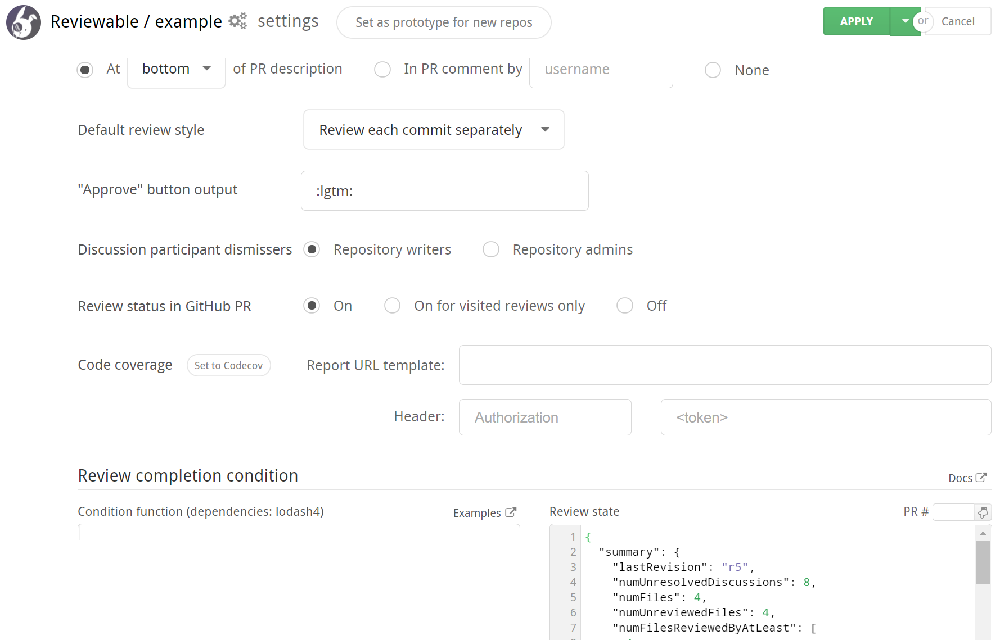

# Repositories

The Repositories page lists all of your repos. From this page, you can connect Reviewable to Github repositories, adjust the connections' settings, and manage your Reviewable subscriptions (for which, please see the [next chapter](subscriptions.md)).


The repositories are grouped by owner and listed alphabetically.  If you don't see an organization of which you're a member, ensure that you click **Show all organizations** if it's there.  If the organization is still missing, check whether you need to [request approval for Reviewable](https://help.github.com/articles/requesting-organization-approval-for-oauth-apps/) from your organization owners.


## Security concerns

First off, Reviewable will never store your source code on its servers. Each session will fetch the code directly from GitHub into the browser over a secure HTTPS connection. For transparency, here’s a non-exhaustive list of the kinds of data stored on Reviewable's servers:

*   Comments, including drafts.
*   Pull request metadata, such as filenames, and commit and file SHAs.
*   Basic account data, such as ID, username, and email address.
*   The OAuth access token that you authorized (encrypted for extra security).
*   Repo permissions and organization memberships.
*   Settings for all levels: organization, repository, user, and review.
*   Subscription data, but only the last 4 of the credit card and expiration date are kept.
*   Issue titles, commit messages, and GitHub branch protection settings are cached and flushed regularly.

Access is controlled by a set of standalone security rules that are enforced directly by the database. Access permissions are inherited from GitHub and rechecked every half hour. All data is always transmitted across secure connections.

The access token remains encrypted at rest with a key known only to Reviewable servers, and used only to access GitHub on your behalf. Unless you grant explicit written authorization, Reviewable staff will never use the token to access your repository contents or mutate data.  (We may use it to test innocuous read-only metadata API calls when debugging an issue specific to your account.)

Reviewable does need write permissions for your repos.  See the [GitHub authorizations](registration.md#github-authorizations) section for a full explanation.

And of course under no circumstances will we disclose any of your private information to other parties beyond what's needed to provide our service — please see our [terms of service](https://github.com/Reviewable/Reviewable/blob/master/legal/terms.md) and [privacy policy](https://github.com/Reviewable/Reviewable/blob/master/legal/privacy.md) for the legal details.

If you need more details about our security architecture or have any other concerns we can address, please contact us at [support@reviewable.io](mailto:support@reviewable.io).


## Connecting repositories

The indicator next to each repository name shows the connection state for this repo. While a repo is connected, Reviewable automatically creates a review for any open PR and inserts a link into all open PRs in the repo.


The toggle's color reflects the state of the connection:

*   **Black** — The repo is disconnected. Reviewable will not automatically create reviews for this repo, but it is possible to initiate a review from the [Reviews dashboard](dashboard.md#open-review).
*   **Green** — The repo is connected and healthy. Reviewable will automatically create and update reviews for all open PRs and insert a link to the review into the description for each PR.  (You can customize this latter behavior in the [settings](#repo-settings), but must do so _before_ connecting the repo!)
*   **Red** — The repo was connected, but the connection is now broken. Look for the error message on this page. Though some reviews may be created under this condition, it is necessary to fix the problem to ensure all reviews function properly.

You must have repo admin permissions to connect or disconnect a repo. Connecting to a private organizational repo may cause you to automatically begin the 30-day free trial.

It is entirely safe to connect or disconnect a repo at any time without risk of data loss. After a review is created, it will not be affected by this toggle.

?> If you previously connected repos, but later revoked the authorization for Reviewable, you will need to re-authorize access to maintain the connection. You will see messages at the top of the repo page that prompt you to take action.

!> If a user has connected a repo but later leaves an organization, it will be necessary for another admin to toggle the repo off and then on to assume control of the connection.  (Reviewable will send a warning email to the original connector if it detects this situation.)

Each connected repository will have an "N open reviews" link under it that will take you to a repository-specific [reviews dashboard](dashboard.md).


### Connect all current and future repos :id=current-and-future

There's also a special **All current and future repos** toggle.  When turned on by an organization owner, Reviewable will connect all current _and future_ repos in this organization and automatically create reviews for those repos. Reviewable will not connect any repos that were previously manually toggled off.

!> You may wish to confirm the [settings](#repo-settings) of current repos and designate a [prototype repo](#prototype-repo) for future ones before you turn on this feature.  By default, Reviewable will insert a link into all open PRs in all repos unless you've changed this setting beforehand.


### Create reviews for your own PRs

You can also get Reviewable to create reviews for all PRs that you author, across all repos.  If the **My PRs in any public repo** toggle is on, Reviewable will regularly scan your public PRs and create reviews for them (inserting a link into the PR), covering all of your open source contributions.


The same applies to private PRs for the **My PRs in any private repo** toggle, which gives you the flexibility to have only a subset of users in a private repo use Reviewable.

!> This last is a legacy feature that may get removed in the future, since it was mainly used to constrain the set of contributors to avoid going over quota, and this can now be specified directly in a subscription's configuration.  It will only work if the relevant repo has an active subscription at the time the PR is created and won't backfill if a subscription is created later.


### Reviews in connected vs unconnected repos

When you connect a repo, you get links to the reviews from all PRs in that repo and immediate updates whenever anything changes in GitHub.

By contrast, Reviewable doesn't get write access to the repo if you individually connect all your own PRs or create ad-hoc reviews via the dashboard. There are some disadvantages to this approach:

*   New commits, GitHub comments, labels, and the PR assignee don't immediately sync with the review, but will only synchronize after somebody loads the review. The dashboard will display stale information for such reviews. Comments posted in Reviewable will propagate immediately.
*   Assignee and label directives in GitHub and emailed comments won't apply until a user loads the review.
*   Review status checks won't post to the PR, since Reviewable isn't subscribed to repo events and unable to make timely updates.
*   Reviewable may not be able to reliably detect and apply your branch protection settings in its UI. (The branch protection settings will be enforced by GitHub no matter what, though, so this is safe but potentially confusing.)
*   It may not be possible for Reviewable to pin revision commits, so if you use `git rebase` and `git push --force`, some of them may get garbage collected and will no longer be accessible in the review. They'll usually get pinned when the reviewer (with push authority) accesses the review.

Though the differences above may be minor, it's much more convenient and reliable to connect a repo directly.

?> You may find it impracticable to use Reviewable for all PRs, especially for small changes. While every pull request from a connected repo will automatically display a button that links it to a Reviewable review, you can simply ignore it and conduct the review in GitHub. Reviewable will close the review when you close the PR.  However, if the PRs are in a private organizational repo, each review will count against your contributor maximum — whether you use it or not.


## Repository settings :id=repo-settings

Click on a repository name to access the repo settings panel.  This works whether the repo is connected or not.



If you make any changes to the settings, click the **Apply** button at the top of the page to commit your changes for the repo you originally chose. Click the adjacent dropdown button to view a panel for specifying additional repos to which these settings will be applied (_all_ the settings, not just your current changes).  Click **Cancel** to discard any change to the settings.


### Prototype settings for new repos :id=prototype-repo

If you are an organization owner, you can set a repo as the settings prototype for any repos not yet accessed or created.  Simply click the **Set as prototype for new repos** button and new repos will get a copy of the prototype's settings the first time Reviewable accesses them.

?> This feature is particularly useful if you chose to connect [all current and future repos](#current-and-future).

### Reviewable badge

Choose where the Reviewable badge is to be inserted on the GitHub website:

*   **Description** — at the top or bottom of the description for the PR.  This is convenient since the link will be in a consistent place. However, manual edits to the PR immediately after it's created will race, and might occasionally cause the edits to be lost.
*   **Comment** — in a new PR comment. Optionally specify who should be the author of the comment (organization members with access to the repo only). Otherwise, this defaults to the repo connector or review visitor.
*   **None** — no badges will be created (private repos only).

?> Changes here are retroactive (except that an existing description badge won’t be moved to a comment), but will be applied lazily as reviews are visited.


### Default review style

Choose the default [review style](reviews.md#changes-commits) for all reviews in this repo. The choice here affects how commits are grouped into revisions, and the suggested sequence of diffs to review.  Please follow a link for a full explanation of the two options.

This setting can be overridden on a particular review by any user with push permissions.


### Approve button output

You can customize the function of the **Approve** button (aka **LGTM** button), which appears on the general discussion when the conditions are right. You can customize what will be inserted into the draft when you click it. By default it inserts `:lgtm:`, which renders a custom LGTM (Looks Good To Me) emoji. But, some teams customize it to insert a form, or a different approval message. The button also always sets the publication status to **Approved**.


### Discussion participant dismissers

This setting controls what permissions a user needs to have to be able to [dismiss](discussions.md#checking-and-changing-dispositions) participants from a discussion.  By default, anybody with write permissions can do so but you can limit it to only repo admins if a stricter approach is desired.


### Review status in GitHub PR

This setting determines whether or not to post the current completion status of the review as a status check on GitHub. Choose **On for visited reviews** to post only after a review has been visited at least once in Reviewable.


## Custom review completion condition :id=completion-condition

Reviewable allows you to write custom code that determines when a review is complete and controls other details of a review's progress.  Typically, you'll use this to customize the number of reviewers required, or switch from the GitHub approval system to a more flexible one based on explicit LGTMs.  Some people have created more unusual conditions, though, such as:

*   preventing review completion for N hours after a PR was created, so people get a chance to check it out,
*   requiring reviews from certain people based on the labels attached to the PR, or
*   preventing merging of PRs that have commits with “WIP” in the title.

### Development environment

The **Review completion condition** section of the repository settings helps you refine your code in a live evaluation environment.

In the **Condition Code** panel, you can edit the code that determines when a review is complete.  It starts off with the code that Reviewable uses by default and you can pick other sample conditions to customize or study from the small **Examples** menu above the editor.

The condition code will run in an isolated NodeJS 6.x environment (as of this writing — this gets updated regularly) that includes the 3.x `lodash` module available through the customary `_` binding. You can require other built-in Node modules, though some may be disallowed. Each invocation of your code must return a result within three seconds.

For testing, your code will be continuously evaluated against the **Review state** on the right.  It will start off with the current state of some PR in your repo, but you can fill in the state of any PR via the small box above it, or edit the state manually to your liking.  See the [review state input](#review-state-input) section below for an explanation of the state's properties.

The results of your code will appear in the **Evaluation result** pane at the bottom of the settings page.  They must follow a specific structure described in the [condition ouput](#condition-output) section below.


### Review state input :id=review-state-input

The current state of the review is accessible to your code via the `review` variable.  The sample review state below explains the various properties. All timestamp values indicate milliseconds since the epoch, and all lists are ordered chronologically (when appropriate). If you find that you'd like more data please ask and we'll see what we can do.

```
{
  summary: {
    lastRevision: 'r1',             // The key of the last revision
    numUnresolvedDiscussions: 1,    // The number of unresolved discussions
    numFiles: 1,                    // Total number of active files in the review
    numUnreviewedFiles: 1,          // Number of files not reviewed by anyone at latest revision
    numFilesReviewedByAtLeast: [1]  // Number of files reviewed by at least N people (as index)
      // e.g., numFilesReviewedByAtLeast[2] is the number of file reviewed by at least 2 people
  },
  pullRequest: {
    title: 'Work work work',
    number: 44,
    body: 'There is so much work to be done, and this PR does it all.',
    author: {username: 'pkaminski'},
    creationTimestamp: 1436825000000,  // added recently, it could be missing for older reviews
    draft: false,
    assignees: [
      // A user is participating iff they commented or reviewed a file.
      {username: 'pkaminski-test', participating: true},
      {username: 'mdevs5531', participating: false}
    ],
    requestedReviewers: [
      // When executing the condition prior to publishing a review, this list won't include any
      // reviewers added by the "sync requested reviewers" option if it's checked.  Doing so would
      // create a dependency cycle.  This only affects the posted message -- the condition will be
      // re-evaluated after publishing with the full list of requested reviewers to determine the
      // actual review status.
      {username: 'pkaminski-test', participating: true}
    ],
    requestedTeams: [
      {slug: 'developers'}
    ],
    approvals: {
      // Maps usernames to their current PR approval status, if any.  The status is one of
      // 'approved', 'changes_requested', 'commented', or 'dismissed'.
      'pkaminski-test': 'changes_requested'
    },
    numCommits: 3,
    target: {owner: 'pkaminski', repo: 'sample', branch: 'work'},
    source: {owner: 'pkaminski', repo: 'sample', branch: 'pkaminski-patch-9'},
    // one of dirty, unknown, blocked, behind, unstable, has_hooks, clean, or draft
    mergeability: 'clean',
    checks: {
      Shippable: {
        state: 'failure',
        descriptio: 'Builds failed on Shippable',
        timestamp: 1432363555000
      }
    }
  },
  revisions: [  // List of all revisions, in chronological order
    {
      key: 'r1',
      snapshotTimestamp: 1436825047000,  // When this revision was snapshotted (missing if provisional)
      obsolete: false,
      commitSha: '435ae39a89e6992c9ed72fd154bc3c45290d8a97',
      baseCommitSha: '3cd017d236fe9174ab22b4a80fefb323dbefb50f',
      commits: [
        {sha: '435ae39a89e6992c9ed72fd154bc3c45290d8a97', timestamp: 1436825047000, title: 'Fix foo'}
      ]
    }
  ],
  labels: [  // List of all labels applied to the pull request
    'Comments only in Reviewable'
  ],
  sentiments: [  // List of sentiments (currently just emojis) extracted from comments
    {username: 'pkaminski', emojis: ['lgtm', 'shipit'], timestamp: 1449045103897}
  ],
  discussions: [  // List of the discussions in the review (metadata only)
    {
      numMessages: 1,
      resolved: false,  // Whether the overall discussion is resolved
      participants: [
        {
          username: 'pkaminski',
          disposition: 'discussing',  // Participant's current disposition
          resolved: true,  // False if this participant is blocking resolution
          lastActivityTimestamp: 1436828040000  // Last time user sent a message or changed disposition
        }
      ],
      target: {  // Target file location; the top-level discussion doesn't have a target
        file: 'LICENSE', revision: 'r1', base: false, line: 4
      }
    }
  ],
  files: [  // List of files in the review
    {
      path: 'LICENSE',
      revisions: [  // List of the revisions where this file was changed
        {
          key: 'r1',
          obsolete: false,
          reviewers: [  // List of users who marked file as reviewed at this revision
            {username: 'somebody', timestamp: 1436828040000}  // timestamp could be null for legacy marks
          ]
        }
      ]
    }
  ]
}
```

### Condition output :id=condition-output

Your code must return an object with some or all of the following properties.  Any missing properties (at the top level) will be filled in by using the built-in default condition.  This means that you can safely return, e.g., just the `disableGitHubApprovals` flag and the rest will be defaulted for you.

- `completed`: a boolean indicating whether the review is complete or not.
- `description`: a string describing the current status of the review, such as `2 of 5 files reviewed, 4 unresolved discussions`.
- `shortDescription`: a string of no more than 50 characters describing the current status of the review, used for GitHub status checks.  If not provided, Reviewable will automatically truncate the `description` instead.
- `pendingReviewers`: an array of objects with a `username` property listing the users whose attention is needed to advance the review, like `[{username: 'pkaminski'}]`.  The contents of this list will be automatically formatted and appended to the `description` and `shortDescription`.
- `files`: an array of objects that look like `{path: 'full/path/to/file', group: 'Some Group', revisions: [key: 'r1', reviewed: true]}`.  (It's OK to just augment the `review.files` structure with additional properties and return the whole thing here.)
  - To [group files in the file matrix](files.md#file-list), set an optional `group` property on each file with any name you'd like; all files with the same `group` value will be arranged into a group with that name.  Files with no group set will belong to the default, unnamed group.  Groups will be sorted alphabetically, so you can force a specific arbitrary order by starting each group name with a digit.
  - To override whether a file has been reviewed at a revision set a `reviewed` boolean property there.  By default, a file revision is considered reviewed if it was marked so by at least one user.
- `refreshTimestamp`: a timestamp in milliseconds since the epoch for when the completion condition should be re-evaluated.  Useful if some of your logic depends on the current time.  You can obtain the current time in a compatible format via `Date.getTime()`.  If you try to schedule a refresh less than 5 minutes from now it'll get clamped to 5 minutes, but on-demand refreshes (e.g., triggered by a review visit) will always fire immediately.  Any subsequent executions of the condition will override previous `refreshTimestamp`s.
- `disableGitHubApprovals`: a boolean that, if true, will disable the “Approve” and “Request changes” options when publishing via Reviewable.  This can be useful to prevent confusion if your condition uses some other values (e.g., LGTMs) to determine completion, but note that users will still be able to publish approving and blocking reviews directly via GitHub.
- `syncRequestedReviewers`: a boolean that, if true, will force synchronization of GitHub requested reviewers from `pendingReviewers`.  (You should only set it if the repository is connected to Reviewable.)  This can be useful to standardize the workflow (e.g., to make metrics provided by another tool more reliable), but note that users will still be able to manually request and unrequest reviewers anyway.  When set to `true`, the server will automatically update requested reviewers whenever `pendingReviewers` changes (including when the PR is first created) using any repo admin account.  The client will also force enable (`true`) or disable (`false`) the ["Sync requested reviewers"](reviews.md#sync-requested-reviewers) option when publishing via Reviewable.
- `disableBranchUpdates`: a boolean that, if true, will disable the ability to merge the target (base) branch into the source (head) branch in Reviewable's UI.  This is to avoid misclicks in workflows where developers are expected to rebase rather than merge.  (It's not possible to trigger a rebase through Reviewable's UI unfortunately.)
- `mergeStyle`: one of `'merge'`, `'squash'` or `'rebase'`.  If set, forces the merge style for a PR _in Reviewable only_.  (Does not affect merging via the GitHub UI or API.)  If this conflicts with GitHub's permitted merge styles it's ignored.
- `defaultMergeCommitMessage`: a string that will be used as the default commit message when merging a pull request from Reviewable in the normal ("Merge") mode.  The user can edit it before merging as usual.
- `defaultSquashCommitMessage` a string as above, but used when merging in "Squash" mode.
- `debug`: any data structure you'd like to be able to inspect when debugging your condition.  It'll be displayed in the **Evaluation result** pane but otherwise ignored.
