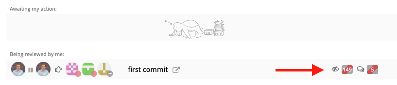
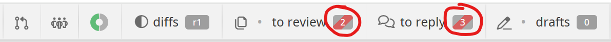
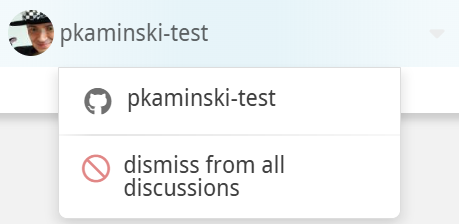
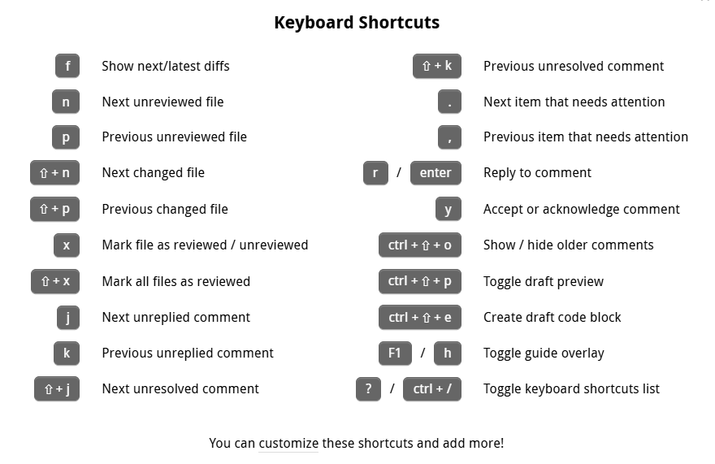

# Code review

In Reviewable, each review corresponds to a GitHub pull request. To initiate a code review, you’ll first need to create a pull request as usual and then access the corresponding review. This can be done either (a) through the link to Reviewable inserted into the PR, or (b) by clicking on the PR on your Reviewable dashboard.

In general, Reviewable keeps data synchronized between the review and its pull request for all compatible features, such as assignees, comments, and approvals.  However, some features are unique to Reviewable (such as file review marks or discussion dispositions). Other Reviewable features cannot be mapped effectively due to GitHub API limitations, such as line comments that often become top level comments.  Consequently, we don’t recommend mixing use of Reviewable and GitHub reviews on the same pull request as the experience will prove frustrating on both sides.

::: tip
Reviewable can't operate directly on raw commits, since it doesn't actually clone your repo. It depends heavily on GitHub APIs that are only available for pull requests.
:::

This chapter provides an overview of the review page, but the core features of reviewing files and managing review discussions are addressed separately in subsequent chapters.

## User roles

Throughout this guide, we'll often refer to users by the role they play in a review.  Reviewable automatically assigns one of three roles to every review participant:

* **Author**: the creator of the pull request.  Note if an author marks a file as reviewed they'll become a reviewer.
* **Reviewer**: anybody that is not an author or mentionee.
* **Mentionee**: someone other than the author that was @-mentioned in a discussion (except the main top-level one).  Note that a mentionee will become a reviewer if they start a new discussion or mark a file as reviewed.

It's possible for one person to be both the author and a reviewer in a “self-review” scenario. In that case, the “reviewer” behavior usually trumps the “author” path, but it's context-dependent.

## Publishing your review {#publish}

As you work through a review using the tools at your disposal, Reviewable will automatically save your changes but they won't be visible to others.  To publish all drafts and other buffered state changes (including review marks, dispositions, and acknowledgements), click the **Publish** button. This action will reveal all of these to other authorized Reviewable users, and also post a single, combined message to the PR on GitHub.

::: tip
To temporarily keep a draft from being published, switch its disposition to **<i class="pondering disposition icon"/>&nbsp;Pondering**.
:::

::: tip
If the pull request has [auto-merge](https://docs.github.com/en/pull-requests/collaborating-with-pull-requests/incorporating-changes-from-a-pull-request/automatically-merging-a-pull-request) turned on and publishing your review _might_ trigger it, the button will show a <i class="automerge icon"></i> icon and you'll need to click and hold to publish just like with the merge button.
:::

::: tip
If you'd like to suppress the posting of messages to Github, e.g. because you want to separate the Reviewable review from the GitHub review process, you can do so on a PR-by-PR basis. Just add the `Comments only in Reviewable` label (exact spelling!) to the PR and both batch published and single-send comments will be kept solely in Reviewable.
:::

::: danger
Some Reviewable inline comments won't appear as inline comments in GitHub and vice-versa, because the GitHub model for comment placement is poor and trying to conform to it would invalidate many of the best features in Reviewable. See [issue #437](https://github.com/Reviewable/Reviewable/issues/437#issuecomment-2440580002) for details.
:::

You can open the dropdown menu off the **Publish** button to set a few extra options. The dropdown also shows you a preview of how your published message will appear on GitHub. You can click on any of your comments in this preview to navigate to the corresponding draft in the review.

{width=628px}

### Approval levels

Like for GitHub reviews, there are three approval levels you can choose from when publishing via the dropdown attached to the button:

* **Comment** — Submit general feedback without explicit approval.
* **Approve** — Submit feedback and approve merging these changes.
* **Request changes** — Submit feedback that must be addressed before merging.

Reviewable will select a default approval level for you according to your review marks and the disposition of any comments you’re sending. You can override this level in the Publish dropdown menu for the review that you are about to publish (your selection is not “sticky” for subsequent publications). This approval level will be visible to others, and may affect the review completion requirements for both GitHub and Reviewable.

::: tip
You may only change the approval level if you have write permissions to the repository and are not the author of the PR.  As a repository admin you can also disable the **Approve** and **Request changes** for everyone via the [custom review completion condition](repositories.md#completion-condition) if they are apt to mess up your team's workflow.
:::

::: danger
If you choose **Comment**, any previous **Approve** or **Request changes** will remain in effect; you cannot rescind your vote, only change it.
:::

### Requested reviewers synchronization {#sync-requested-reviewers}

Reviewable maintains its own list of people whose action is needed on a review (as shown on the [dashboard](dashboard.md#review-state) and in the [participants summary](#labels-and-participants-summary)), independent of GitHub's requested reviewers list.  You can choose to synchronize the latter with the former by checking the **Sync requested reviewers** box.  Doing so will request reviews from Reviewable's awaited reviewers, and cancel requests for people who have left Reviewable's list.  The option shows you what changes it will make in GitHub and you can always override it with `±reviewer` [inline directives](discussions.md#inline-directives).

::: danger
It's not possible to request a review from the pull request's author in GitHub, nor from people who aren't collaborators on the repo, even if the user in question is on Reviewable's list of awaited reviewers.  Also, only users with push permissions on the repo can request reviewers.
:::

::: tip
Keeping requested reviewers up-to-date (rather than just requesting the initial review) can improve integration with other tools.
:::

Repository admins can customize the list of awaited reviewers and, if desired, override the **Sync requested reviewers** checkbox in a [custom review completion condition](repositories.md#completion-condition).  For example, you may wish to remove other users from the list if the PR author is on it, or force this option on for everyone to maintain a consistent workflow.

### Conclusion

For your convenience, Reviewable will provide a Conclusion panel at the end of the review so you don't have to scroll back to the top of the page to leave a comment in the top-level review discussion.

::: tip
The conclusion doesn't show up if the review was forced into [single file mode](files#single-file-mode) due to too many files showing.  You can still pop it up by clicking on <i class="drafts icon"></i> in the toolbar.
:::

The draft has an LGTM button that you can use to approve the pull request.  (See the [repository settings](repositories.md#approve-button-output) for information on how to customize this button.)

Below the publish button there may appear red counters of files to review and discussion to reply.  You can click the mark reviewed button to mark these files as reviewed and the discussions as read, though that might not absolve you of the need to reply to them.  If you publish your review with files or discussions outstanding they'll automatically be [deferred](#deferring-a-review).

### Deferring a review

When you publish a review and you have files left to review or discussions left to reply (red counters), the review will be automatically deferred for you: the red counters will turn grey with a red stripe and the review will not be awaiting your action. This lets you post a partial review — perhaps requesting some larger design changes or putting off reviewing test cases — and visibly hand off responsibility for taking the next action.

{width=600}

A review will remain deferred until either a new revision of a file becomes available for you to review or a new comment is posted. When this happens, the review will be reactivated for you with all counters going back to being red (including for files or discussions you had deferred), and the review awaiting your action once more.

Note that you can continue manipulating a review as usual while it's deferred, except that Reviewable won't suggest the next set of diffs to review. If you wish, you can also reactivate a deferred review manually via the dropdown menu in the participants panel.

{width=350}

::: tip
Sending an individual comment (via its dedicated send button) doesn't affect deferrals either way: it will neither defer a review, nor cause a deferred review to become active again.
:::

## Merging a pull request {#merge}

When a review is complete, a victory graphic appears and you can merge the pull request directly from within Reviewable given sufficient permissions.

{width=311px}

A review is considered complete when the first defined condition of the following is true:

1. You've defined a [custom review completion condition](repositories.md#completion-condition) and it has returned a verdict with `completed: true` (irrespective of any other per-file or per-discussion flags).

1. You've turned on branch protection for the target branch in this repo in GitHub, and GitHub says that a merge is permitted.

1. Otherwise, a review is considered complete when GitHub reports that merging the branch won't cause any conflicts, all files have been marked reviewed by at least one person at the most recent revision, and all discussions have been resolved.  (In this case, the toolbar will show a green Checks donut, a grey Changes revision, and grey zero counters in the remaining boxes.)

To merge the pull request, click and hold the button for a couple seconds until the arming indicator fills with yellow and starts pulsing, then release.  This procedure is in place to reduce the chances of accidentally merging a pull request without requiring a separate confirmation.

You can set merge options and edit the merge commit message via the dropdown attached to the button:

{width=440px}

Here you can select between the usual GitHub merge styles (normal/full, squash, and rebase), and whether Reviewable should automatically delete the source branch for you if the merge is successful.  Your selections are automatically persisted for this review, and the selections you made last will be applied to any new reviews.  A [custom review completion condition](repositories.md#condition-output) can force the merge style to use.

::: tip
When using the rebase merge style, Reviewable will indicate if the merge will be a fast-forward by adding a small annotation under the style radio button.
:::

If you've selected the full or squash merge styles, you can edit the automatically generated merge commit message as well, or generate your own default in your [custom review completion condition](repositories.md#condition-output).

## Review toolbar

At the top of every review page you’ll find a floating toolbar with some core state indicators and buttons for common actions.

At the right end of the toolbar you'll always find a **Publish**, **Merge** or **Continue** button, depending on the review's state.  Note that if you have drafts pending, you'll always see the **Publish** button even if the pull request is otherwise mergeable.  See the sections above for details on these two operations.

On the left end of the toolbar you will see a bunny icon.  Click this icon to display shortcuts to **Reviews** and **Repositories**, the **Support** menu, and either your user settings or a button to sign in to Reviewable.

The main part of the toolbar consists of various status indicators and links to panels with more details.  Clicking on a panel link will take you to the corresponding panel.  If the panel is expanded, this will scroll your view to the right spot.  If it's collapsed, however, it will pop up the panel in a modal dialog instead, which can be useful for checking some details without losing your spot in the review.  The last expanded or collapsed state of each panel is remembered _across reviews_ so you can set your preferred configuration once and for all.

We'll now look at the items from left to right.

### Information panel links

The first three items link to the corresponding panels: [pull request details](#pull-request-details), [participants](#participants), and [checks](#checks).  The pull request item's icon reflects the current state (draft, open, merged or closed) and will additionally have a "merged" or "closed" stamp next to it if the pull request is no longer open.  The checks item donut chart conveniently summarizes the current state of status checks on the pull request.

### Diffs

This item summarizes the changes you're currently looking at and links to the [diff controls](files#diff-controls) panel.  The revision label indicates the revision that is the current right diff bound for all files, or `r??` if it's a mix.  If the label is red, then you have reviewed all files in your current diff but there are more unreviewed revisions that remain. Click to open the diff controls panel, then click **Show Unreviewed Diffs**, or adjust the diff bounds manually yourself.

### Counters

The next three items on the toolbar are counters for files, discussions, and drafts.  Red counters indicate that you must address the given number of items to advance the review.  Grey counters indicate that other participants must address the given number of items, but you're in the clear. Grey counters with a red stripe indicate that you've [deferred](#deferring-a-review) reviewing files or responding to conversations until others have acted, but otherwise work just like a grey one.

::: tip
The counters take into account your unsent drafts, so somebody else may see different numbers on the same review.
:::

The **files counter** displays the number of files that remain to be reviewed at the current diff bounds, either by you or by others.  Click on the files icon to go to the [file matrix](files#file-matrix), or on the counter itself to cycle between these files (default keyboard shorcut: `n`).  You're free to disregard these suggestions, of course, but if you find yourself doing so often you may want to check the [review style settings](files#review-style) in the commits file, change your [review overlap strategy](files#show-default-diffs-to-review), or customize your [review completion condition](repositories.md#completion-condition), which also controls the per-file reviewed state.

::: tip
If you can’t get things to work the way you want, have a look at [issue #404](https://github.com/Reviewable/Reviewable/issues/404) for a more thorough exploration of “to review” semantics and suggestions for alternative command bindings.
:::

The **discussions counter** display the number of discussions that are waiting for your reply or that are unresolved.  Click to cycle between these discussions (default keyboard shortcuts: `j` for next unreplied, `⇧J` for next unresolved).

::: tip
The main review discussion is always considered resolved.
:::

The **drafts counter** displays the number of drafts you have pending, and also turns red if you have any buffered state such as review marks, disposition changes, or acknowledgements.  Click on the draft icon to go to the [conclusion panel](#conclusion), or on the counter itself to cycle between your drafts.  You can publish all of your drafts and other buffered changes by clicking the **Publish** button.

## Pull request details

This panel appears at the very top of the review page and show core information about the pull request:

The top section shows the pull request's _summary and description_, as well as the _pull request author_ (that you can hover over for details).  You can expand or collapse the description with the see more / see less button on the divider and this choice will be persisted per-review.

Next comes a line with some technical details about the pull request:
- The _repository and pull request number_, which link to the pull request page on GitHub.
- The _number of commits and revisions_, which links to the [virtual commits file](files#revision-commits) for full details.  Each revision is an automatic, unmodifiable capture of one or more commits.  If there are tentative _provisional revisions_ that may still change up to the point at which someone begins reviewing it they'll be counted separately.  (The intent behind provisional revisions is to permit the PR author to self-review the changes and push fixes without polluting the revision list.)
- The _source (head) branch name_, which links to the corresponding branch on GitHub.  You can click the adjacent copy button to copy the source branch name, e.g., to check it out locally.
- The _target (base) branch name_, which links to the corresponding branch on GitHub.  You can click the adjacent edit button to change the target branch for the pull request, if you have the necessary permissions.

Below that you'll see lines listing the _labels_ and _milestone_ for the pull request, if any.  Unlike on GitHub, you cannot edit these directly; instead, you'll need to use [_directives_](discussions#inline-directives) such as `+label` or `-reviewer:@username`.  You can add these directives to any comment but the pull request panel includes a field that lets you do so on the spot, for your convenience.  The contents of this field will be automatically appended to your main review comment but you can also send and apply it independently, using the adjacent <i class="basic send icon"></i> button.

::: tip
You can enter anything into the command field, not just directives.  This can be particularly useful for sending `/` bot commands as many bots don't correctly parse commands embedded in published reviews.
:::

## Participants

The participants panel lets you quickly track the status of each individual that is involved in the review. Every information cell has contextual help with more details on its contents. Some cells may also have a dropdown menu with relevant actions that appears on hover. You can copy all usernames, or a subset of sorted usernames, by clicking the <i class="icon clone"/>&nbsp;button. You can sort participants by each category using the <i class="icon sort"/>&nbsp;button.

For each participant the following information is provided:

Icon | Participant is:
:----:|---------
<i class="icon waiting on"/>&nbsp;| is **responsible for the next step** of this review.
<i class="icon waiting on circular no data"/>&nbsp;| is **not being waited on** in the review.
<i class="icon sanction approved"/>&nbsp;| has **approved the pull request**.
<i class="icon sanction blocked"/>&nbsp;| has **requested changes** to the pull request.
 | says 'Everything **looks good to me**!'
<i class="icon disposition blocking"/>&nbsp;| is **blocking a discussion** in the review.
<i class="icon participant status circular no data"/>&nbsp;| has **no approval-related status**.
<i class="icon author"/>&nbsp;| is an **author of the pull request**.
<i class="icon reviewer"/>&nbsp;| is a **reviewer**.
<i class="icon review requested"/>&nbsp;| is a **requested reviewer** active in the review.
<i class="icon review requested inactive"/>&nbsp;| is a **requested reviewer** not yet active in the review.
<i class="icon mentionee"/>&nbsp;| has only been **@-mentioned** in a discussion.
<i class="icon passive"/>&nbsp;| is **not directly participating** in the review.
<i class="icon assignee left"/>&nbsp;<i class="icon assignee right"/>&nbsp;| is **assigned to this pull request**.
<i class="icon commit"/>&nbsp;|  has either **authored or submitted a commit** in this pull request.
<i class="icon commit circular no data"/>&nbsp;| was **not involved with commits** in this pull request.
<i class="icon active circular no data"/>&nbsp;| is **not yet active in the review**.
<i class="icon drafts"/>&nbsp;| has **pending comments drafted** that are not yet published.
<i class="icon drafts circular no data"/>&nbsp;| has **no pending drafts**.
<i class="icon comments circular no data"/>&nbsp;| is **not engaged in any discussions**.

### Waiting on

Reviewable keeps track of which participants are needed to move a review forward and marks them with a <i class="icon waiting on"/>&nbsp;pointing hand.  The list is roughly the union of the following:
- All participants involved in unresolved discussions that are [unreplied](discussions.md#unreplied-discussions) for them.
- All participants who most recently marked as reviewed a file that is not reviewed at the latest revision.
- All requested reviewers, or if none all assigned users, or if none and there are files with no previous reviewers or discussions with no participants besides the pull request's author then all reviewers .

However, if a user deferred by publishing a review when some files or discussions were still unreviewed or unreplied, then they'll be removed from consideration for the waiting-on list until the review's state changes.  Finally, if all files and discussions in the review have been engaged with but the list of waited-on users is still empty, Reviewable will default to the pull request's author.  (This happens most often when a review has been completed and the pull request is ready to merge.)

You can see the algorithm above written out as code [here](https://github.com/Reviewable/Reviewable/blob/master/examples/conditions/pending_reviewers.js) and [customize it](repositories.md#pendingreviewers) to better fit your workflow.

### Actions

Each participant has a menu of actions:

{width=250px}

The specifics contents of the menu depend on the participant's status and your permissions, but may include:
- A link to the user's GitHub profile.
- **Dismiss from all discussions**, which will dismiss the participant from all unresolved discussions they are engaged in. You can undo this action until you publish.

## Checks

The checks panel tracks he current condition of GitHub's CI commit statuses and checks, mergeability, and review completion.

The donut chart icon in the header summarizes the relative proportion of successful, pending, and optional or required error / failure states.

The checks are grouped into required, optional and successful sections (with the latter being collapsed by default) and sorted alphabetically within each section:

The state icons have the following meanings:

| Icon | Meaning |
| ---- | ------- |
| <i class="status check success icon"></i> | Check successful |
| <i class="status check pending icon"></i> | Check pending |
| <i class="status check missing icon"></i> | Required check missing |
| <i class="status check inprogress icon"></i> | Work in progress, action required to advance |
| <i class="status check failure icon"></i> | Check failed |
| <i class="status check error icon"></i> | There was an error running the check |

Two checks have special actions associated with them:
- If your pull request branch is behind the target branch, you can **merge** the target branch into your pull request or **rebase** onto the target branch using the button, next to the mergeability status.  (Repository administrators can disable this feature in a custom [review completion condition](repositories#condition-output), if desired.)
- If you are a repository administrator and are not using [file-based repository settings](repositories#file-based-settings),the **customize** button will take you to the [custom review completion condition](repositories#completion-condition) editor in the repository's settings.

## Keyboard shortcuts

There are a number of keyboard shortcuts available to power your way through a review. Type `?` to display a popup that lists the current bindings. Learn how to modify the available commands and the corresponding keyboard shortcuts in the [Custom key bindings](accountsettings.md#custom-key-bindings) section.

