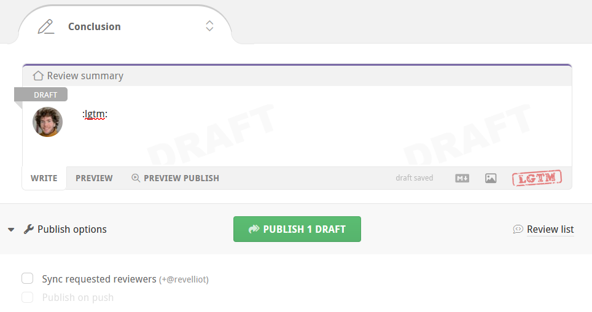
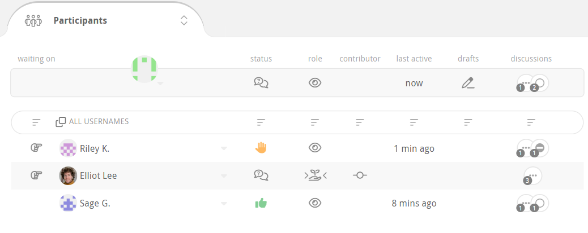

# Code review

In Reviewable, each review corresponds to a GitHub pull request. To initiate a code review, you’ll first need to create a pull request as usual and then access the corresponding review. This can be done either (a) through the link to Reviewable inserted into the PR, or (b) by clicking on the PR on your Reviewable dashboard.

In general, Reviewable keeps data synchronized between the review and its pull request for all compatible features, such as assignees, comments, and approvals.  However, some features are unique to Reviewable (such as file review marks or discussion dispositions). Other Reviewable features cannot be mapped effectively due to GitHub API limitations, such as line comments that often become top level comments.  Consequently, we don’t recommend mixing use of Reviewable and GitHub reviews on the same pull request as the experience will prove frustrating on both sides.

::: tip
Reviewable can't operate directly on raw commits, since it doesn't actually clone your repo. It depends heavily on GitHub APIs that are only available for pull requests.
:::

This chapter provides an overview of the review page, but the core features of reviewing files and managing review discussions are addressed separately in subsequent chapters.

## User roles

Throughout this guide, we'll often refer to users by the role they play in a review.  Reviewable automatically assigns one of three roles to every review participant:

* **Author**: the creator of the pull request.  Note if an author marks a file as reviewed they'll become a reviewer.
* **Reviewer**: anybody that is not an author or mentionee.
* **Mentionee**: someone other than the author that was @-mentioned in a discussion (except the main top-level one).  Note that a mentionee will become a reviewer if they start a new discussion or mark a file as reviewed.

It's possible for one person to be both the author and a reviewer in a “self-review” scenario. In that case, the “reviewer” behavior usually trumps the “author” path, but it's context-dependent.

## Publishing your review {#publish}

As you work through a review using the tools at your disposal, Reviewable will automatically save your changes but they won't be visible to others.  To publish all drafts and other buffered state changes (including review marks, dispositions, and acknowledgements), click the **Publish** button. This action will reveal all of these to other authorized Reviewable users, and also post a single, combined message to the PR on GitHub.

::: tip
To temporarily keep a draft from being published, switch its disposition to **<i class="pondering disposition icon"/>&nbsp;Pondering**.
:::

::: tip
If you'd like to suppress posting the combined message to Github, e.g. because you want to separate the Reviewable review from the GitHub review process, you can do so on a PR-by-PR basis. Just add the `Comments only in Reviewable` label (exact spelling!) to the PR and neither batch published nor single-send comments will be posted to GitHub.
:::

::: danger
Some Reviewable inline comments won't appear as inline comments in GitHub and vice-versa, because the GitHub model for comment placement is poor and trying to conform to it would invalidate many of the best features in Reviewable. <more> In more detail, it's important to understand that GitHub has two types of inline comments: pull request (PR) comments and commit comments. PR comments are assigned to lines based on the raw git diffs between two commits. Reviewable doesn't use these diffs, making mapping locations hard (see [issue #14](https://github.com/Reviewable/Reviewable/issues/14)), and can place comments on lines that don't appear in the diffs. Also, comments placed on negative delta lines in GitHub don't actually record sufficient information to figure out what line they're really on! Commit comments share most of those limitations, and also disappear from the PR if the branch is rebased. Finally, it's impossible to post commit comments without triggering a notification email for each and every comment, and while PR comments can be batched the API only allows one commit to be targeted per batch and doesn't support threading.</more>
:::

You can open the dropdown menu off the **Publish** button to set a few extra options. The dropdown also shows you a preview of how your published message will appear on GitHub. You can click on any of your comments in this preview to navigate to the corresponding draft in the review.

### Approval levels

Like for GitHub reviews, there are three approval levels you can choose from when publishing via the dropdown attached to the button:

* **Comment** — Submit general feedback without explicit approval.
* **Approve** — Submit feedback and approve merging these changes.
* **Request changes** — Submit feedback that must be addressed before merging.

Reviewable will select a default approval level for you according to your review marks and the disposition of any comments you’re sending. You can override this level in the Publish dropdown menu for the review that you are about to publish (your selection is not “sticky” for subsequent publications). This approval level will be visible to others, and may affect the review completion requirements for both GitHub and Reviewable.

::: tip
You may only change the approval level if you have write permissions to the repository and are not the author of the PR.  As a repository admin you can also disable the **Approve** and **Request changes** for everyone via the [custom review completion condition](repositories.md#completion-condition) if they are apt to mess up your team's workflow.
:::

::: danger
If you choose **Comment**, any previous **Approve** or **Request changes** will remain in effect; you cannot rescind your vote, only change it.
:::

### Requested reviewers synchronization {#sync-requested-reviewers}

Reviewable maintains its own list of people whose action is needed on a review (as shown on the [dashboard](dashboard.md#review-state) and in the [participants summary](#labels-and-participants-summary)), independent of GitHub's requested reviewers list.  You can choose to synchronize the latter with the former by checking the **Sync requested reviewers** box.  Doing so will request reviews from Reviewable's awaited reviewers, and cancel requests for people who have left Reviewable's list.  The option shows you what changes it will make in GitHub and you can always override it with `±reviewer` [inline directives](discussions.md#inline-directives).

::: danger
It's not possible to request a review from the pull request's author in GitHub, nor from people who aren't collaborators on the repo, even if the user in question is on Reviewable's list of awaited reviewers.  Only users with push permissions on the repo can request reviewers.
:::

::: tip
Keeping requested reviewers up-to-date (rather than just requesting the initial review) can improve integration with other tools.
:::

Repository admins can customize the list of awaited reviewers and, if desired, override the **Sync requested reviewers** checkbox in a [custom review completion condition](repositories.md#completion-condition).  For example, you may wish to remove other users from the list if the PR author is on it, or force this option on for everyone to maintain a consistent workflow.

### Review summary

For your convenience, Reviewable will provide a review summary panel at the end of the review so you don't have to scroll back to the top of the page to leave a comment in the top-level review discussion.

::: tip
The review summary doesn't show up if the review was forced into one file at a time mode, due to too many files showing.
:::

The draft has an LGTM button that you can use to approve the pull request.  (See the [repository settings](repositories.md#approve-button-output) for information on how to customize this button.)

Below the draft, there are counters of unreviewed files and unresolved discussions.  A red counter indicates that there's still something for you to do: either review some files, or read / respond to some discussions.  When appropriate, you can hover over a counter to reveal a button underneath that will mark files as reviewed or discussions as read.

::: tip
Grey counters &mdash; even if non-zero &mdash; are just an indication of the review's state, but don't imply that any action is required from you at this time.
:::

## Merging a pull request {#merge}

When a review is complete, a victory graphic appears and you can merge the pull request directly from within Reviewable given sufficient permissions.

A review is considered complete when the first defined condition of the following is true:

1. You've defined a [custom review completion condition](repositories.md#completion-condition) and it has returned a verdict with `completed: true` (irrespective of any other per-file or per-discussion flags).

1. You've turned on branch protection for the target branch in this repo in GitHub, and GitHub says that a merge is permitted.

1. Otherwise, a review is considered complete when GitHub reports that merging the branch won't cause any conflicts, all files have been marked reviewed by at least one person at the most recent revision, and all discussions have been resolved.  (In this case, the toolbar will show a green Checks donut, a grey Changes revision, and grey zero counters in the remaining boxes.)

To merge the pull request, click and hold the button for a couple seconds until the arming indicator fills with yellow and starts pulsing, then release.  This procedure is in place to reduce the chances of accidentally merging a pull request without requiring a separate confirmation.

You can set merge options and edit the merge commit message via the dropdown attached to the button:

Here you can select between the usual GitHub merge styles (normal/full, squash, and rebase), and whether Reviewable should automatically delete the source branch for you if the merge is successful.  Your selections are automatically persisted for this review, and the selections you made last will be applied to any new reviews.  A [custom review completion condition](repositories.md#condition-output) can force the merge style to use.

::: tip
When using the rebase merge style, Reviewable will indicate if the merge will be a fast-forward by adding a small annotation under the style radio button.
:::

If you've selected the full or squash merge styles, you can edit the automatically generated merge commit message as well, or generate your own default in your [custom review completion condition](repositories.md#condition-output).

## Review toolbar

At the top of every review page you’ll find a floating toolbar with some core state indicators and buttons for common actions.

At the right end of the toolbar you'll always find either a **Publish** or **Merge** button, depending on the review's state.  Note that if you have drafts pending, you'll always see the **Publish** button even if the pull request is otherwise mergeable.  See the sections above for details on these two operations.

On the left end of the toolbar you will see a bunny shortcut menu icon.

Click this icon to display shortcuts to **Reviews** and **Repositories** on the left side of the toolbar. You will also see shortcuts to **Support**, and your user settings on the right side of the toolbar when this menu is active.

We'll now look at the functionality of the different features moving from left to right along the toolbar.

### Checks

This item summarizes the current condition of GitHub's CI commit statuses and checks, mergeability, and review completion.  The donut chart icon indicates the relative proportion of successful, pending, and error/fail states.

Click the item to open a panel with more details:

These state icons may appear in the panel:

If you're a repo admin you can click on the small wrench icon next to the current review state to jump to the [custom review completion condition](repositories.md#completion-condition) editor in the repository's settings.

Also, if your PR branch is behind the target branch, you can merge the target branch into your PR by clicking the small merge button, next to the mergeability status.  Repo admins can disable this feature in a custom [review completion condition](repositories.md#condition-output).

### Changes

This item summarizes the changes you're currently looking at.  The revision label indicates the revision that is the current right diff bound for all files, or `r??` if it's a mix.  If the label is red, then you have reviewed all files in your current diff but there are more unreviewed revisions that remain. Click to open the panel, and then click **Show Unreviewed Diffs**. Or, adjust the diff bounds manually yourself.

Click the item to open a panel with more details:

This is similar to parts of the [changes summary box](#changes-summary), but also includes a list of commits currently in scope.

### Counters

The next three items on the toolbar are counters for files, discussions, and drafts.  Red counters indicate that you must address the given number of items to advance the review.  Grey counters indicate that other participants must address the given number of items, but you're in the clear. Grey counters with a red stripe indicate that you've [deferred](#deferring-a-review) reviewing files or responding to conversations until others have acted, but otherwise work just like a grey one.

::: tip
The counters take into account your unsent drafts, so somebody else may see different numbers on the same review.
:::

The **files counter** displays the number of files that remain to be reviewed at the current diff bounds, either by you or by others.  Click to cycle between these files (default keyboard shorcut: `n`).  You're free to disregard these suggestions, of course, but if you find yourself doing so often you may want to check the review settings in the [Changes summary box](#changes-summary) or customize your [review completion condition](repositories.md#completion-condition), which also controls the per-file reviewed state.

::: tip
If you can’t get things to work the way you want, have a look at [issue #404](https://github.com/Reviewable/Reviewable/issues/404) for a more thorough exploration of “to review” semantics and suggestions for alternative command bindings.
:::

The **discussions counter** display the number of discussions that are waiting for your reply or that are unresolved.  Click to cycle between these discussions (default keyboard shortcuts: `j` for next unreplied, `⇧J` for next unresolved).

::: tip
The main general discussion is always considered resolved.
:::

The **drafts counter** displays the number of drafts you have pending, and also turns red if you have any buffered state such as review marks, disposition changes, or acknowledgements.  Click to cycle between your drafts.  You can publish all of your drafts and other buffered changes by clicking the **Publish** button.

## Changes summary

This panel appears at the very top of the review page. The top line describes the current diff set you're viewing as succinctly as possible to help orient you.  There's also a link to the pull request in the top-right corner..

The panel is divided into three sections, and has some auxiliary [file matrix](files.md#file-matrix) controls at the bottom and may also have some unique styling if a review has been [deferred](#deferring-a-review).

### Files

This shows the number of files currently in the review.

Any extra _obsolete files_ have been modified at some point during the PR, but those are now the same as in the target base branch (so no further review of those files is necessary).  They're usually hidden by default but you can reveal manually by clicking a small link next to the count.  If you are in commit-by-commit review mode then obsolete files will still be selected for review for you, until you reach the commit at which they've become obsolete.

The **Mark as Reviewed** button will mark all files as reviewed—up to the current right-bound of the diffs. This doesn’t necessarily mean that you think the files are ready for merging, but rather only that you reviewed them and added all of your comments. After clicking this button, a small **Undo** link will appear beneath it for a while. (Incidentally, this is the only action in Reviewable that offers an explicit undo method of recovery.)

To mark files as reviewed individually, click the buttons to the left of the file name in the File Matrix, or in the file headers and at the bottom of unreviewed files.

### Revisions

This shows the total number of revisions in the review. Each revision is an automatic, unmodifiable capture of one or more commits. You’ll find the commits assigned to a revision in the [special Commits](#revision-commits) file.

::: tip
The logic for grouping commits into revisions depends on the [review style](#review-style), number of commits pushed at the same time, commit authors, etc.  There are also some safety limits for how many revisions Reviewable will create at one time.
:::

A _provisional revision_ is tentative, since it may still change up to the point at which someone begins reviewing it. The intent behind provisional revisions is to permit the PR author to self-review the changes and push fixes without polluting the revision list.  Provisional revisions are italicized in the file matrix.

An _obsolete revision_ is one that is no longer part of the pull request due to a force push that changed the commit history.  It will appear crossed out in the file matrix.

The **Show Unreviewed Diffs** button (exact wording varies) in this section will set the diff bounds on all the files to the next range that Reviewable thinks you need to examine. When you first load the review page, this button has in essence already been clicked for you — that is, the initial diffs will be what Reviewable thinks you should be looking at, not necessarily the ones that you were looking at on your last visit.  <more>If you're a reviewer in a **combined commits** style review, this will be the range between the last reviewed revision (for each file) and the latest revision. If you're using **review each commit** style, this will be the range between the last fully reviewed commit and the next one. If you're the PR author, this will be the range between the last snapshotted revision and the latest one, so you can review the diffs that you have just pushed.</more>

::: tip
When applicable, you’ll find a small **Show full diff** link beneath the **Show Unreviewed Diffs** button that will show the full diffs between the base and the latest revision for each file.  This will show you exactly the full deltas that will be applied if the PR is merged.
:::

When there is more than one reviewer participating in the review, a dropdown with three **review overlap strategy** options will appear beneath the button. This setting changes which file diffs are suggested for the user to review and implicitly sets the default for any future reviews.

- **Skip files claimed by others** suggests files that have been previously reviewed by you, or that nobody has reviewed yet. Select this if you want to divide work by skipping files already reviewed by someone at an earlier version.
- **Review any unreviewed files** suggests files to review if they have not been reviewed by anyone at the current revision. Select this if you want to combine efforts and review any file that needs reviewing.
- **Review all files personally** suggests files you have not personally reviewed. Select this if you want to ensure that you review every file yourself, ignoring other reviewers.

::: tip
Regardless of which option you select you will still be able to manually diff and review any file you want.
:::

### Commits {#changes-commits}

This shows the current number of commits encompassed by the pull request, along with the source (head) and target (base) branch names. You can easily copy the source branch name (e.g., to check out locally) or change the target branch of the PR if you have the necessary permissions.  Click any of the other links here to open the corresponding GitHub page in the same tab.

The [**Review Style**](#review-style) dropdown lets you choose the style of this review, affecting how commits are grouped into revisions and the suggested sequence of diffs to review.

## Labels

Any labels or milestones that have been applied to the PR appear in the Review discussion footer.

## Participants

The participants panel lets you quickly track the status of each individual that is involved in the review. Every information cell has contextual help with more details on its contents. Some cells may also have a dropdown menu with relevant actions that appears on hover. You can copy all usernames, or a subset of sorted usernames, by clicking the <i class="icon clone"/>&nbsp;button. You can sort participants by each category using the <i class="icon sort"/>&nbsp;button.

For each participant the following information is provided:

Icon | Participant is:
:----:|---------
<i class="icon waiting on"/>&nbsp;| is **responsible for the next step** of this review.
<i class="icon waiting on circular no data"/>&nbsp;| is **not being waited on** in the review.
<i class="icon sanction approved"/>&nbsp;| has **approved the pull request**.
<i class="icon sanction blocked"/>&nbsp;| has **requested changes** to the pull request.
 | says 'Everything **looks good to me**!'
<i class="icon disposition blocking"/>&nbsp;| is **blocking a discussion** in the review.
<i class="icon participant status circular no data"/>&nbsp;| has **no approval-related status**.
<i class="icon author"/>&nbsp;| is an **author of the pull request**.
<i class="icon reviewer"/>&nbsp;| is a **reviewer**.
<i class="icon review requested"/>&nbsp;| is **a requested reviewer**.
<i class="icon mentionee"/>&nbsp;| has only been **@-mentioned** in a discussion.
<i class="icon passive"/>&nbsp;| is **not directly participating** in the review.
<i class="icon assignee left"/>&nbsp;<i class="icon assignee right"/>&nbsp;| is **assigned to this pull request**.
<i class="icon commit"/>&nbsp;|  has either **authored or submitted a commit** in this pull request.
<i class="icon commit circular no data"/>&nbsp;| was **not involved with commits** in this pull request.
<i class="icon active circular no data"/>&nbsp;| is **not yet active in the review**.
<i class="icon drafts"/>&nbsp;| has **pending comments drafted** that are not yet published.
<i class="icon drafts circular no data"/>&nbsp;| has **no pending drafts**.
<i class="icon comments circular no data"/>&nbsp;| is **not engaged in any discussions**.

### Waiting on

Reviewable keeps track of which participants are needed to move a review forward and marks them with a <i class="icon waiting on"/>&nbsp;pointing hand.  The list is roughly the union of the following:
- All participants involved in unresolved discussions that are [unreplied](discussions.md#unreplied-discussions) for them.
- All participants who most recently marked as reviewed a file that is not reviewed at the latest revision.
- All requested reviewers, or if none all assigned users, or if none and there are files with no previous reviewers or discussions with no participants besides the pull request's author then all reviewers .

However, if a user deferred by publishing a review when some files or discussions were still unreviewed or unreplied, then they'll be removed from consideration for the waiting-on list until the review's state changes.  Finally, if all files and discussions in the review have been engaged with but the list of waited-on users is still empty, Reviewable will default to the pull request's author.  (This happens most often when a review has been completed and the pull request is ready to merge.)

You can see the algorithm above written out as code [here](https://github.com/Reviewable/Reviewable/blob/master/examples/conditions/pending_reviewers.js) and [customize it](repositories.md#pendingreviewers) to better fit your workflow.

### Actions

#### Discussions

If you have the necessary permissions on the repo, you can open the actions dropdown for another active participant and click **dismiss from all** in the drop-down, which will dismiss the participant from all unresolved discussions they are engaged in. You can undo this action until you publish.

## Deferring a review

When you publish a review and you have files left to review or discussions left to reply (red counters), the review will be automatically deferred for you: the red counters will turn grey with a red stripe and the review will not be awaiting your action. This lets you post a partial review — perhaps requesting some larger design changes or putting off reviewing test cases — and visibly hand off responsibility for taking the next action.

A review will remain deferred until either a new revision of a file becomes available for you to review or a new comment is posted. When this happens, the review will be reactivated for you with all counters going back to being red (including for files or discussions you had deferred), and the review awaiting your action once more.

Note that you can continue manipulating a review as usual while it's deferred, except that Reviewable won't suggest the next set of diffs to review. If you wish, you can also reactivate a deferred review manually by clicking the continue review now button on the review page.

::: tip
Sending an individual comment (via its dedicated send button) doesn't affect deferrals either way: it will neither defer a review, nor cause a deferred review to become active again.
:::

## Revision / commit mapping {#revision-commits}

Each revision in a review is an automatic, unmodifiable capture of one or more commits.  The mapping between commits and revisions is shown in a synthetic **Commits file**.  This virtual file is kept up-to-date automatically by Reviewable and will always be listed first in the files list.  It behaves just like a normal file in that it will be diffed against the selected revision and supports discussions, however it *will not* impact your repository or pull request in anyway — it's solely used by Reviewable for presenting and reviewing commit messages.

::: tip
While the commit file is virtual, it still needs to be marked as reviewed as much (or as little) as normal files.  It's included in review file [counters](#counters), but not counted in review status messages unless it's the only unreviewed file.  It's also handled separately from normal files when evaluating a custom review completion condition; see [custom completion condition](repositories.md#custom-review-completion-condition) for details.
:::

This special file also provides some additional controls over the mapping between revisions and commits.

### Review style

The **Review Style** dropdown lets you choose the style of this review, affecting how commits are grouped into revisions and the suggested sequence of diffs to review.

There are two review styles, and changing the style will require from a few seconds to a minute or so to restructure the provisional revisions in the review.

* **Combine commits for review** — review commits that are grouped together according to the time at which they were pushed and a few other factors. Keep in mind that some commits might not be accessible for diffing.
* **Review each commit separately** — a revision is created for each commit, even if a successive commit wrote over previous changes. We recommend choosing this review style only if the commits have been carefully organized. Keep in mind that there are some built-in limits on how many revisions can be created together. This means that commits may get aggregated if those limits are exceeded.  Please contact support to discuss raising the limits for your repos if you feel this would be useful.

If you're a repository administrator, you can also set the default review style for the repository via repository settings.

::: warning
Snapshotted revisions won’t get restructured, so you may encounter surprising results if you switch the review style after beginning the review.  An exception to this is the case in which a revision was snapshotted only because somebody other than the PR author looked at it, in which case it appears snapshotted but is OK for restructuring. The purpose of this is to enable a reviewer to switch the review style, since just loading the page will show the diff and snapshot the revisions.
:::

### Compacting revisions

Since revisions are immutable, long running reviews can end up with a lot of them, which impacts the performance and usability of the review.  You can have Reviewable reduce the number of revisions for all participants by clicking the **Compact revisions** button if you have write access to the repository.  This will attempt to eliminate and combine redundant revisions but the process is slightly lossy:

* Discussions may be reassigned to an equivalent revision, and you may no longer be able to display the original diff context.
* Code blocks may be reasigned to an equivalent revision.
* Only the latest review mark from every reviewer is guaranteed to be retained.
* Matched prior revisions may be removed for rebased or merged revisions, making diffs less useful.

Access to the review will be blocked until the process completes (typically within 10 to 15 seconds).Revisions that are kept will retain their old numbers, which means that revision numbers may no longer be sequential.

::: danger
This is an experimental feature and may break the review.  If something goes dreadfully wrong, you can ask admin staff to recover the original review from a backup automatically snapshotted at the start, though this will discard any changes made in the meantime.
:::

## Keyboard shortcuts

There are a number of keyboard shortcuts available to power your way through a review. Type `?` to display a popup that lists the current bindings. Learn how to modify the available commands and the corresponding keyboard shortcuts in the [Custom key bindings](accountsettings.md#custom-key-bindings) section.

