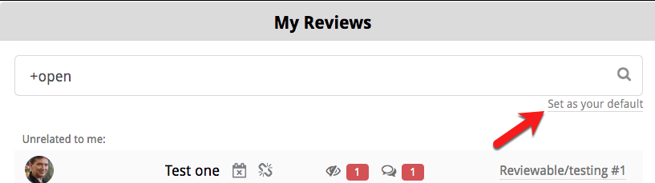
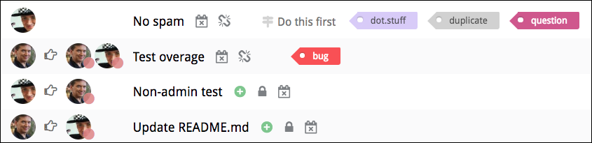

# Reviews

In Reviewable, each review corresponds to a GitHub pull request. To initiate a code review, you’ll first need to create a pull request as usual and then access the corresponding review. This can be done either (a) through the link to Reviewable inserted into the PR, or (b) by clicking on the PR on your Reviewable dashboard.

In general, Reviewable keeps data synchronized between the review and its pull request for all compatible features, such as assignees, comments, and approvals.  However, some features are unique to Reviewable (such as file review marks or discussion dispositions). Other Reviewable features cannot be mapped effectively due to GitHub API limitations, such as line comments that often become top level comments.  Consequently, we don’t recommend mixing use of Reviewable and GitHub reviews on the same pull request as the experience will prove frustrating on both sides.

<table border ="1", bgcolor="ADE9FB">
<tbody>
<tr>
<td><strong>Raw commits</strong>: Reviewable can't operate directly on raw commits, since it doesn't actually clone your repo. Reviewable heavily depends on an array of GitHub APIs that are only available for pull requests.</td>
</tr>
</tbody>
</table>

## Reviews List

Click the <strong>Reviews</strong> button at the very top of the page to display the reviews list. Here, you'll find all open PRs in which you are a participant. As a participant, these PRs have either been created by you, assigned to you, contain comments from you, or mention you (or a team you belong to). Reviewable automatically updates this list at least every minute (and data held in Reviewable is updated in real time), so there is no need to reload the page.

<table border ="1", bgcolor="ADE9FB">
<tbody>
<tr>
<td><strong>NOTE:</strong>: If the reviews listing doesn't appear, click the <strong>Include stalled pull requests/reviews</strong> link at the bottom of the panel. If you haven't yet granted those permissions to Reviewable, you may want to click the green <strong>Also show team reviews</strong> or <strong>Also show private reviews</strong> buttons at the bottom as well. Finally, if PRs are still missing, check whether the relevant organizations have OAuth app access restrictions turned on.

</td>

</tr>
</tbody>
</table>

 

Up to three closed PRs from the previous three days may also be shown here. This makes it easier to follow-up on recently completed reviews. Enter "+open" in the search bar to hide the closed PRs.

PRs are sorted into groups ordered from most to least relevant. Within each group, PRs are sorted in chronological order. The exception is that in the <strong>Waiting on me</strong> group, the PRs that are only waiting on you appear before others. The intention is that the PRs appear in the order you ought to deal with them. You cannot change the sort order, but you can filter the list instead (see below for details).

Click on a PR to open the review, or hold down the appropriate modifier key to open it in a new tab.

You can modify the view with the various toggles and filters on this page. You can also view all of the PRs in a specific repository by clicking one of the repo links on the [Repository page](repositories.md).

## Review state

Each review in the listing indicates the state of the review, in real-time:

 

If a PR is ready for merging, the status checks are successful, and all the counters are zero, then a merge button appears in the state column instead.  This lets you quickly merge completed PRs but doesn't give access to merge options -- for that, please open the review page.

Other possible states include <strong>Merged, Closed, Archived</strong> (automatically, for old reviews -- just open to unarchive). No state appears for any PR that not yet connected to a review.

## Visit the PR on GitHub 

Click the link on the right end of a listing to access the pull request on GitHub.

## Filter field 

In the filter field, enter one or more terms to match in the PR summary, repository, number, milestone, labels, author username, or blocking reviewer.  The query is immediately reflected in the URL if you'd like to bookmark it.

<strong>Create a new review:</strong> To create or access a review for a PR that you can see on GitHub, simply paste the URL into the filter field.

You can also use the special filters in the table below, adding either a + or - prefix to the special term (such as "+open").

Click the small <strong>Set as your default</strong> link to change the default to the filter to what you've entered in the filter field.

 

Add an OR operator to the positive filter by entering a comma. For example, “+needs:review,needs:fix” will filter for all reviews that need work, or have a failing check. For negative filters, the comma functions as an AND operator. More complex boolean expressions are not supported.

<table>
<tbody>
<tr>
<td>

<strong>&plusmn;open</strong>

</td>
<td>

Currently open PRs

</td>
</tr>
<tr>
<td>

<strong>&plusmn;red</strong>

</td>
<td>

PRs with red counters

</td>
</tr>
<tr>
<td>

<strong>&plusmn;mine</strong>

</td>
<td>

Created, assigned, and requested PRs

</td>
</tr>
<tr>
<td>

<strong>&plusmn;needs</strong><strong> </strong><strong> &nbsp;&nbsp;&nbsp;review</strong>

<strong> &nbsp;&nbsp;&nbsp;fix</strong>

<strong> &nbsp;&nbsp;&nbsp;merge</strong>

<strong> &nbsp;&nbsp;&nbsp;me</strong>

<strong> &nbsp;&nbsp;&nbsp;author</strong>

<strong> &nbsp;&nbsp;&nbsp;reviewer</strong><strong>  </strong>

</td>
<td> 

Incomplete reviews

Reviews with failing checks

Completed and clean reviews

Reviews waiting on you

Reviews waiting on author

Reviews waiting on a reviewer

</td>
</tr>
<tr>
<td>

<strong>&plusmn;am:</strong>

<strong> &nbsp;&nbsp;&nbsp;author</strong>

<strong> &nbsp;&nbsp;&nbsp;assigned</strong>

<strong> &nbsp;&nbsp;&nbsp;requested</strong>

<strong> &nbsp;&nbsp;&nbsp;</strong>

</td>
<td> 

Created PRs

Assigned PRs

Requested reviewer PRs

</td>
</tr>
<tr>
<td>

<strong>&plusmn;public</strong>

</td>
<td>

PRs from public repos

</td>
</tr>
<tr>
<td>

<strong>&plusmn;private</strong>

</td>
<td>

PRs from private repos

</td>
</tr>
<tr>
<td>

<strong>&plusmn;starred</strong>

</td>
<td>

PRs from repos you starred

</td>
</tr>
<tr>
<td>

<strong>&plusmn;watched</strong>

</td>
<td>

PRs from repos you&rsquo;re watching

</td>
</tr>
</tbody>
</table>

## Open a review

Click on a listing to open the review for that PR. If a  is shown, clicking on the listing will open a new review and insert a link into the description for the PR. If  is also shown, this may begin a free trial. The author of the PR is shown to the left of the , and people whose attention the review currently needs to the right. You can see the approval status icon for any reviewer, which will appear with a   if the review is waiting on those reviewers. You’ll also see a summary, current milestone, and labels.

 

The  icon indicates that the repository for this PR is not connected to Reviewable and the review will update on demand only. In such cases, the counters may be out of date. An administrator can connect the repository from the [link to Repositories] page.

A  icon indicates a stalled review, that has not been updated in over two weeks.

## Exclude or include stalled PRs
If shown, you can click the link near the bottom of the panel to exclude or include any stalled PRs.  The current state of this toggle is reflected in the URL, so you can bookmark it.

## Reviews List Toggles
At the bottom of the Reviews page, you’ll find two toggle buttons, which we explain below.

 

<table border ="1", bgcolor="ADE9FB">
<tbody>
<tr>
<td><strong>NOTE</strong>: Green <strong>Also show team reviews</strong> and <strong>Also show private reviews</strong> buttons may appear at the bottom if you haven't granted the respective permissions to Reviewable yet.</td>
</tr>
</tbody>
</table>

#### Show pull request not yet connected to Reviewable 
If this toggle is on, the list will include PRs for which a review has not yet been created. Such a PR will be indicated with the  icon, and clicking that PR will connect that PR to a review and insert a link into the PR description.

You may want to turn off this toggle if you only want to see PRs from connected repositories.

#### Also show pull request you’re not involved with from all repos to which you can push. 
If this toggle is on, the list includes PRs from all repos where you have commit privileges. 

<table border ="1", bgcolor="ADE9FB">
<tbody>
<tr>
<td><strong>NOTE</strong>: Optionally, you can restrict this set of repos to only those repos connected to Reviewable, or watched or starred on GitHub. This can be useful if you have push permissions to many on a lot of repos—as in the case, for example, that you don’t see random open-source repos while at work.</td>
</tr>
</tbody>
</table>

