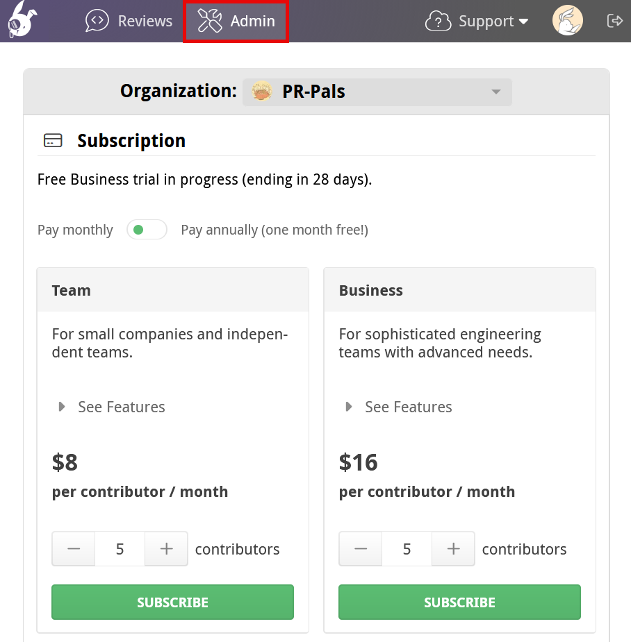
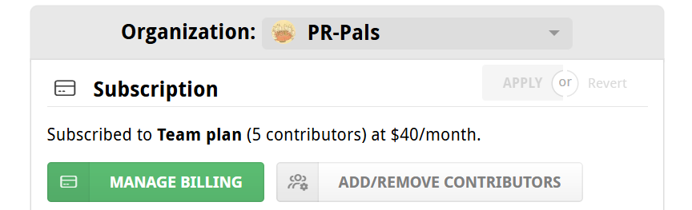
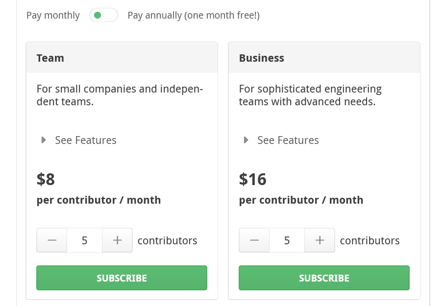
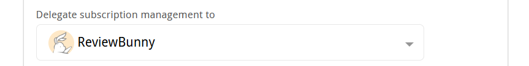
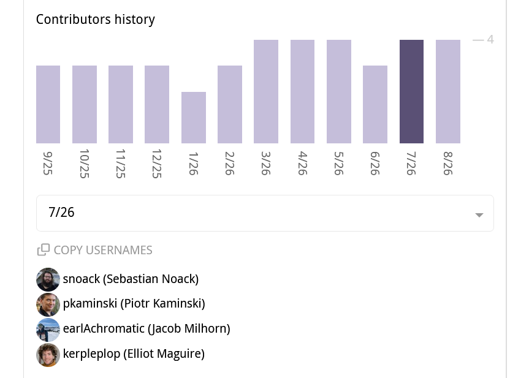
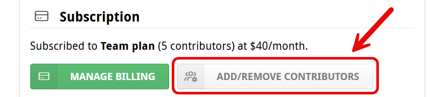
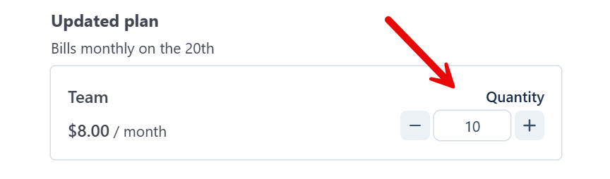

# Subscriptions and licenses

All public repositories and personal private repositories can use Reviewable free of charge forever.  A subscription or license is required for private organizational repositories.  Subscriptions are used on `reviewable.io`, while licenses are needed for managed or self-hosted enterprise instances.

## Subscriptions

The Subscription section of the [Admin Center](https://reviewable.io/admin) displays the current subscription or trial status of the organization selected from the dropdown at the top of the page.  Available plans will be listed for organizations that do not have a current subscription.  

{width=500px}

For organizations that are already subscribed, plan details and a **Manage Billing** button will be visible to organization owners and the [billing manager](#billing-manager).  Clicking **Manage Billing** will take you to the Stripe billing portal where you can manage your payment and billing information,  view invoices, or cancel your subscription.

{width=500px}

### Free Trial

Every organization gets a 30 day free trial of the Business plan, which requires no credit card. Any organization member can start a trial from any private review page, or from the Subscription section in the Admin Center.  If the button isn't showing, then you're already in the middle of a trial, have recently completed one, or have a current subscription.

### Selecting a plan

Any organization member can start a new subscription; by doing so, they will become the organization's [billing manager](#billing-manager).  You can compare plans, add contributors ([more on this below](#contributors)), and click **subscribe** to begin the checkout process in the Stripe billing portal.

{width=500px}

::: danger
OAuth app restrictions may entirely block Reviewable from an organization. Learn more in the [OAuth app access restrictions](registration.md#oauth-restrictions) section in the Registration chapter.
:::

### Changing a plan

Once subscribed, you can change or cancel your plan at any time through the **Manage billing** button, which takes you to the Stripe billing portal.

{width=190px}

If you change your plan during the billing cycle, the new plan takes effect immediately and fees are prorated which results either in a credit being applied to future invoices, or in additional fees to be charged today.  There are no refunds. 

### Billing manager

The billing manager is a designated user who, along with organization owners, can view and manage an organization's subscription.  By default, the user who started the subscription becomes the organization's billing manager until they either leave the organization or the role is reassigned via the **Delegate subscription management to** dropdown. Organization owners can always manage the subscription.

{width=580px}

### Contributors

We count each distinct PR author during a calendar month as a contributor, at the time a review is created and linked to the PR.  Once a review has been created, any number of people can view it and participate.

If a PR causes you to exceed your plan's contributor quota, both the subscriber and the person who connected the affected repo will be immediately notified by email.  Reviewable won't create reviews for PRs created by additional authors until you upgrade your subscription or the contributor count resets at the beginning of the next month.

::: tip
If you exceed your plan's quota, Reviewable will continue updating all previously created reviews and keep creating reviews for contributors that were already counted this month.
:::

#### Checking contributors

The **Contributors history** graph shows the number of active contributors for the past 12 months.  You can view the exact GitHub users from each of the past 3 months by clicking the relevant column in the chart, or by using the dropdown below it.  

{width=500px}

#### Changing contributors

To change the number of contributors for your plan, click **Add/Remove Contributors** next to the **Manage Billing** button. 

{width=500px}

This will take you to the Stripe billing portal where you can then **Adjust plan** and add or remove the quantity of contributors. 

{width=500px}

### Managing the scope of your subscription

By default, a subscription covers all reviews in a single organization. Optionally, you can restrict or expand this scope.

To restrict access to your Reviewable subscription, simply designate a contributor team using the **Limit contributors to members of** dropdown. Only PRs from team members can be submitted for review, even if others outside the team create PRs in a connected repository. Establishing a team is one approach to ensure that you won't exceed the contributor maximum for your subscription.

On the other hand, if your company's repos are distributed over multiple GitHub organizations (as is sometimes the case for consulting companies), you can specify extra organizations to be covered (if your plan allows it) using the **Cover reviews in additional organizations** dropdown. In this situation, a person who creates reviews in any of the subscription's organizations counts as a single contributor — so this may be a less expensive alternative to maintaining separate subscriptions.

::: tip
Restricting an organization to a team and extending it to other organizations are mutually exclusive.
:::

### Canceling a subscription

To cancel a subscription, click the **Manage Billing** button to access the Stripe billing portal and then click **Cancel subscription**.  Only organization owners and the [billing manager](#billing-manager) can do this.  If this is not possible or convenient, please get in touch with [support](mailto:support@reviewable.io) and we'll help you out.

You can change or cancel a subscription at any time with immediate effect, but there will be no refunds or proration of fees. If you cancel, previously created reviews will continue to be accessible and synchronized with GitHub. However, you'll no longer have the ability to create new reviews.

## Licenses

On an enterprise instance, the license administrator you selected when signing up and any GitHub Enterprise Server instance administrators will be able to check the license details in a panel at the top of the Admin Center.  The details include the number of licensed seats, how many are currently in use, the organization(s) the license is constrained to (if any), and the license's expiry date.

You can click on the allocated seat count to view the users assigned licensed seats, and guest seats if any are present.  Seats are allocated when a user signs in, and released automatically 90 days after a user's last interaction with Reviewable. You cannot release seats manually.

### Team constraints

If desired, you can limit the users who will be able to obtain seats on your instance.  This can be useful in larger organizations where Reviewable is only intended for use by a specific team or department, and you don't want other employees accidentally taking up seats that are needed for the intended users.  (By default, any GitHub user can sign in and occupy a seat, or, for an organization-constrained license, any member of said organizations.)

To turn on team constraints, enter one or more fully-qualified team slugs in the **Limit contributors to members of** field in the organization's Subscription section in the Admin Center.  Only users who are a member of at least one of these teams will be able to obtain a seat.  Users with currently assigned seats will _not_ be evicted even if they're not a team member, but won't be able to renew their seat once it expires.

::: tip
The designated license administrator is always allowed to grab a seat so they can't accidentally lock themselves out.
:::

### Guest passes

If the license is out of available seats, or team constraints are on and a user signing in is not a member (but otherwise a valid user for the license), they'll be given a full-access guest pass instead.  A guest pass lasts for two weeks and doesn't take up a license seat, but once it runs out the user will be signed out and unable to sign back in until a seat becomes available / they're a team member or eligible for a guest pass again (every 90 days).  While on a guest pass, every page will display a banner encouraging the user to request access to a licensed seat:

> You've been allocated a temporary guest seat that will expire in N days. Please contact your organization administrator to obtain a permanent one.

### API

On Reviewable Enterprise instances, if enabled by the admin, license information and team constraints can be managed via a [REST API](https://github.com/Reviewable/Reviewable/blob/master/enterprise/api.md).
