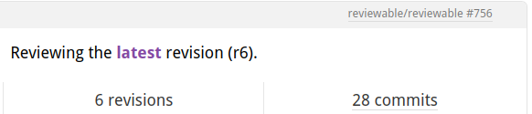

# Tips and Tricks

## Visual tweaks

Reviewable doesn't have a lot of settings exposed in the UI to customize how things look to keep things simple.  However, you can easily inject a [custom stylesheet](accountsettings.md#custom-stylesheet) to override styling on a wide range of elements.  Here are some commonly requested examples.

### Line numbers

Reviewable doesn't show line numbers in the diff for a number of reasons &mdash; there's a long discussion in [issue #147](https://github.com/Reviewable/Reviewable/issues/147).  The snippet below overrides this.  It's not perfect but it should work in the vast majority of cases:

```css
div[data-line-number]:not([data-line-number="0"]):before {
  content:attr(data-line-number);
  position:absolute;
  color: #444;
  padding: 1px 3px 3px;
  font-size: x-small;
  display: block;
  width: 20px;
  text-align: right;
}
div[data-line-number]:not([data-line-number="0"]) div.hljs {
  margin-left: 26px;
}
```

If you don't need to tweak these styles, just paste `https://gist.githack.com/pkaminski/4fd7c7b9014856de32bb43f84a396772/raw/line_numbers.css` into the custom stylesheet field.

### Diff line background

When in side-by-side diff mode, Reviewable doesn't highlight the whole line &mdash; just the deltas.  If you'd prefer the full line to also be highlighted like in unified diff mode you can use these styles:

```css
.two.column.diff .diff.line:not(.keep) .line.wrapper:not(.empty) .left.line.content {
  background-color: #FBDDDD;  /* rgba(91, 220, 114, 0.20) on white */
}
.two.column.diff .diff.line.base:not(.keep) .line.wrapper:not(.empty) .left.line.content,
.two.column.diff .diff.line.whitespace:not(.keep) .line.wrapper:not(.empty) .left.line.content {
  background-color: #FFF7F7;  /* rgba(91, 220, 114, 0.05) on white */
}

.two.column.diff .diff.line:not(.keep) .line.wrapper:not(.empty) .right.line.content {
  background-color: #DDF7E2;  /* rgba(91, 220, 114, 0.20) on white */
}
.two.column.diff .diff.line.base:not(.keep) .line.wrapper:not(.empty) .right.line.content,
.two.column.diff .diff.line.whitespace:not(.keep) .line.wrapper:not(.empty) .right.line.content {
  background-color: #EFFCF1;  /* rgba(91, 220, 114, 0.05) on white */
}

.two.column.diff .diff.line .left.line.content .delta {
  background-color: rgba(240, 92, 92, 0.30);
}
.two.column.diff .diff.line.base .left.line.content .delta,
.two.column.diff .diff.line.whitespace .left.line.content .delta {
  background-color: rgba(240, 92, 92, 0.15);
}

.two.column.diff .diff.line .right.line.content .delta {
  background-color: rgba(91, 220, 114, 0.30);
}
.two.column.diff .diff.line.base .right.line.content .delta,
.two.column.diff .diff.line.whitespace .right.line.content .delta {
  background-color: rgba(91, 220, 114, 0.15);
}
```

Or just use this link:  `https://rawgit.com/pkaminski/2922da3d58f76a8ed7bf/raw/highlight_lines_in_two_columns.css`.

### Victory bunny

Don't like the merge bunny?  Turn it off like this:

```css
.victory.decor {display: none}
```

## Easy local revision checkout

### TLDR

```sh
git fetch origin refs/reviewable/pr756/r6
git checkout FETCH_HEAD
```

### Explanation

Reviewable stores references to commits associated with each revision on Github.
This has a handy side effect of making it easy to checkout a local copy of any revision from any Reviewable pull request.

This can be done in two steps.

1. Get a reference to the pull request or revision of interest.
2. Checkout or make use of that reference.

#### 1. Get the revision reference

If your prId were `756` and your desired revision were `6` as in the image above, you would store revision reference in `.git/FETCH_HEAD` constant using

```sh
git fetch origin refs/reviewable/pr756/r6
```

Note that the form of the reviewable reference titles as shown above is `refs/reviewable/pr${prId}/r${revisionId}` .

The ids `prId` and `revisionId` are available by inspection on the reviewable.io. review page:



{:.tip}
You can also just explore the references using the git client, by typing a reference name partially, as in `git fetch origin refs/reviewable/`, and then use tab completion to get your options.

#### 2. Use the revision reference

After saving the FETCH_HEAD reference as described above, you can use it as you see fit.

For example check out the revision code using

```sh
git checkout FETCH_HEAD
```

or glance at the log using

```sh
git log -n 1 --oneline FETCH_HEAD
```
