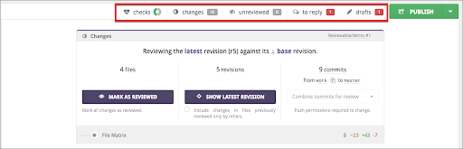
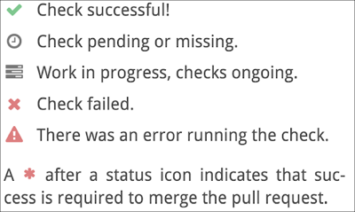
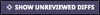
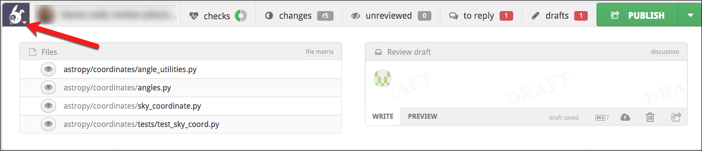

# Top toolbar

At the top, you’ll find a toolbar that provides status and options for the following.

## Checks
Displays a panel with details on the current status of GitHub CI check, including mergeability—at the latest revision of the review. The donut icon indicates the degree of success, pending, and error/fail statuses.

 

These icons may appear in the panel:

 

If you're a repo admin you can click on the small wrench icon next to the current review state to jump to the custom review completion condition editor in the [Repo settings](repositories.md).

Also, if your PR branch is behind the target branch, you can merge the target branch into your PR by clicking the small merge button, next to the mergeability status.

## Changes
This is similar to the Changes box in the Review Summary, but also includes a list of commits currently in scope.

 

Click here to display a panel in which you can mark all files as reviewed, and also change the diff bounds for all files. An r1 label indicates that it is the current right diff bound for all files (if it’s a single one). An r?? label indicates that it’s a mix.

If the label is **red**, then you have reviewed all files in your current diff but there are more unreviewed revisions that remain. Click to open the panel, and then click . Or, adjust the diff bounds yourself. 

## Counters

Counters will appear in some of the toolbar items:

*   Red counters: To move this review forward, you must address the number of items given in the red counters in the status bar above.
*   Gray counters: these are the items that other participants need to address.

<table border ="1", bgcolor="ADE9FB">
<tbody>
<tr>
<td><strong>NOTE:</strong>: The counters take into account your unsent drafts, so somebody else may see different numbers on the same review.</td>
</tr>
</tbody>
</table>

## To Review / Unreviewed
Click to navigate to the next unreviewed file. The default keyboard shortcut is n.

If the counter is **red**, it is displaying the number of files that you need to review at the current diff bounds. 

If the counter is **gray**, then Reviewable is indicating that you don’t have any files left to review at the current diff bounds, and is displaying the number of files that other people need to review. 

Of course, you can override the Reviewable estimation of the count and review those files anyway, but you might want to customize your review completion condition. This way, Reviewable is aware of your preferred workflow. Customizing the review completion condition also determines when a file counts as reviewed. If you can’t get things to work the way you want, have a look at [issue #404](https://github.com/Reviewable/Reviewable/issues/404) for a more thorough exploration of “to review” semantics and suggestions for alternative command bindings.

## To reply / Unresolved 
Click to navigate to the next discussion that requires your response, or the next unresolved discussion that is waiting on a response from you (or from someone else if you’ve responded to everything). 

The default keyboard shortcuts are j for next unreplied comment, and ⇧ + j for the next unresolved one.

If the counter is **red**, the count indicates the number of discussions which require a response from you. A gray counter indicates the number of unresolved discussions. 

The top-level discussion is always considered resolved.

## Drafts
Click to navigate to your next draft comment.

A **red** counter indicates the number of drafts that you have in the review, or indicates that there are some buffered changes such as review marks, dispositions, or acknowledgements. You can publish all of your drafts and other buffered changes by clicking the PUBLISH button.

## Shortcut menu
Click the shortcut menu icon to drop down a panel in which you can jump to a file or quickly edit the top-level draft.  Keep in mind that this menu icon only appears after you being scrolling down the page.

 

## Keyboard shortcuts
There are a number of keyboard shortcuts available. Type the **?** character on the keyboard to display a popup that lists these shortcuts. Learn how to modify the available commands and the corresponding keyboard shortcuts in the [Customize key bindings section of Account Settings](accountsettings.md) section.  

 
