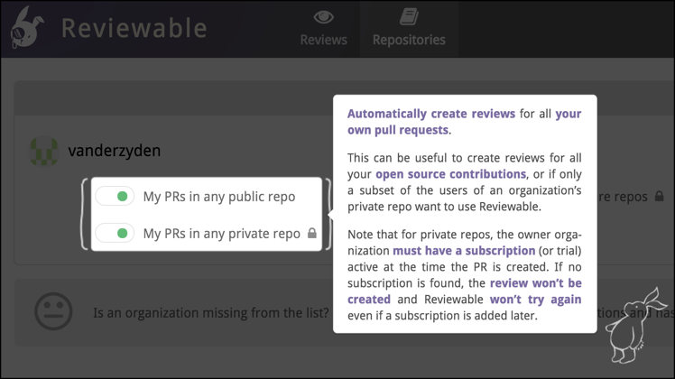
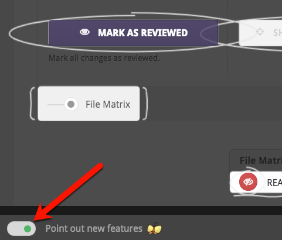

# Where to find help

## Help on using Reviewable 

Help is available through many channels:

*   Press F1 or the h key to view the hints for all of the features on a page. If you invoke help while hovering your mouse pointer over a button or feature, specific help for that feature will appear.  Press the same key again, or click on the grey background to get back to the app.

*   Click **Support > Issues** to report a bug, or make a feature request. To save effort, please check existing issues for duplicates first if you have a moment.

*   Click **Support > Chatroom** to submit other questions in a public forum.

*   [Send us an email](mailto:support@reviewable.io) for questions that should stay private, or engage in private chat through [Gitter](https://gitter.im/). 

<table border ="1", bgcolor="ADE9FB">
<tbody>
<tr>
<td><strong>NOTE</strong>: On tablets and other touch devices with no convenient keyboard, tap the question mark icon in the bottom-right corner of the screen instead.</td>
</tr>
</tbody>
</table>

## A special note on butterflies

When starting out with Reviewable, butterflies may appear to attract your attention to important features. 

 

If you find them intensely annoying, you can disable the butterflies: open the help overlay with <strong>F1</strong> or <strong>Support > Help</strong>, locate the <strong>Point out new features</strong> toggle in the lower left corner and click it to turn it off.

 

## Stay up to date 

Follow us on Twitter at [@reviewableio](https://twitter.com/reviewableio) for service status updates, changelog notifications, and occasional discussions and votes on potential features.  For the truly dedicated, you can watch the [Reviewable/Reviewable](https://github.com/reviewable/reviewable) repo for new issues and updates to these docs, or hang out in the [Gitter channel](https://gitter.im/Reviewable/Reviewable) to help out other users when we're not around.  (Thanks!)
