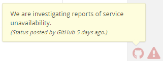

# Other Issues

## Generated files {#generated-files}

Reviewable will automatically detect many kinds of generated files and hide the diff by default. If you'd like to add a new common pattern (based either on the filename or the contents of the file), don't hesitate to let us know. If your generated files are specific to your project, you have two options:

*   You can tweak your build to insert the exact text **GENERATED FILE DO NOT EDIT** as a comment on a line by itself into the generated file. There can be up to 4 additional characters on the line before and after the marker text. We have this restriction so that Reviewable doesn't accidentally consider your build script itself to be generated!
*   You can use **.gitattributes** files checked into your repo to control diffing. For more information, see [Customizing the diff display in the File Diffs page](filediffs.md).

## Abnormal conditions 
### GitHub status 
Reviewable monitors the [GitHubs status page](https://status.github.com), and will display a yellow or red warning indicator in the lower-right corner of the window if there are reported issues.  You can click on the indicator to read the message posted by GitHub's engineers.  Note that any issues with GitHub are likely to affect Reviewable as well, due to their tight integration.

 

### Firebase connection trouble
Reviewable also continuously monitors the quality of the connection to Firebase, its main datastore.  This includes monitoring the socket itself, the latency of every write, and the latency of obtaining permissions for data access.  If the connection deteriorates, Reviewable will display a yellow or red warning indicator in the lower-right corner of the window.

 

If the connection remains poor for a long time, a modal overlay will block access to the app until things have improved, and warn you if there are unconfirmed writes that indicate your recent work may not have been saved.  You might want to check @reviewableio on Twitter for any outage announcements, or see if there are any Realtime Database issues over on the [Firebase Status page](https://status.firebase.google.com/).

 

### Forced upgrade
While we generally support older versions of the client for quite a while, if you’ve kept a page open without reloading it for weeks (or months!) we may lock it out and ask you to upgrade to the latest version immediately.  Just reload the page, or avoid the situation by occasionally reloading open pages yourself.

 

### Crash
If Reviewable detects an unexpected error that it has no idea how to deal with, it will immediately put the application in a safe state, try to save your data, report the error to our exception capture database, and show the modal crash overlay.  We investigate all errors captured this way so you don’t need to report them separately, but if it happens regularly (or you know how to reproduce it) then a tip is always appreciated!

Note that Reviewable is sensitive to all top-level exceptions, unhandled promise rejections, and other situations that can be caused by badly implemented browser extensions, following the philosophy of “better safe than sorry”.  If you’re having trouble with Reviewable crashing all the time please try running it with all extensions disabled to confirm where the root cause lies.

 