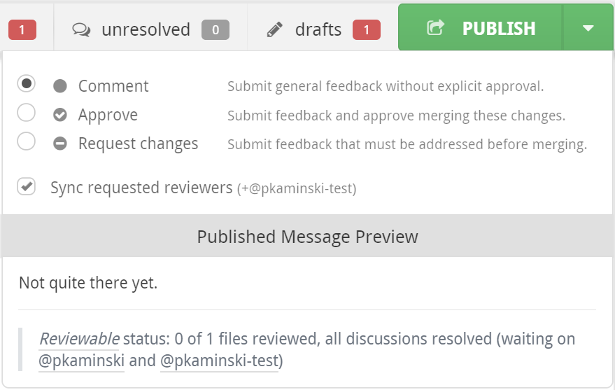

# Publishing 

## Set the approval level

There are three approval levels for publishing:

*   <strong>Comment</strong> — Submit general feedback without explicit approval.
*   <strong>Approve</strong> — Submit feedback and approve merging these changes. 
*   <strong>Request changes</strong> — Submit feedback that must be addressed before merging.

 
 

Reviewable will select a default approval level for you according to your review marks and the disposition of any comments you’re sending. You can override this level in the Publish dropdown menu for the review that you are about to publish (your selection is not “sticky”). This approval level will be visible to others, and may affect the review completion requirements for both GitHub and Reviewable.

<table border ="1", bgcolor="ADE9FB">
<tbody>
<tr>
<td><strong>NOTES</strong>:  

* You may only change the approval level if you have write permissions to the repository and are not the author of the PR.  
* Also, if you choose **Comment**, any previous **Approve** or **Request Changes** will remain in effect, and you cannot rescind your vote. 
</td>
</tr>
</tbody>
</table>

The drop-down menu also shows you a preview of how your published message will appear on GitHub. You can click on any of your comments in this preview to navigate to the corresponding draft in the review.

## Publish button

To publish all drafts and other buffered state changes (including review marks, dispositions, and acknowledgements), click the **Publish** button. This action will reveal all of these to other authorized Reviewable users, and also post a single, combined message to the PR on GitHub. 

If you'd like to suppress posting the combined message to Github, e.g. because you want to separate the Reviewable review from the GitHub review process, you can do so on a PR-by-PR basis. Just add the **Comments only in Reviewable** label (exact spelling!) to the PR and neither batch published nor single-send comments will be posted to GitHub. 

## If Reviewable comments do not appear inline in GitHub, and vice-versa 
The limitation is that the GitHub model for comment placement is poor, so any attempt to conform to it would invalidate many of the best features in Reviewable.

In more detail, it's important to understand that GitHub has two types of inline comments: pull request (PR) comments and commit comments. PR comments are assigned to lines based on the raw git diffs between two commits. Reviewable doesn't use these diffs, making mapping locations hard (see this [Reviewable issue in GitHub](https://github.com/Reviewable/Reviewable/issues/14)), and can place comments on lines that don't appear in the diffs. Also, comments placed on negative delta lines in GitHub don't actually record sufficient information to figure out what line they're really on! Commit comments share most of those limitations, and also disappear from the PR if the branch is rebased. Finally, it's impossible to post commit comments without triggering a notification email for each and every comment, and while PR comments can be batched the API only allows one commit to be targeted per batch and doesn't support threading.

Some sample templates that assume /directory/with/repos is the absolute path to the directory where your git repos live, and each repo directory is named the same as its repo:

*   **GitHub:** https://github.com/{{owner}}/{{repo}}/blob/{{viewSha}}/{{path}}#L{{viewLine}} is the built-in default that opens GitHub on the exact version of the file you're looking at with the line highlighted.
*   **TextMate:** txmt://open?url=file:///directory/with/repos/{{repo}}/{{path}}&line={{line}}.
*   **Sublime Text:** subl://open?url=file:///directory/with/repos/{{repo}}/{{path}}&line={{line}} if you install an appropriate URL handler.
*   **Emacs:** emacs://open?url=file:///directory/with/repos/{{repo}}/{{path}}&line={{line}} if you install the [Emacs URL Handler](https://github.com/typester/emacs-handler) for OS X. If you know of solutions for Linux or Windows, do [let us know](mailto:support@reviewable.io)!
*   **Atom:** atm://open?url=file:///directory/with/repos/{{repo}}/{{path}}&line={{line}} if you install [Atom Handler](https://github.com/WizardOfOgz/atom-handler) on OS X.
*   **Eclipse:** openineclipse://open?url=file:///directory/with/repos/{{repo}}/{{path}}&line={{line}} if you install the [OpenInEclipse](https://gist.github.com/uncreative/1100212) script on OS X. Or,[ follow the instructions for Linux](https://gist.github.com/jGleitz/cf9df461698f4e133cef). If you know of solutions for Windows, do [let us know](mailto:support@reviewable.io)!
*   **IntelliJ IDEA, Android Studio, PyCharm, PHPStorm:** idea://open?file=/directory/with/repos/{{repo}}/{{path}}&line={{line}} (or replace idea: with pycharm:, phpstorm:—check your docs for the scheme specific to your editor flavor). This should work on OS X, not sure about other platforms.

Your custom URL template can use the following variables:

*   **{{owner}}:** the repo owner (or organization) username
*   **{{repo}}:** the repo name
*   **{{pr}}:** the pull request number
*   **{{path}}:** the full path to the file (does not start with /)
*   **{{sha}}:** the commit sha of the latest revision in this review
*   **{{line}}:** the line number in the latest revision of the file that best represents the original context in which the comment was made
*   **{{viewSha}}:** the commit sha of the revision in which the discussion is currently being displayed
*   **{{viewLine}}:** the line number in the revision in which the discussion is currently being displayed; this is the number that's displayed in the top-right corner of the discussion.

Typically you'll want to edit the latest version of the file and that's what you'll have loaded in the editor, so you probably want to use {{line}} rather than {{viewLine}}. If you need any other variables for your template, please let us know.

